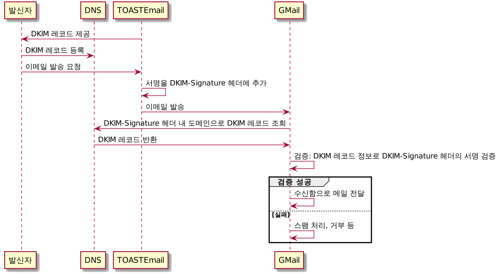

### 2021-12-21

## DKIM 적용하기
- *참고: https://hiseon.me/linux/ubuntu/dkim-settings/*
- *참고: https://meetup.toast.com/posts/248*
- *참고: https://www.cisco.com/c/ko_kr/support/docs/security/email-security-appliance/215360-best-practice-for-email-authentication.html*
- **DKIM 이란?**
    - 메일 발송자의 도메인과 메일의 무결성을 검증할 수 있는 기술
    - 보낸사람 주소가 위조된 경우 메일 탐지
    - Verbling DKIM signature
    ```
    DKIM-Signature: v=1; a=rsa-sha256; c=relaxed/relaxed; d=info.verbling.com; 
    h=content-type:from:mime-version:subject:reply-to:x-feedback-id:to; 
    s=s1; bh=yurMcrg5W97a0bnM840AyZYyEnx4j8QZcGCRwB4r6eM=; 
    b=qEiTpG63wwKCYlEPQ05DfLtq5OzIgvT5qgKwhqn0h6IN/3khkA7pfD5C33a9phS+MBTH 
    cGIUgYoeUBeFHB1xluq/zxi9D/qyxfznfl++2GsJY5FK6emKhrCPpuMBCrjFyspyuMfClZ 
    EFqT33dTpty4jKzhbe2YMJUfFKfP1AZ8ENQN/+GvjDufjguwBUJ0PhEZrH8NCnsheszPw9 
    gu9Sb5abx5WsCbvoUBJtDaXgwyLDpAwwgK6H6NgPw1Zt96a531KjM7053omFk2zu872lnG 
    uk74LtvEc5MUglVqbvHevFk74CUsxHUCaoTlKNq14UQCtVdZ3jT/R2NQwbQ3nZeg==
    ```
    - DKIM 검증 흐름
        - 

- **OpenDKIM 설치**
    - `$ sudo apt-get install opendkim opendkim-tools`

- **DKIM 이론**
    - 발신자가 발신 메시지에 암호로 서명하고, 다른 확인 메타데이터와 함께 DKIM-Signature에 포함시켜 전송
    - 발신자는 DNS에 공개키를 게시
    - DKIM을 구현하기 위해 전송조직은 하나의 공개키쌍을 생성하고, DNS에 공개키를 TXT레코드로 게시
        - 각 키쌍은 "selector"에서 참조
    - 다음과 같이 서명
        - a: 서명에 사용될 알고리즘
        - c: 정규화 체계 지정
        - s: 선택키 또는 키 참조
        - d: 서명 도메인
        - h: 서명된 헤더를 나열
        - i: 서명 사용자 id
        ```
        DKIM-Signature: v=1; a=rsa-sha256; c=relaxed/relaxed; d=info.verbling.com;
        h=content-type:from:mime-version:subject:reply-to:x-feedback-id:to;
        s=s1; bh=yurMcrg5W97a0bnM840AyZYyEnx4j8QZcGCRwB4r6eM=;
        b=qEiTpG63wwKCYlEPQ05DfLtq5OzIgvT5qgKwhqn0h6IN/3khkA7pfD5C33a9phS+MBTH
        cGIUgYoeUBeFHB1xluq/zxi9D/qyxfznfl++2GsJY5FK6emKhrCPpuMBCrjFyspyuMfClZ
        EFqT33dTpty4jKzhbe2YMJUfFKfP1AZ8ENQN/+GvjDufjguwBUJ0PhEZrH8NCnsheszPw9
        gu9Sb5abx5WsCbvoUBJtDaXgwyLDpAwwgK6H6NgPw1Zt96a531KjM7053omFk2zu872lnG
        uk74LtvEc5MUglVqbvHevFk74CUsxHUCaoTlKNq14UQCtVdZ3jT/R2NQwbQ3nZeg==
        ```
    - DKIM 서명 메시지를 수신하면 다음 DNS 쿼리를 구성해 공개키 조회
        - selector._domainkey.cstoday.me
        - 버블링 예시: s1._domainkey.info.verbling.com
        - 

- **드디어 성공한 DKIM**
    - 자바에서는 pem 말고 der 양식의 인증서만 읽을 수 있음
    - 따라서 파일로써 읽은 다음에 인증에 사용하도록 코드를 구현
    - 요런 갬성
    ```java
    @Service
    public class MailSenderService {
    
        private static final String WELCOME_MAIL_SUBJECT = "오늘의 CS를 구독해주셔서 감사합니다 🎁";
        private static final String NEWSLETTER_SUBJECT = "오늘의 CS 뉴스레터입니다 🎁";
        private static final String SERVER_MAIL_NAME = "오늘의 CS";
        private static final String SERVER_MAIL_ADDRESS = "cstoday@cstoday.me";
    
        private Mailer mailer;
        private File dkimFile;
    
        @Value("${setting.dkim}")
        private String dkimFilePath;
    
        @Value("${spring.mail.host}")
        private String mailHost;
    
        @Value("${spring.mail.port}")
        private Integer mailPort;
    
        @Value("${spring.mail.username}")
        private String mailUsername;
    
        @Value("${spring.mail.password}")
        private String mailPassword;
    
        @PostConstruct
        public void init() {
             mailer = MailerBuilder
                    .withSMTPServer(mailHost, mailPort, mailUsername, mailPassword)
                    .withTransportStrategy(TransportStrategy.SMTP_TLS)
                    .withProperty("mail.smtp.auth", true)
                    .withProperty("mail.smtp.timeout", 5000)
                    .withProperty("mail.smtp.socketFactory.class", "javax.net.ssl.SSLSocketFactory")
                    .withProperty("mail.smtp.starttls.enable", true)
                    .buildMailer();
    
             dkimFile = new File(dkimFilePath);
        }
    
        public void sendWelcomeMail(String destination) {
            final Email email = generateEmail(destination, WELCOME_MAIL_SUBJECT, WelcomeMail.welcomeMailContent);
            mailer.sendMail(email);
        }
    
        public void sendNewsLetter(String destination, String content) {
            final Email email = generateEmail(destination, NEWSLETTER_SUBJECT, content);
            mailer.sendMail(email);
        }
    
        private Email generateEmail(String destination, String subject, String content) {
            return EmailBuilder.startingBlank()
                    .to(destination)
                    .from(SERVER_MAIL_NAME, SERVER_MAIL_ADDRESS)
                    .withSubject(subject)
                    .withHTMLText(content)
                    .signWithDomainKey(dkimFile, "cstoday.me", "mail")
                    .buildEmail();
        }
    }
    ```