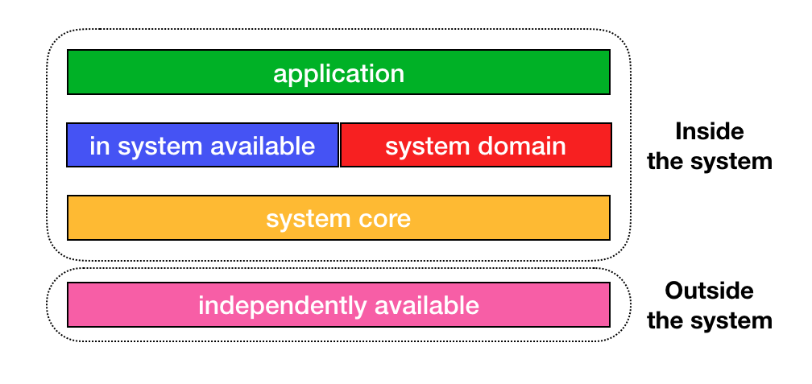
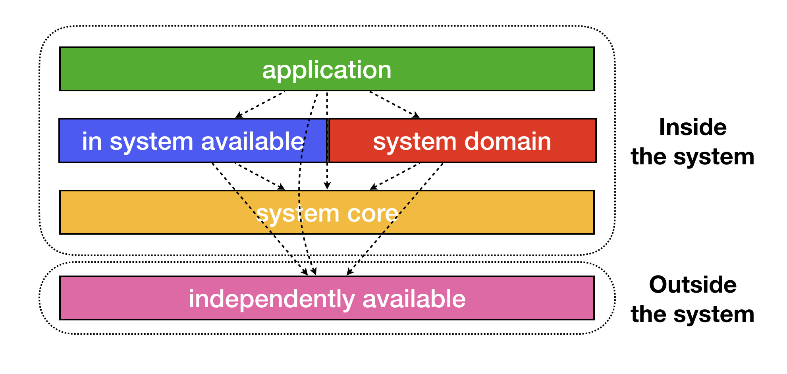

### 2022-06-29

## 서버리스
- *참고: https://www.redhat.com/ko/topics/cloud-native-apps/what-is-serverless*
- **개요**
  - 개발자가 서버를 관리할 필요없이 어플리케이션을 빌드하고 실행할 수 있도록 하는 것
  - 서버가 존재하긴 하나, 어플리케이션 개발에서와 달리 추상화되어 있음
  - 클라우드 업체가 서버 인프라에 대한 프로비저닝, 유지관리, 스케일링 등의 작업 처리
  - 개발자는 배포를 위해 코드를 컨테이너에 패키징만 하면 됨
  - 배포된 후 필요에 따라 자동으로 스케일 업되거나 스케일 다운됨
  - "이벤트 기반" 실행 모델을 차용하기에, 온디맨드로 미러링
  - 서버리스 기능이 유휴 상태일 때에는 아무런 비용도 들지 않음

- **서버리스 아키텍쳐 개요**
  - 클라우드 제공업체가 클라우드 인프라와 어플리케이션의 스케일링을 모두 관리함
  - 호출시 온디맨드로 자동 시작되는 컨테이너에 배포
  - Infrastructure-as-a-Service (IaaS)
  - 어플리케이션이 필요한 경우에만 실행되며, 클라우드 업체가 신속하게 해당 코드에 대한 리소스 할당시켜줌

- **BaaS(Backend-as-a-Service)**
  - 개발자가 다양한 제3사 서비스와 어플리케이션에 액세스할 수 있게 해줌 
  - API를 통해 호출됨
  - 주로 개발자가 서버리스라고 하면 FaaS를 지칭함

- **FaaS(Function-as-a-Service)**
  - 이벤트 기반 컴퓨팅 실행 모델
  - 개발자가 작성하는 로직은 플랫폼에서 전체를 관리하는 컨테이너로 배포된 후 온디맨드로 실행
  - 개발자에게 더 많은 권한 부여
  - 특징
    - stateless
    - 일회성
    - event-driven
    - 전체 관리형

- **어디에 써야하지?**
  - 비동기식, stateless 어플리케이션에 이상적
  - 예측할 수 없는 수요 급증에 어울림

## AWS Lambda
- *참고: https://www.44bits.io/ko/keyword/aws-lambda*
- **개요**
  - 서버리스 컴퓨팅 서비스
  - 별도의 서버 셋업없이 곧바로 코드를 실행해줌
  - EC2는 초 단위로 비용 계산하지만, 람다는 1ms당 요금을 계산해 정확히 사용한 만큼만 비용 발생

- **AWS 람다 컴퓨팅 자원**
  - 128MB와 3,008MB 사이에서 64MB 단위로 결정할 수 있음
  - CPU 용량과 기타 리소스가 메모리 할당량에 비례해서 증가함
    - ex) 함수에 256MB 할당한 경우, 128MB 할당한 경우보다 CPU 용량 2배로 증가
    - 1,792 MB 메모리 할당한 경우 1vCPU와 같다고 함

- **AWS 람다 컴퓨팅 요금**
  - AWS 람다는 리퀘스트와 컴퓨팅에 의해 비용이 발생
  - 1 리퀘스트 => 1백만 요청당 0.2 USD
  - 메모리 1GB => 1ms 당 0.0000000167 USD

- **람다 함수 트리거**
  - 특정 이벤트를 기반으로 요청 받은 즉시 실행
  - API 게이트웨이나 어플리케이션 로드밸랜서가 받은 요청을 기반으로 실행할 수 있음
  - AWS의 다양한 서비스와 연동
    - Cloudwatch 이벤트를 소스로 람다 함수를 트리거링 할 수 있음
    - S3 객체 이벤트를 소스로 받아 함수 실행
    - 데이터독 이벤트로 람다 트리거 가능
    - API 게이트웨이를 통해서 람다 트리거 가능

## AWS Fargate
- *참고 1: https://docs.aws.amazon.com/ko_kr/AmazonECS/latest/userguide/what-is-fargate.html*
- *참고 2: https://www.44bits.io/ko/post/getting-started-with-ecs-fargate*
- **개요**
  - AWS의 매니지드 컨테이너 오케스트레이션 서비스인 ECS와 EKS를 기반으로 작동하는 서비스
  - 도커 컨테이너를 EC2 인스턴스없이 독립적으로 실행
  - EC2 보다 세세하게 컴퓨팅 성능 선택 가능
  - 태스크 단위 별로 IAM 롤이나 네트워크 인터페이스 부여도 가능
  - AWS 람다와 EC2 중간쯤에 위치한 서비스

- **AWS Fargate가 나온 배경**
  - 컨테이너 오케스트레이션의 큰 발전
    - AWS ECS/Kubernetes/Docker Swarm/Apache Mesos
  - Fargate를 쓴다면 AWS의 ECS를 기반으로 EC2와 같은 별도의 컴퓨팅 자원에 의존하지 않고 컨테이너를 독립적으로 실행 가능

- **ECS(Elastic Container Service)**
  - Fargate를 ECS를 기반으로만 사용 가능
  - Cluster: ECS의 가장 기본적인 단위, 논리적인 개념으로 서비스나 태스크가 실행되는 공간
  - Container Instance: 서비스나 태스크를 실행하기 위해 사용하는 컴퓨팅 자원
  - Image: 컨테이너 오케스트레이션 도구로 컨테이너 관리 (Docker)
  - Task Definition: 태스크를 실행하기 위한 설정을 저장하고 있는 리소스
  - Task: 태스크는 ECS의 최소 실행 단위로 하나 혹은 둘 이상의 컨테이너 묶음
  - Service: 태스크를 지속적으로 관리하는 단위

## AWS parameter store
- *참고: https://jojoldu.tistory.com/509*
- *참고: https://dublin-java.tistory.com/66*
- **필요한 이유**
  - 프로젝트 자체 내부 코드에서 민감정보를 넣어두면 보안상 안좋음
  - 따라서 프로젝트 코드 밖에서 관리를 해야함
  - 가장 흔한 방법은 "서버에 직접 파일을 저장"하여 사용하는 것

- **AWS Parameter Store**
  - AWS에서 원격 설정값을 제공하는 서비스
  - 표준 파라미터, Limit 해제하지 않는 상태라면 무료로 사용 가능

- **동적 파라미터**
  - Spring Cloud Config에 비해 동적 파라미터가 안된다
  - 런타임 중간에 파라미터를 변경되는 것을 검사하려면 Spring Cloud Config 혹은 DB에 적재해서 사용하는 방법 고민할 것

- **특징**
  - 무료
  - 키-값 쌍으로 값을 저장
  - KMS를 이용해 암호화된 값을 저장할 수 있음
  - IAM을 이용해 일부 사용자만 접근할 수 있도록 설정 가능
  - 값에 대한 변경 이력까지 저장하고 있다
  - 사용 방법 간단하며 관리하기 쉽다

## Datadog
- *참고: https://www.44bits.io/ko/keyword/datadog*
- **소개**
  - 서버, 데이터베이스, 클라우드 서비스 등에 대한 다양한 모니터링 서비스를 제공하는 클라우드 모니터링 어플리케이션
  - 서버 상태를 모니터링하는 기능 시작으로 다양한 클라우드 서비스와 통합 기능을 제공함
  - DB, 캐시 스토어, 알람, 대시보드, 로그 수집, APM, 네트워크 트래픽 모니터링, 엔드포인트 모니터링 등을 지원하는 종합 모니터링 서비스로 확장 중

- **주요 개념과 주요 서비스**
  - 인프라스트럭처 모니터링
    - 특정 호스트에 데이터독 에이전트 설치시 자동으로 해당 서버의 시스템 정보를 수집
    - 무료 플랜에서는 다섯 개의 호스트까지 무료로 모니터링 가능
  - 인테그레이션
    - 서버 외의 다양한 서비스들을 추가적으로 모니터링 할 수 있음
    - AWS, Azure, GCP 등의 주요 클라우드
    - MySQL, PostgreSQL, 쿠버네티스, 레디스, 도커 등 어플리케이션 모니터링
    - 슬랙, 페이저튜티 알림 연동 등 인터그레이션 지원

## ELK stack
- *참고 1: https://aws.amazon.com/ko/opensearch-service/the-elk-stack/*
- *참고 2: https://velog.io/@holidenty/ELK-ELK-Stack-%EC%9D%B4%EB%9E%80-%EB%AC%B4%EC%97%87%EC%9D%BC%EA%B9%8C*
- **ELK**
  - 사용자에게 모든 시스템과 어플리케이션에서 로그를 집계하고 이를 분석하며 어플리케이션과 인프라 모니터링 시각화를 생성하고, 빠르게 문제 해결하며 보안 분석할 수 있는 능력 제공
  - Elastic이라는 회사에서 제공하는 오픈소스 따라서 "무료"
  - 로그 분석 공간에서 필요를 채워줌
  - 

- **ElasticSearch**
  - 로그 저장 및 검색
  - Storage
    - 데이터 저장
    - 데이터 분석
    - 데이터 관리

- **Logstash**
  - 로그 수집 엔진
  - Data Processing
    - 서버 내의 로그, 웹, 메트릭 등 다양한 소스에서 데이터를 수집하여 입력
    - 데이터 변환 및 구조 구축
    - 데이터 출력 및 송신

- **Kibana**
  - 로그 시각화 및 관리
  - Visualize
    - Dashboard를 통한 데이터 탐색
    - 팀원들과 공유 및 협업하는데 사용 가능
    - 액세스 제어 사용 가능

- **Beat**
  - 대상 서버에서 데이터를 수집하는 역할 담당

## 프로메테우스 & 그라파나
- *참고 1: https://www.44bits.io/ko/keyword/grafana*
- *참고 2: https://danawalab.github.io/common/2020/03/17/Common-Dashboard.html*
- *참고 3: https://essem-dev.medium.com/%ED%94%84%EB%A1%9C%EB%A9%94%ED%85%8C%EC%9A%B0%EC%8A%A4%EC%99%80-%EA%B7%B8%EB%9D%BC%ED%8C%8C%EB%82%98%EB%A1%9C-%EA%B0%9C%EB%B0%9C-%EC%84%9C%EB%B2%84-%EB%AA%A8%EB%8B%88%ED%84%B0%EB%A7%81%ED%95%98%EA%B8%B0-8942aea724b3*
- *참고 4: https://benlee73.tistory.com/60*
- **개요**
  - 오픈소스 메트릭 데이터 시각화 도구로 메트릭 분석 플랫폼 지향
  - 오픈소스 대시보드 도구로 개발됨
  - 메트릭 정보를 시각화하고 대시보드를 구성
  - AWS 클라우드와치, 애저 모니터와 같은 클라우드 데이터 소스를 비롯해 로키나 엘라스틱서치 등을 기반으로 로그 데이터를 지원하는 등 더 많은 데이터 소스를 지원
  - 데이터를 시각화하여 분석 및 모니터링을 용이하게 해주는 오픈소스 분석 플랫폼 => 시각화된 데이터 대시보드로 구성 가능
  - 프로메테우스
    - 그라파나를 통해 시각화 가능
    - 많은 시스템을 모니터링할 수 있는 다양한 플러그인
    - 쿠버네티스의 메인 모니터링 시스템으로 사용
    - 주기적으로 exporter로 부터 pulling 방식으로 메트릭 읽어서 수집함
  - 그라파나
    - 여러 데이터들을 시각화해주는 모니터링 툴
    - 알림 기능 무료 사용 가능

- **그라파나 vs 데이터독**
  - 둘 다 클라우드 모니터링 서비스로 메트릭 데이터를 시각화하고 대시보드를 구성할 수 있음
  - 데이터독: 데이터를 직접 저장, 모니터링 서비스를 제공하는 상용 서비스
    - ex. 데이터독에서 AWS 연동
      - 클라우드 와치의 메트릭 데이터를 일정 주기로 가져와 데이터독 DB에 저장
      - 클라우드 와치와 15분 정도의 시차 발생
  - 그라파나: 외부 데이터 소스를 정의하고 해당 데이터 소스에 쿼리를 통해 데이터를 동적으로 가지고 와서 시각화, 오픈소스 프로젝트
    - AWS 클라우드 와치에 직접 쿼리해서 가져오기 때문에 대시보드 조회하는 동안 최신 데이터를 확인할 수 있음

- **프로메테우스와 그라파나로 서버 모니터링**
  - 익스포터를 설치하여 각종 지표를 노출, 프로메테우스가 해당 지표를 모아서 저장, 그라파나가 데이터를 가져와서 시각화
    - 개발 서버 => 익스포터 => 프로메테우스 => 그라파나 => 브라우저
  - 익스포터 설치
    - 모니터링 하고 싶은 머신에 익스포터를 설치
  - 프로메테우스 설치
    - 독립적으로 설치할 수 있지만, 쿠버네티스에 설치해보자
    - 어느 URL에서 지표를 읽어들일지 정의하는 설정파일 준비할 것 (configmap > prometheus.yml)
    - 설정 파일을 쿠버네티스 컨피그맵으로 생성
    - 이후 프로메테우스 설치
  - 그라파나 설치
    - 매니페스트에서 네임스페이스, 볼륨 크기, 인그래스의 호스트명 등을 자신의 환경에 맞게 수정

## RDS
- *참고: https://www.bespinglobal.com/bespins-pick-vol-11-aws-rds-vs-ec2/*
- *참고: https://dev.classmethod.jp/articles/for-beginner-rds-explanation/*
- **RDS란?**
  - 인프라 및 데이터베이스 업데이트를 관리해주는 것 뿐만 아니라 까다로운 관계형 데이터베이스의 설치/운영/관리를 지원
  - Amazon RDS 현재 MySQL, Oracle, SQL Server, PostgreSQL, MariaDB, Aurora를 비롯한 6가지 지원
  - DB 크기는 3가지
    - 기본(m4)
    - 메모리 최적화(r3)
    - 마이크로(t2)

- **RDS 장점**
  - 관리 부담 감소
    - 사용 편의성
    - 자동 소프트웨어 패치
    - 모범 사례 권장 사항
  - 확장성
    - 즉각적인 컴퓨팅 규모 조정
    - 간편한 스토리지 규모 조정
    - 읽기 전용 복제본
  - 가용성 및 내구성
    - 자동 백업 (1~35일)
    - 데이터베이스 스냅샷 (S3 버킷에 저장 => 이걸로 복원 가능)
    - 다중 AZ 배포
    - 자동 호스트 교체
    - Read Replica
      - DB 레플리케이션 제공 (마스터 & 슬레이브 방식)
      - Read Replica: Read Only DB by RDS

- **RDS 요금**
  - EC2 인스턴스를 기반으로 운영하는 서비스
  - 기본 인스턴스 크기, 데이터 스토리지, 멀티 가용영역, 데이터 전송에 따라 달라짐

- **RDS 사용하기 vs EC2에 DB 직접 설치**
  - 기업이 선택할 수 있는 DB 사용 방안은 대개 2가지로 좁혀짐
  - 가격 자체는 EC2에 직접 설치하는게 더 저렴
  - 하지만 RDS를 사용할 경우 관리하는데 사용되는 리소스가 획기적으로 줄어듦
    - OS, DB 업데이트, 간단하게 인스턴스 크기 축소/확장
    - 클릭 한번으로 간단하게 높은 가용성 이룰 수 있음

## Spring 멀티모듈
- *참고: https://techblog.woowahan.com/2637/*
- **모듈이 왜 필요한가?**
  - 멀티 모듈 프로젝트는 독립적으로 실행가능한 어플리케이션 모듈을 1개 이상 가지고 있으며, 사용하는 인프라 자원 역시 1개 이상을 가지고 있음
  - 하위의 모듈들에 의존성과 사용성에 대한 개방/폐쇄를 철저히 해야만 했음
  - 공통 모듈로 공통 기능 묶었으나 굉장히 덩치가 커져서 뇌절

- **모듈**
  - 독립적으로 운영될 수 있는 의미를 가지는 구성요소 단위
  - 특징
    - 모듈은 독립적인 의미를 갖는다
    - 모듈은 어떠한 추상화 정도에 대한 계층을 가진다
    - 계층 간 의존 관계에 대한 규칙이 있다

- **멀티 모듈 설계**
  - 
  - 어플리케이션 모듈 계층
  - 내부 모듈 계층 
    - 저장소/도메인 외 시스템에서 필요한 모듈은 이 계층에 속함
    - 원칙: 어플리케이션, 도메인을 모른다
  - 도메인 모듈 계층
    - 저장소와 밀접한 중심 도메인을 다루는 게층은 더 견고하고 특별하게 격리/관리
    - 원칙
      - 서비스 비즈니스를 모름
      - 하나의 모듈은 최대 하나의 인프라에 대한 책임만 가짐
      - 도메인 모듈을 조합한 더 큰 단위의 도메인 모듈 있을 수 있음
    - 도메인 모듈의 책임
      - Domain
      - Repository
      - Domain Service
  - 공통 모듈 계층
    - 하나의 모듈에서 사용될 수 있는 것들은 나올 수 밖에 없었음
    - 하지만 큰 제약사항 필요
      - Type/Util 등을 정의
      - 가능하면 사용하지 않음
  - 독립 모듈 계층
    - 시스템과 무관하게 어디에서나 사용 가능한 라이브러리 성격의 모듈
    - 프로젝트 내에서 가장 프로젝트와 성격이 먼 모듈
    - 프로젝트 내에 의존관계 X
  - 

## AWS EC2 vs AWS Fargate UACC에 더 어울리는 것은?
- **AWS EC2**
  - t2.micro 1개 100% 사용 => $10/month
  - t2.small 1개 100% 사용 => $15/month
  - t2.medium 1개 100% 사용 => $30/month

- **AWS EC2 t계열**
  - *참고: https://progdev.tistory.com/37*
  - T계열 인스턴스들은 기본 성능을 제공하다가, 유저들이 몰리거나 하는 등 기준 이상의 성능이 필요할 경우 버스트 기능이 동작
  - 인스턴스 사양마다 제공되는 크레딧이 다르고, 그 크레딧이 남아있는 동안 버스트 기능 사용
    - 클라우드 워치에서 크레딧 확인 가능
    - t2 인스턴스는 무제한 모드가 꺼져있지만, t3의 경우 무제한 모드가 켜져있음
    - t3: intel cpu, t3a: amd cpu
  - 24시간 내내 트래픽 존재한다면 m4, m5 계열의 인스턴스 사용이 더 바람직
    - 이건 항상 똑같은 성능을 제공
    - 그만큼 비쌈

- **사용자 수에 따라 알맞은 아키텍쳐**
  - *참고: https://developer88.tistory.com/316*
  1. 100~999명
     - EC2 한 대 (T2.medium, A1.Large, M4.Large, M5.Large, C5.Large 등)
     - RDS 한 대 (Aurora DB, MySQL)
     - Cloudwatch
  2. 1000~9999명
     - ELB 앞단
