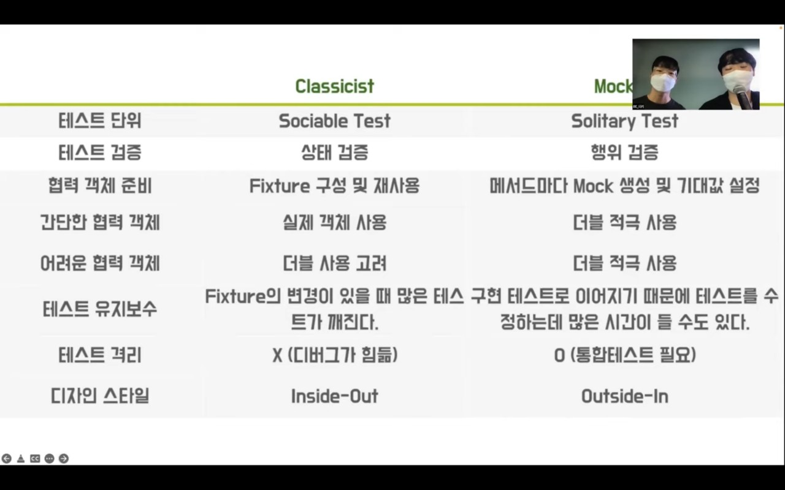

### 2022-07-24

## Classic TDD vs Mockist TDD
- *참고: https://www.youtube.com/watch?v=n01foM9tsRo*
- **Test Double**
  - Dummy
  - Fake
  - Mock: 호출될 것으로 예상되는 메서드에 대해서 반환하는 값의 사양과 결과값을 코딩해두는 것
  - Spy
  - Stub

- **두 테스트의 차이를 생각해봅시다?**
```java
// given
Order order = new Order(bread, jam, milk);
WareHouse wareHouse = new WareHouse(bread, jam, milk, apple);

// when
order.check(wareHouse);

// then
assertThat(order.isPossible()).isTrue();
assertThat(wareHouse.size()).isEqualTo(1);
```
```java
// given
Order order = new Order(bread, jam, milk);
WareHouse mockWareHouse = mock(WareHouse.class);

given(mockWareHouse.hasInventory(bread, jam, milk)).willReturn(true);

// when
order.check(mockWareHouse);

// then
verify(mockWareHouse).hasInventory(bread, jam, milk);
verify(mockWareHouse).remove(brea, jam, milk);
```

- **단위란?**
  - 단위 테스트의 공통적 특징
    - Low-Level
    - 일반적인 도구 사용
    - 빠르다
  - 한 메서드를 단위로, 한 클래스를 단위로, 한 기능을 단위로 볼 수도 있음
  - Double을 사용하여 실제 의존 클래스로 부터 격리된 테스트 : Solitary Tests => Mockist
  - Double을 사용하지 않은 테스트: Sociable Tests => Classicist

- **Classicist vs Mockist**
  - XP (Extreme Programming)
    - Pair Programming
    - TDD 
    - Refactoring
  - Classicist
    - Black-Box Testing
    - Inside-Out
    - State Based Testing
  - Mockist
    - White-Box Testing
    - Outside-In
    - Interaction Testing

- **단어 정리**
  - SUT(System Under Test): 테스트 대상 클래스
  - 협력객체: SUT가 의존하는 클래스

- **상태 검증 & 행위 검증**
  - 상태 검증
    - Classicist가 주로 사용
    - 검증을 위해 테스트하여 객체 내부의 상태를 검증
  - 행위 검증
    - Mockist가 주로 사용
    - verify를 통해 협력 당한 호출 메서드가 호출되었는지
    - 특정 행동이 이루어졌는지를 검증하는 행위 검증

- **Fixture & Mock**
  - 배달 -> 주문 -> 창고
  - Fixture
    - 픽스쳐를 사용하게 되면 앞에 사전에 준비해야할 것이 많다.
    ````java
    // given
    List<Item> orderItems = List.of(new Item("bread"), new Item("jam"), new Item("milk"));
    Order order = new Order(orderItems);
    List<Item> inventory = List.of(new Item("bread"), new Item("jam"), new Item("milk"), new Item("apple"));
    WareHouse wareHouse = new WareHouse(inventory);
    order.check(wareHouse);
    
    // when
    Delivery delivery = new Delivery(order, "address");
    delivery.start();
    
    // then
    assertThat(delivery.isStarted()).isTrue();
    ````
  - Mock
    - 직접적인 협력을 맺고 있는 메서드만 미리 설정해주면 됨
    ```java
    // given
    Order mockOrder = mock(Order.class);
    given(mockOrder.isPossible()).willReturn(true);
    
    // when
    Delivery delivery = new Delivery(order, "address");
    delivery.start();
    
    // then
    verify(mockOrder).isPossible();
    ```
  
- **비결정적인 테스트**
  - 결제 시스템에서와 같이 외부의 신용카드 정보와 결제 시스템을 활용하는 상황에서는 어떻게 테스트를 해야할까? (테스트하기 어려운 상황)
  - 시나리오
  - 배달 => 주문 => 창고
        => 결제
  - 테스트하기 어려운 상황에서도 테스트 더블의 종류와 상관없이 활용할 수 있다. 
    - 객체간의 협력 관계에서 테스트하기 어려운 부분이 있다면 클래시스트라도 테스트 더블 사용가능
    - 외부 API써도 안정적이라면 더블 없이도 가능

- **구현 테스트**
  - Mock을 사용해 테스트를 작성하게 된다면, Mock 테스트는 구현에 묶기게 됨
  - 테스트가 구현에 영향 받아 구현 바뀌면 테스트가 깨짐
  - Classicist
    - 구현의 변경 생기더라도 테스트 깨지지 않음
  - Mockist
    - 구현의 변경이 생기면 테스트가 깨짐
    - 구현 바뀔때마다 테스트 깨지면 현타옴

- **Test Isolation**
  - Mockist는 Mock을 단위들 간에 테스트 격리를 이룰수 있다는 점을 강조

- **Inside-Out & Outside-In**
  - Inside-Out
    - Classicist
    - 도메인 테스트에서 출발
    - 개발 내부에서 시작해 외부로 나아가는 형식
    - 장점
      1. 리팩토링 단계에서 디자인이 도출됨
      2. TDD에서 빠른 피드백이 가능
      3. 오버엔지니어링을 피하기 쉬움
      4. 시스템 전반에 대한 오나전한 이해없이 시작 가능
      5. 초보자가 선택하기 좋음
      6. 객체간의 협력이 어색하거나 public api가 잘못 설계될 수 있음
  - Outside-In
    - Mockist
    - 인수테스트로 출발
    - 구현보다는 객체들의 상호작용에 중점
    - 바깥부터 안짝으로 들어가는 감성
    - 장점
      1. Test Red 단계에서 디자인이 도출됨
      2. 협력 객체의 public api가 자연스레 도출됨
      3. 객체들간의 구현보다는 행위에 집중할 수 있음
      4. 객체지향적인 코드 작성이 가능함
      5. 설계에 대한 기초적인 지식이 필요해 숙련도가 필요
      6. 오버 엔지니어링으로 이어질 수 있음

- 

## Spring 테스트 전략
- *참고: https://cheese10yun.github.io/spring-guide-test-1/*
- *참고: https://github.com/HomoEfficio/dev-tips/blob/master/Spring-Boot-%EB%A0%88%EC%9D%B4%EC%96%B4%EB%B3%84-%ED%85%8C%EC%8A%A4%ED%8A%B8.md*
- **테스트 전략별 어노테이션**
  - `@SpringBootTest` : 통합 테스트, 전체 | Bean 전체
  - `@WebMvcTest` : 단위 테스트, MVC 테스트 | MVC 관련된 Bean
  - `@DataJpaTest` : 단위 테스트, JPA 테스트 | JPA 관련된 Bean
  - None: 단위 테스트, Service 테스트, POJO, 도메인 테스트

- **통합 테스트**
  - 장점
    - 모든 Bean을 올리고 테스트 진행하기에 쉽게 테스트 가능
    - 모든 Bean을 올리고 테스트 진행하기에 운영환경과 가장 유사한 테스트 가능
    - API 테스트할 경우 요청부터 응답까지 전체적인 테스트 진행 가능
  - 단점
    - 모든 Bean을 올리고 테스트를 진행하기에 테스트 시간이 오래걸림
    - 테스트의 단위가 크기 때문에 테스트 실패시 디버깅이 어려움
    - 외부 API 콜 같은 Rollback 처리 안되는 테스트 진행이 어려움
  - 코드
    -  
    ```java
    @RunWith(SpringRunner.class)
    @SpringBootTest(classes = ApiApp.class)
    @AutoConfigureMockMvc
    @ActiveProfiles(TestProfile.TEST)
    @Transactional
    @Ignore
    public class IntegrationTest {
        @Autowired
        protected MockMvc mvc;
            
        @Autowired
        protected ObjectMapper objectMapper;
    }
    ```
    
- **서비스 테스트**
  - 장점
    - 진행하고자 하는 테스트에만 집중할 수 있음
    - 테스트 진행시 중요 관점 아닌 것들은 Mocking 처리하여 외부 의존성 줄일 수 있음
    - 테스트 속도 빠름
  - 단점
    - 의존성 있는 객체를 Mocking하기에 문제가 완결된 테스트 X
