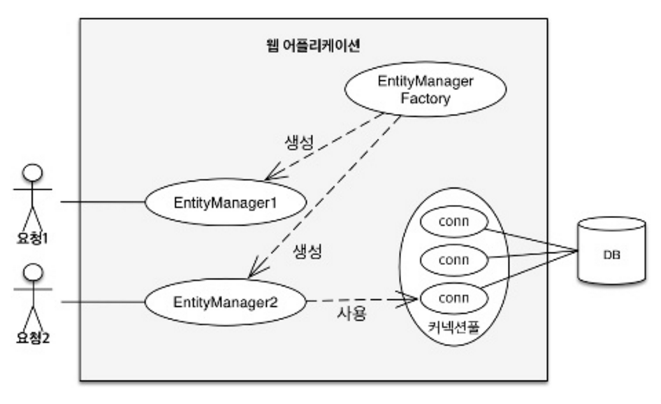

### 2022-08-28

## OSIV (Open Session In View)
- *참고: https://www.baeldung.com/spring-open-session-in-view*
- *참고: https://ykh6242.tistory.com/entry/JPA-OSIVOpen-Session-In-View%EC%99%80-%EC%84%B1%EB%8A%A5-%EC%B5%9C%EC%A0%81%ED%99%94*
- **개요**
  - OSIV는 영속성 컨텍스트를 뷰까지 열어두는 기능
  - 영속성 컨텍스트가 유지되면, 엔티티도 영속 상태로 유지됨
    - 이는 뷰에서 Lazy Loading을 가능하게한다. (DTO 생성 가능) 

- **기능**
  - Spring Framework에서 제공하는 OSIV... **서블릿 필터**에서 적용할지, **스프링 인터셉터**에서 적용할지 선택 가능!
    - `org.springframework.orm.jpa.support.OpenEntityManagerInViewFilter`
    - `org.springframework.orm.jpa.support.OpenEntityManagerInViewInterceptor`

- **Why Needed?**
  - 스프링 프레임워크가 제공하는 OSIV는 비즈니스 계층에서 트랜잭션 사용하는 OSIV
  - 영속성 컨텍스트는 사용자의 요청 시점에서 생성이 된다. 
  - 데이터 쓰거나, 수정하는 트랜잭션은 비즈니스 계층에서 뚝딱. 
  - 

- **동작 원리**
  1. 클라이언트의 요청이 들어오면 서블릿 필터나 스프링 인터셉터에서 **영속성 컨텍스트 생성**
     - 이때 트랜잭션은 시작 X
  2. 서비스 계층에서 `@Transactional`로 트랜잭션 시작할 경우, 1번에서 미리 생성한 영속성 컨텍스트 찾아와 트랜잭션 시작
     - 영속성 컨텍스트는 기본적으로 트랜잭션 범위 안에서 엔티티를 조회하고 수정할 수 있음
  3. 서비스 계층 끝나면 트랜잭션 커밋하고 영속성 컨텍스트 flush. 
     - 이때, 트랜잭션이 끝나지만 영속성 컨텍스트는 파기되지 않음
  4. 컨트롤러와 뷰까지 영속성 컨텍스트가 유지되기에 조회한 엔티티는 영속 상태 유지
     - 이러다보니까 lazy loading이 가능하고, (proxy를 조회해오는 것)
       - 트랜잭션이 없어도 읽기는 동작함 (Nontransactional read)
  5. 서블릿 필터나 스프링 인터셉터로 요청이 돌아오면 영속성 컨텍스트 종료
     - 이때 em.flush() 없이 그냥 종료
     - em.close()를 통해 영속성 컨텍스트만 종료시켜버림
     - em.flush() 억지로 시켜도 TransactionRequiredException 발생!

- **OSIV 주의점**
  - 프록시를 초기화하는 작업을 View에서도 할 수 있는데 왜 주의해야지?
  - OSIV 전략은 최초 DB 커넥션 시작 시점부터 API 응답이 끝날 때 까지 영속성 컨텍스트와 DB 커넥션을 유지함
  - DB 커넥션을 오랜기간 유지하는게 장애로 이어질 수도!
    - 실시간 트래픽이 중요한 어플리케이션에서는 커넥션이 모자람 => 장애로 이어짐
    - DB 커넥션을 영속성 컨텍스트가 종료될 때까지 1:1로 물고 있는게 큰 단점!

## 영속성 컨텍스트 & 엔티티 매니저 & 엔티티 매니저 팩토리
- *참고: https://www.youtube.com/watch?v=XlL0eq9Phws*
- *참고: https://ultrakain.gitbooks.io/jpa/content/chapter3/chapter3.1.html*
- *참고: https://stackoverflow.com/questions/42074270/should-there-be-an-entitymanager-per-thread-in-spring-hibernate*
- **영속성 컨텍스트?**
  - 엔티티 메모리 저장소 (Cache)
  - 엔티티 타입과 식별자를 키로 사용하는 객체의 집합
    - KEY: ENTITY_TYPE + PK
    - VALUE: ENTITY ITSELF

- **영속성 컨텍스트의 장점**
  - 1차 캐시
  - 동일성 보장
  - 트랜잭션 쓰기지연
  - 변경 감지
  - 지연 로딩

- **엔티티 매니저**
  - 커밋 시점에 영속성 컨텍스트에서 관리하고 있던 영속 객체의 변경 내역을 추적하여 DB에 반영
  - 데이터베이스 액세스를 위한 객체
  - 쓰레드간 공유 불가!
  - DB 연결이 필요한 시점까지 커넥션 얻지 않음
  - 엔티티 매니저로 DB 데이터를 CRUD
  - em.flush(), em.clear()
  - 엔티티매니저는 ThreadLocal에 저장!
    - `@Transactional`에서 엔티티 매니저 만들어서 ThreadLocal 변수에 엔티티 매니저 저장
    - `@Transactional`이 끝난다면, 엔티티 매니저가 close 됨!

- **어플리케이션에서 관리하는 엔티티 매니저**
  - 어플리케이션 시작 => EntityManagerFactory 초기화 => 필요한 상황에 EntityManager 생성하여 사용
  - EntityManger의 사용 마치면 close()
  - 자원 누수 문제 발생할 수 있음

- **컨테이너에서 관리하는 엔티티 매니저 => Spring JPA**
  - 컨테이너에서 관리하는 엔티티 매니저는 JEE 컨테이너에서 EntityMangerFactory와 EntityManger의 라이프사이클 관리
  - 어플리케이션 코드에서는 컨테이너가 제공하는 엔티티 매니저 사용
  - `@PersistenceContext` 사용한 구현

- **엔티티 매니저 & 영속성 컨텍스트**
  - 엔티티 매니저 생성시 하나의 영속성 컨텍스트가 생성

- **엔티티 매니저 팩토리**
  - 만드는 비용이 커서 한개만 만들어서 어플리케이션 전체에서 공유
  - 여러 쓰레드가 동시에 점근해도 안전. 
  - 쓰레드간 공유 OK

- 
