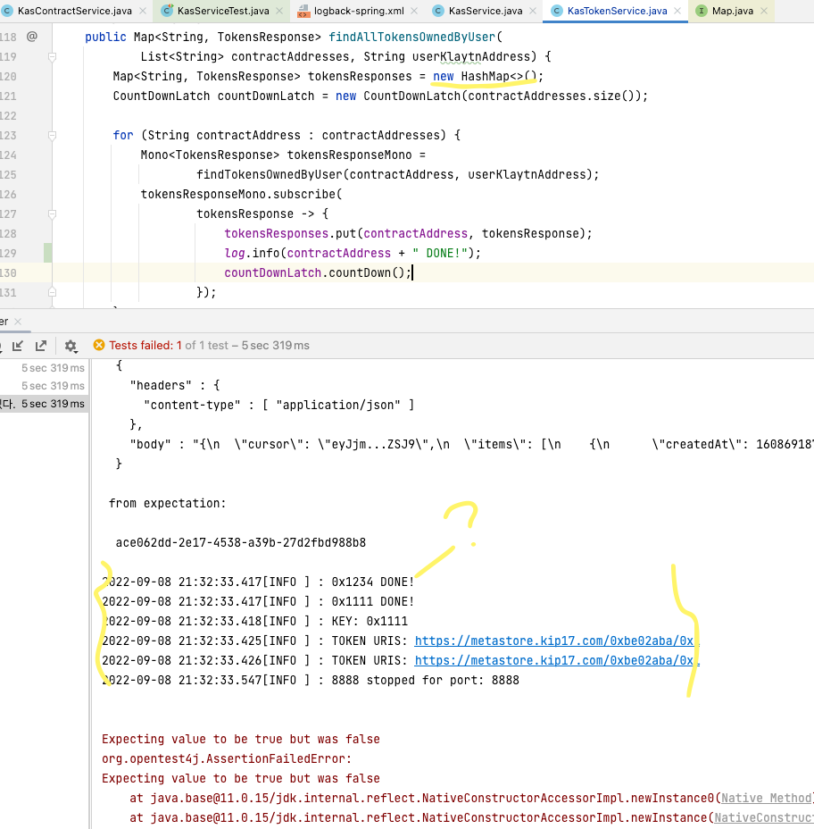

### 2022-09-08

## WebClient
- *참고: https://docs.spring.io/spring-framework/docs/current/reference/html/web-reactive.html#webflux-client*
- *참고: https://gngsn.tistory.com/198*
- **개요**
  - Spring 5.0에서 추가된 Non-Blocking 방식의 HTTP 클라이언
  - 리액터 베이스의 functional, fluent API
  - 선언적, 비동기적 로직 구현 가능 (쓰레드나 동시성 상관없이)
  - 넌블럭킹
  - 스트리밍 지원
  - 외부 API 요청시 리액티브 타입의 전송과 수신 (Mono, Flux)

- **특징**
  - 싱글 스레드 방식을 사용
  - Non-Blocking 방식을 사용
  - JSON, XML 쉽게 응답 받음

- **생성**
  - 정적 팩터리 메서드 사용
  - `WebClient.create()`
  - `WebClient.builder()`
  - 한번 생성된 WebClient는 불변 객체

- **동기적 사용**
  - 마지막에 .block()을 사용하여 막기

## retrieve()
- 어떻게 응답을 추출할 것인가
- .retrieve()
  - .toEntity(Person.class);
  - .bodyToMono(Person.class);
  - .bodyToFlux(Quote.class);
- body를 받아 디코딩하는 간단한 메서드
- 받은 응답을 bodyToFlux, bodyToMono 형태로 각각 Flux, Mono 객체로 바꿔줌
```java
private Mono<ResponseEntity<ResDTO>> retrievePostForMono(String uri, Map<String, String> body) {
    return webClient.post()
        .uri(uri)
        .bodyValue(body)
        .retrieve()
        .onStatus(HttpStatus::is4xxClientError, response -> 
            Mono.error(
                new CustomException(
                    response.rawStatusCode(),
                    response.bodyToMono(String.class),
                    response.headers().asHttpHeaders())
                )
            )
        )
        .toEntity(ResDTO.class);
}
```

## Blocking vs Non-Blocking
- **Blocking**
  - 어플리케이션이 커널로 작업 요청을 할 때, 커널에서 요청에 대한 로직을 처리
  - 어플리케이션은 요청에 대한 응답을 받을 때 까지 대기
  - 어플리케이션은 커널이 작업을 끝냈는지 백그라운드에서 지속적으로 확인

- **Non-Blocking**
  - 어플리케이션이 커널로 작업 요청을 하고, 바로 제어권을 받음
  - 그리고 다른 로직이 실행이 됨

## Sync vs Asynnc
- **Sync**
  - 작업 결과값을 직접 받아 처리하는 형식

- **Async**
  - 결과값을 받을 때 어떻게 처리할 지 "콜백함수"를 미리 정의해둠

## Blocking/Non-Blocking & Sync/Async 조합
- *참고: https://gngsn.tistory.com/154*
- 
- **Sync-Blocking**
  - 동기 방식의 블로킹은 수행한대로 순서에 맞게 수행
    - Application: 커널아 처리좀!
    - Kernel: 작업동안 기다려봐
    - Application: ㅇㅇ 기다릴게
    - ...
    - ...
    - Kernel: 끝났다. 여기 결과!

- **Sync-NonBlocking**
  - 동기 방식의 넌블로킹은 작업을 시작하고 제어권을 돌려주기에 다른 작업 수행할 수 있음
    - Application: 커널아 처리좀!
    - Kernel: 작업할게!
    - Application: 다함?
    - Kernel: 아직
    - Application: 다함?
    - Kernel: 아직
    - Application: 다함?
    - Kernel: 응 다했다! 여기 결과!

- **Async-Blocking**
  - 비동기에 블로킹 방식
    - Application: 커널아 여기 처리좀! 결과 나오면 알려줘~
    - Kernel: 작업동안 기다려봐
    - Application: ㅇㅇ 기다릴게
    - ...
    - ...
    - Kernel: 끝났다. 여기 결과!

- **Async-NonBlocking**
  - 비동기 방식의 넌블로킹
    - Application: 커널아 여기 처리좀! 결과 나오면 알려줘~
    - Kernel: 그래 다하면 알려줄게. 너 할거 하고 있어봐바
    - ...
    - Kernel: 다했다! 여기 결과!
    - Application: 땡큐!

## Mono/Flux
- *참고: https://github.com/gngsn/Gngsn-Spring-Lab/blob/master/concept-note/Reactor.md*
- **Reactor**
  - 리액티브 스트림을 구현하는 라이브러리
  - Flux, Mono 두가지 타입으로 스트림 정의
  - 일련의 작업 단계를 기술하는 것이 아닌, 데이터가 전달될 파이프라인을 구성
  - 파이프라인을 통해 데이터가 전달되는 동안 어떤 형태로든 변경/사용 가능

- **Mono/Flux**
  - 500개 이상의 오퍼레이션
    - 생성
    - 조합
    - 변환
    - 로직
  - **Mono**
    - 0개 or 1개의 데이터 항목과 에러를 가짐
  - **Flux**
    - 0개 or 여러개의 데이터 항목과 에러를 가

- **타입 생성**
  - 객체 -> 리액터
    - just() 메러드를 통해 리액티브 타입 생성
    - subscribe() 를 통해 리액티브 타입 전달받을 때 사용하는 메서드

## WebClient with CountDownLatch
- **현재 동기적으로 동작하는 코드**
  ```java
  public ContractItemsResponse getMyContracts() {
      String url = endPointGenerator.contractBaseUrl();
      Mono<ContractItemsResponse> response =
              kasWebClient.getForObject(url, ContractItemsResponse.class);
      return response.block();
  }
  ```

- **이러면 비동기적으로 동작하나?**
  ```java
  public ContractItemsResponse getMyContracts() {
      ContractItemsResponse contractItemsResponse = new ContractItemsResponse();
      String url = endPointGenerator.contractBaseUrl();
      Mono<ContractItemsResponse> response =
              kasWebClient.getForObject(url, ContractItemsResponse.class);
  
      CountDownLatch countDownLatch = new CountDownLatch(1);
      response.subscribe(
              res -> {
                  contractItemsResponse.setItems(res.getItems());
                  contractItemsResponse.setCursor(res.getCursor());
                  countDownLatch.countDown();
              });
  
      try {
          countDownLatch.await();
          return contractItemsResponse;
      } catch (InterruptedException e) {
          throw new RuntimeException(e);
      }
  }
  ```

## Connectable에서 WebClient 사용하기
- *참고: https://findmypiece.tistory.com/276*
- 하나의 API Call 하면서 CountDownLatch 쓰는거는 피차일반 성능상으로
  - 어차피 메인쓰레드 블락해야해
- 하지만, 여러개의 API이 발생하면 병렬적으로 처리되는 장점이 있음!
  - 컬렉션에 담아서 CountDownLatch로 대기해서 뚝딱 처리가 가능하구나!

## CountDownLatch
- *참고: https://codechacha.com/ko/java-countdownlatch/*
- **개요**
  - 어떤 쓰레드가 다른 쓰레드에서 작업이 완료될 때 까지 기다릴 수 있게 해주는 클래스
  - Main 쓰레드에서 5개의 쓰레드를 생성하여 작업 병렬 처리 지시
    - Main 쓰레드는 다른 쓰레드 종료되는 것 기다리지 않고 다음 코드 실행
  - CountDownLatch를 쓰면 다음코드 실행하지 않고 기다리게 할 수 있음
  - 쓰레드를 N개 실행시 일정 개수의 쓰레드가 모두 끝날 때 까지 기다리는 경우

- **사용법**
  ```java
  CountDownLatch countDownLatch = new CountDownLatch(5);  
  countDownLatch.countDown(); //Latch의 숫자가 1씩 감소
  countDownLatch.await(); //Latch의 숫자가 0이 될때까지 기다림
  ```

## HashMap 동시성
- *참고: https://woooongs.tistory.com/67*
- *참고: https://javaconceptoftheday.com/hashmap-vs-concurrenthashmap-in-java/*
- 자바의 HashMap은 Thread Safe 하지 않기 때문에 "동시에 여러 쓰레드"가 접근할 경우 synchronized 처리가 필요!
- ConcurrentHashMap은 내부적으로 synchronized 되어있기 때문에 쓰레드 safe하다!
  - add, delete synchronized 처리되어있음
- HashMap은 그렇지 않음
- Connectable 테스트코드에서 HashMap을 사용한 경우 똑바로 Map에 저장안된 경우 있음
- 로그상으로는 WebClient Call은 되었는데 저장이 안됨! <- 동시성 이슈
- 
