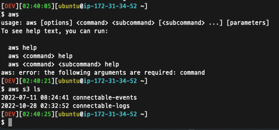
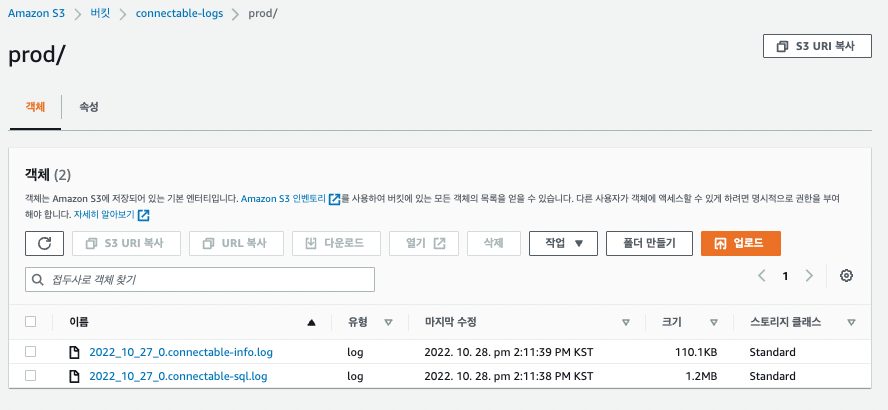

### 2022-10-28

## AWS CLI를 활용한 로그 S3에 백업
- AWS-CLI 설치 : https://lindarex.github.io/aws/ubuntu-aws-cli-installation/
  - aws-cli 설치한 뒤, IAM 권한을 부여해주면 계정에서 만든 s3 버킷 확인 가능!
  - 
- 다음과 같은 쉘 스크립트 + Crontab을 작성해 매일 0시 5분에 수행하도록 설정
  ```shell
  #!/bin/bash
  
  # Example command to send log -> s3
  #$ aws s3 cp 2022_10_21_0.connectable-info.log s3://connectable-logs/prod/2022_10_21_0.connectable-info.log
  
  yesterday_format=`date -d "yesterday" '+%Y_%m_%d'`
  echo $yesterday_format
  
  yesterday_format+='*'
  echo $yesterday_format
  
  # Internal Field Separator
  IFS=$'\n'
  FILES=(`find . -name $yesterday_format | rev | cut -d '/' -f1 | rev`)
  
  cd /home/ubuntu/logs/dateLog
  
  for VALUE in "${FILES[@]}"; 
  do aws s3 cp $VALUE s3://connectable-logs/prod/$VALUE; 
  done
  ```
  ```shell
  10 0 * * * /home/ubuntu/logs/log-backup.sh > /home/ubuntu/logs/crontab.log 2>&1 
  ```
- 결과
  - 

## JVM memory leak
- *참고: https://d2.naver.com/helloworld/1326256*
- *참고: https://techblog.woowahan.com/2628/*

## GC와 Java Reference
- *참고: https://d2.naver.com/helloworld/329631*

## 성능테스트
- *참고: https://techblog.woowahan.com/2572/*
