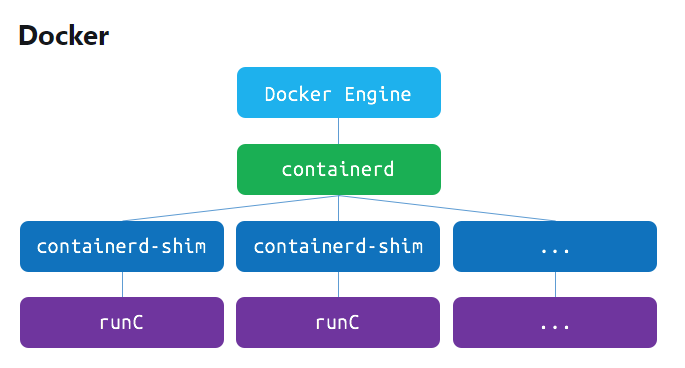

### 2022-03-02

## Docker Namespace
- *참고: https://tech.ssut.me/what-even-is-a-container/*
- *참고: https://anweh.tistory.com/67*
- **Container vs VM**
  - 하이퍼바이져 : OS 및 커널이 통째로 가상화
  - Container : filesystem의 가상화만을 이루며, 호스트 PC의 커널을 공유
  - 호스트 PC의 자원을 격리된 상태로 사용하기에 VM에 비해 성능저하 훨씬 적음

- **namespace란?**
  - 프로세스를 독립시켜주는 가상화 기술, 각 컨테이너에서 실행된 프로세스가 시스템 등에 대해 독립
  - VM : 각 게스트 머신별로 "독립적인 공간"을 제공하며, "서로가 충돌하지 않도록" 하는 기능 제공
  - 리눅스 : 6가지의 namespace 기능을 커널에 내장해둠 => 아래 6가지 기능으로 "독립적인 공간" 제공
    - mnt(파일 시스템 마운트) : 호스트 파일시스템에 구애받지 않고, 독립적으로 파일 시스템 마운트하거나 언마운트 가능
    - pid(프로세스) : 독립적인 프로세스 공간 할당
    - net(네트워크) : namespace간의 network 충돌 방지
    - ipc(SystemV IPC): namespace간의 network 충돌 방지 ex. 중복 포트 바인딩
    - uts(hostname) : 독립적인 hostname 할당
    - user(UID) : 독립적인 사용자 할당
  - namespace 기능은 공간을 공유하되, 조금 더 제한된 공간을 할당해주는 것
  - Linux : `nsenter` 라는 명령어로 namespace 공간에 접근
  - Docker : `docker exec` 라는 명령어로 docker namespace 공간에 접근

- **cgroups**
  - 자원에 대한 제어를 가능하게 해주는 리눅스 커널의 기능
  - 다음과 같은 리소스를 cgroup을 통해 제어 가능
    - 메모리
    - CPU
    - I/O
    - NW
    - /dev/
  - 최대 메모리 사용량 등을 cgroup에서 변경할 수 있는데, 이를 활용하여 container가 vm 마냥 리소스 할당량 제한 가능

- **OCI(Open Container Initative)**
  - LXC, LibContainer, runC : cgroup, namespace를 표준으로 정의해둔 OCI 스펙을 구현한 컨테이너 기술 구현체
  - Docker 1.8 이전 LXC를 이용해 구현, 이후에는 libcontainer -> runC로 자체 구현체를 가짐

- **Docker**
  - 
  - docker 1.11 버전 부터 다음과 같은 구조
  - Docker Engine : 이미지, 네트워크, 디스크 등의 관리 역할
  - containerd : OCI 구현체인 (주로 runC)를 이용해 container를 관리해주는 daemon
  - 가상의 격리환경 만들기
    - Container는 **리눅스의 namespace, cgroup 활용** 하여 구현됨!
    - namespace
      - 프로세스 별로 리소스 사용분리
      - VM에서는 그냥 Hardware 리소스 자체를 가상화
      - namespace는 Linux내의 자원을 가상화
        - pid namespaces, net namespaces, ipc namespaces, mnt namespaces, uts namespaces
    - cgroup
      - 메모리/CPU/NW/Device/IO 를 제한하여 사용
  - **도커를 통해 프로세스 격리, 프로세스에 필요한 컴퓨팅 자원 독립적으로 할당/격리해 완벽히 격리된 가상환경 구축**

- **놀토는 도커 몇버젼?**
  - 
