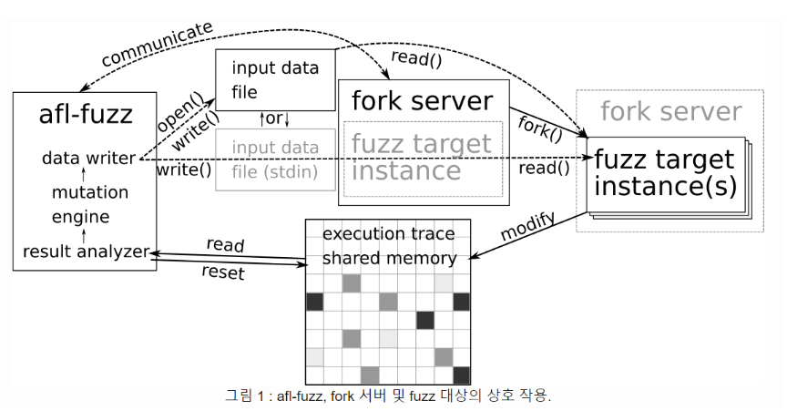

### 2022-05-17

## AFL Fuzzer
- *참고: https://wogh8732.tistory.com/272*
- *참고: https://d0ngr0thy.tistory.com/127*
- *참고: https://medium.com/@ayushpriya10/fuzzing-applications-with-american-fuzzy-lop-afl-54facc65d102*
- **AFL Fuzzer 원리**
  - 브루트 포스로 입력 받지만, 
  - 커버리지를 넓혀가며 프로그램 제어 흐름에 대한 변경 사항 기록하고, 
  - 이를 로깅해 Unique Crash 발견
  - 기본 코드에서 미묘한 오류 조건을 발견하는데 도움이 됨

- **AFL Fuzzer 특징**
  - 커버리지 기반 퍼저이기에 매우 효율적
  - 코드 커버리지 측정을 위한 코드를 "컴파일 타임"에 삽입
    - 코드 삽입 : Instrumentation

- **AFL Fuzzer 동작 로직**
  - 
  1. afl-fuzz에서 퍼징하려는 프로그램 실행
  2. 해당 프로그램 실행되면서 afl-fuzz와 pipe로 통신하면서 fork server 생성. 
  3. 새로운 타겟 인스턴스를 fork call()로 실행
  4. 표준 입력 or file로 들어온 입력이 fuzz 대상 프로그램으로 전달됨
  5. 실행된 결과를 공유 메모리에 기록하여 실행을 완료
  6. afl-fuzz는 공유 메모리에서 fuzz대상이 남긴 기록을 읽고 이전 항목을 변경하여 새로운 입력 만듦
  7. 새롭게 만든 입력은 다시 프로그램에 들어가서 실행됨

- **AFL Instrumentation**
  - 컴파일 타임에 프로그램에 삽입되어 edge coverage와 hit counts 측정
  - afl-gcc/afl-g++을 통해 컴파일 타임에 instrumentation이 추가됨
    - 기존의 gcc보다 afl-gcc가 더 많은 기능들을 수행함
    - instrumentation이 overwrite할 부분 save

- **Hangs**
  - Fuzzing 시작하면 AFL의 결과물을 crash 혹은 hang에 저장해 둠
    - crash는 어플리케이션이 crash 되게 한 테스트 케이스를,
    - hangs는 어플리케이션이 hang 되게 한 테스트 케이스를 저장해 둠
