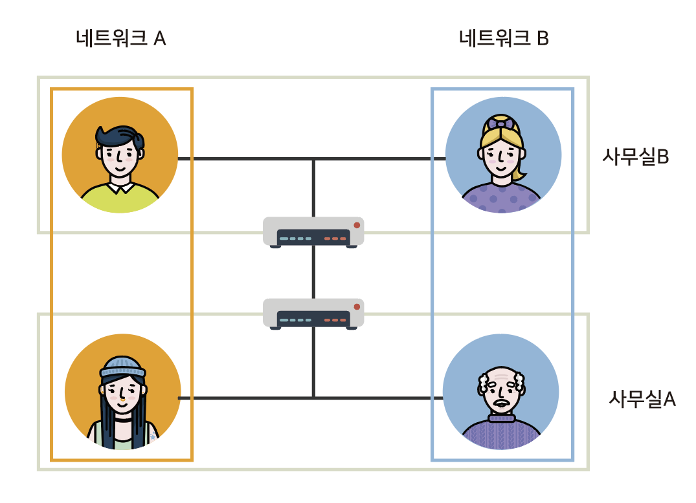

### 2022-06-27

## 스스로 구축하는 AWS 클라우드 인프라 (LAMP 웹 서버 및 Application Load Balancer 구성)
- **VPC**
  - *참고: https://docs.aws.amazon.com/ko_kr/vpc/latest/userguide/what-is-amazon-vpc.html*
  - 강의
    - AWS 공용 공간 => 내가 사용하는 네트워크 분리해서 쓰고 싶어... 이게 VPC (Virtual Private Cloud)
    - Edit DNS hostname
      - Enable: EC2 인스턴스 리소스 DNS hostname 사용할지
    - VPC 생성시 CIDR 블록 생성 (10.1.0.0/16)
  - 공부
    - VPC를 통해 사용자가 정의한 가상 네트워크로 AWS 리소스를 사용할 수 있음
    - 확장 가능한 인프라를 사용하면서, 고객의 자체 데이터 센터에서 운영하는 기존 네트워크와 유사하게 구현 가능
  - 용어 설명
    - VPC: 사용자의 AWS 계정 전용 가상 네트워크
    - 서브넷: VPC의 IP 주소 범위
    - CIDR 블록: 클래스 없는 도메인 간 라우팅, 인터넷 프로토콜 주소 할당 및 라우팅 집계 방법
    - 라우팅 테이블: 네트워크 트래픽을 전달할 위치를 결정하는데 사용하는 라우팅이라는 이름의 규칙 집합
    - 인터넷 게이트웨이: VPC의 리소스와 인터넷 간의 통신을 활성화하기 위해 VPC에 연결하는 게이트웨이
    - NAT 게이트웨이: 프라이빗 서브넷의 EC2가 인터넷/타 VPC에 연결되도록 허용하는 서비스

- **Subnet**
  - VPC 나눠둔 하위 네트워크가 Subnet
  - Subnet의 CIDR 블록
  - VPC의 IP 대역을 나누는 것
    - Subnet의 CIDR 블록이 VPC의 CIDR 블록보다 작아야함
    - 총 6개를 만든다고 가정한다면
    - 10.1.1.0/24

- **Internet gateway & Route Table**
  - 트래픽이 이동할 수 있는 통로를 만들어보자!
  - Internet gateway: 특정 VPC에 Attach 해줘야 함!
  - route table: 어떤 경로를 따라 트래픽이 이동할지? 
    - subnet association => 라우트 테이블에서 public-subnet 이동을 할 수 있도록, 통신할 수 있도록 추가
    - Edit route에서...
      - 0.0.0.0/0, 인터넷 게이트웨이로 설정하고 Save Change
    - 각 public/private subnet에 대한 Route table을 설정해줄 것

## AWS VPC 공부하기
- *참고: https://medium.com/harrythegreat/aws-%EA%B0%80%EC%9E%A5%EC%89%BD%EA%B2%8C-vpc-%EA%B0%9C%EB%85%90%EC%9E%A1%EA%B8%B0-71eef95a7098*
- **VPN은 알아?**
  - 
  - 같은 네트워크에 있더라도, 다른 네트워크에 있는 것 처럼 동작시키기 위해 VPN을 사용
  - 네트워크A와 네트워크B가 실제로 같은 네트워크에 있지만, 다른 네트워크인 것 처럼 동작

- **AWS의 VPC**
  - VPC가 없다면, EC2 인스턴스가 거미줄처럼 인터넷과 연결 => 시스템의 복잡도 끌어올림 + 관리 포인트 다수
  - VPC 적용시, 위 그림과 같이 VPC 별로 네트워크 구성 가능
  - 

- **VPC 구축하는 과정**
  - VPC의 IP 범위를 사설IP 대역에 맞추어 구축할 것
  - 내부에서 쓰는 주소를 사설 IP대역이라고 부름 => 내부 네트워크 내에서 위치를 찾아갈 때 사용함
  - VPC에서 사용하는 사설 IP 대역
    - 10.0.0.0 ~ 10.255.255.255 (10/8 prefix)
    - 172.16.0.0 ~ 172.31.255.255 (182.16/12 prefix)
    - 192.168.0.0 ~ 192.168.255.255 (192.168/16 prefix)

- **서브넷**
  - 서브넷은 VPC를 잘게 쪼개는 과정
  - VPC보다 더 작은단위라서 서브넷 마스크가 더 높게 되고 IP 범위가 더 작은 값을 가짐
  - 서브넷을 나누면 "더 많은 네트워크망"을 만들 수 있음
  - 서브넷 안에 RDS, EC2와 같은 리소스들을 위치시킬 수 있음

- **라우팅 테이블과 라우터**
  - 네트워크 요청이 발생 => 데이터는 라우터 => 정의된 라우팅 테이블에 따라 작동

- **인터넷 게이트웨이**
  - VPC와 인터넷을 연결해주는 하나의 관문
  - 서브넷B의 라우팅테이블 => 0.0.0.0/0 
    - 모든 트래픽에 대해 IGA A로 향하라는 뜻
  - 퍼블릭 서브넷: 인터넷과 연결되어있는 서브넷 
  - 프라이빗 서브넷: 인터넷과 연결되어있지 않은 서브넷
