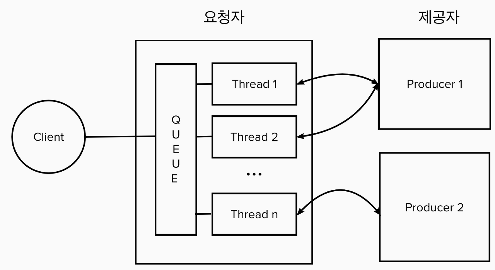
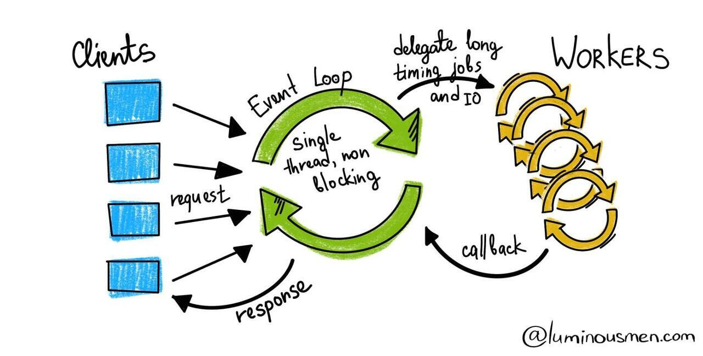

### 2022-07-16

## Spring RestTemplate
- *참고: https://velog.io/@soosungp33/%EC%8A%A4%ED%94%84%EB%A7%81-RestTemplate-%EC%A0%95%EB%A6%AC%EC%9A%94%EC%B2%AD-%ED%95%A8*
- *참고: https://tecoble.techcourse.co.kr/post/2021-07-25-resttemplate-webclient/*
- **RestTemplate의 동작 원리**
  - HttpClient는 HTTP를 사용하여 통신하는 범용 라이브러리
  - RestTemplate은 HttpClient를 추상화하여 제공
  - 동작 원리
    1. RestTemplate을 생성해 URI, HTTP 메서드 등의 헤더를 담아 요청
    2. RestTemplate이 HttpMessageConverter를 사용해 requestEntity를 요청 메시지로 변환
    3. RestTemplate은 ClientHttpRequestFactory로 부터 ClientHttpRequest를 가져와서 요청 보냄
    4. ClientHttpRequest는 요청 메시지를 만들어 HTTP 프로토콜을 통해 서버와 통신
    5. RestTemplate는 ResponseErrorHandler로 오류를 확인한다면 에러 처리
    6. ResponseErrorHandler는 오류가 있다면 ClientHttpResponse에서 응답데이터 가져와 처리
    7. RestTemplate는 HttpMessageConverter를 이용해서 응답메시지를 java object로 변환
    8. 어플리케이션에 반환

- **RestTemplate 처리방식**
  - 
    - 요청자 어플리케이션 구동시에 Thread pool 만들어 둠
    - Request는 Queue에 쌓이고 가용한 쓰레드 있으면 그 쓰레드에 할당되어 처리됨
      - 1요청당 1스레드
    - Blocking 방식의 처리라 다른 요청에 할당 될 수 없음
    - 스레드가 다 차는 경우 Queue에 대기하게 됨
    - 네트워킹이나 DB와의 통신에서 병목 발생

- **RestTemplate vs WebClient**
  - RestTemplate?
    - HTTP 통신에 유용하게 쓰일 템플릿
    - REST 서비스 호출에 용이
    - 특징
      - 통신 단순화, RESTFUL
      - 멀티쓰레드 방식 사용
      - 블록킹 방식 사용
    - 사용
      - 어떤 HttpClient를 사용할 것인지 ClientHttpRequestfactory를 전달하여 지정 가능
      - 빈으로도 설정 가능함
    - Multi-Thread와 Blocking 방식 사용

  - WebClient?
    - 싱글 스레드 방식
    - 넌블로킹 방식 사용
    - JSON/XML 쉽게 응답 받음
    - 사용
      - WebClient.create()
      - Builder 사용

  - 둘의 차이점?
    - Non-Blocking과 비동기화 가능 여부
      - Non-Blocking
        - 시스템을 호출한 직후 프로그램으로 제어가 다시 돌아와 시스템 호출의 종료를 기다리지 않고 다음 동작 진행
        - 동시에 다른 작업 진행할 수 있어 작업속도 빨라짐
        - 네트워킹의 병목을 줄이고 성능 향상 가능
    - 1000명의 사용자까지는 처리속도 비슷하지만, 규모 생기면 WebClient 압승

## WebClient
- *참고: https://gngsn.tistory.com/154*
- **원리**
  - Single Thread와 Non-Blocking 방식을 사용
  - Core당 1개의 쓰레드
  - 
    - Event Loop내에 Job으로 등록
    - 결과를 기다리지 않고 다른 Job 처리
    - 제공자로부터 Callback 응답오면 그 결과를 요청자에게 제공

- **사용법 생성 및 수정**
  - create()
  ```java
  WebClient.create();
  // or
  WebClient.create("http://localhost:8080");
  ```
  - build()
  ```java
  WebClient client = WebClient.builder()
          .baseUrl("http://localhost:8080")
          .defaultCookie("cookieKey", "cookieValue")
          .defaultHeader(HttpHeaders.CONTENT_TYPE, MediaType.APPLICATION_JSON_VALUE)
          .defaultUriVariables(Collections.singletonMap("url", "http://localhost:8080"))
          .build();
  ```
  - Configuration
  ```java
  HttpClient httpClient = HttpClient.create()
          .option(ChannelOption.CONNECT_TIMEOUT_MILLIS, 5000)
          .responseTimeout(Duration.ofMillis(5000))
          .doOnConnected(conn -> 
              conn.addHandlerLast(new ReadTimeOutHandler(5000, TimeUnit.MILLISECONDS))
                  .addHandlerLast(new WriteTimeOutHandler(5000, TimeUnit.MILLISECONDS)));
  
  WebClient client = WebClient.builder()
          .clientConnector(new ReactorClientHttpConnector(httpClient))
          .build();
  ```
  - mutate()
  ```java
  WebClient client1 = WebClient.builder()
          .filter(filterA).filter(filterB).build();
  WebClient client2 = client1.mutate()
          .filter(filterC).filter(filterD).build();
  ```

- **GET**
  1. Flux
  ```java
  @Autowired
  WebClient webClient;
  
  public Flux<Employee> findAll() {
      return webClient.get()
          .uri("/employees")    
          .retrieve()
          .bodyToFlux(Employee.class);
  }
  ```
  2. Mono
  ```java
  @Autowired
  WebClient webClient;
  
  public Mono<Employee> findById(int id) {
     return webClient.get()
         .uri("/employees" + id)    
         .retrieve()
         .bodyToMono(Employee.class);
  }
  ```
  - 쿼리스트링
  ```java
  public String uriBuilder(String uri, MultiValueMap<String, String> params) {
    return UriComponentsBuilder
        .fromUriString(uri)    
        .queryParams(params)
        .toUriString();
  }
  ```

- **POST**
  1. Mono
  ```java
  @Autowired
  WebClient webClient;
  
  public Mono<Employee> create(Employee empl) {
      return webClient.post()
          .uri("/employees")    
          .body(Mono.just(empl), Employee.class)
          .retrieve()
          .bodyToMono(Employee.class);
  }
  ```
  
- **예외처리**
  - retrieve()
```java
Mono<Person> result = client.get()
        .uri("/persons/id")
        .accept(MediaType.APPLICATION_JSON)
        .retrieve()
        .onStatus(HttpStatus::is4xxClientError, response -> ...)
        .onStatus(HttpStatus::is5xxServerError, response -> ...)
        .bodyToMono(Person.class);
```


## 블로킹 vs 넌블로킹 / 동기 vs 비동기
- *참고: https://velog.io/@nittre/%EB%B8%94%EB%A1%9C%ED%82%B9-Vs.-%EB%85%BC%EB%B8%94%EB%A1%9C%ED%82%B9-%EB%8F%99%EA%B8%B0-Vs.-%EB%B9%84%EB%8F%99%EA%B8%B0*
- *참고: https://www.youtube.com/watch?v=oEIoqGd-Sns*
- *참고: https://musma.github.io/2019/04/17/blocking-and-synchronous.html*
- **Blocking vs Non-Blocking**
  - 다른 주체가 작업할때 자신에게 **제어권**이 있는가?
  - 행위 자체가 막혀버린, 제한된, 대기하는 상태
  - Blocking
    - 자신의 작업을 진행하다가 다른 주체의 작업 시작시 다른 작업 끝날때까지 기다렸다가 자신의 작업 시작하는 것
    - 자신이 할 일을 모두 마칠 때까지 제어권을 계속 가지고서 호출한 함수에게 바로 돌려주지 않으면 Block
  - Non-Blocking
    - 다른 주체의 작업에 관련없이 자신의 작업을 하는 것
    - 자신이 할 일을 채 마치지 않았더라도 바로 제어권을 건네주어 다른 일을 진행할 수 있도록 해줌

- **Sync vs Async**
  - 결과를 돌려주었을 때 순서와 결과에 관심이 있는지 아닌지로 판단할 수 있다
  - 동시에 발생하는 것들, 같이/함께 무엇인가가 이루어지는 두 개 이상의 개체 혹은 이벤트
  - sync
    - 동기, 작업을 동시에 수행하거나, 동시에 끝나거나, 끝나는 동시에 시작함을 의미
    - 호출한 함수의 수행 결과 및 종료를 호출한 함수가 신경씀
  - async
    - 비동기, 시작/종료가 일치하지 않으며 끝나는 동시에 시작하지 않음을 의미
  - 