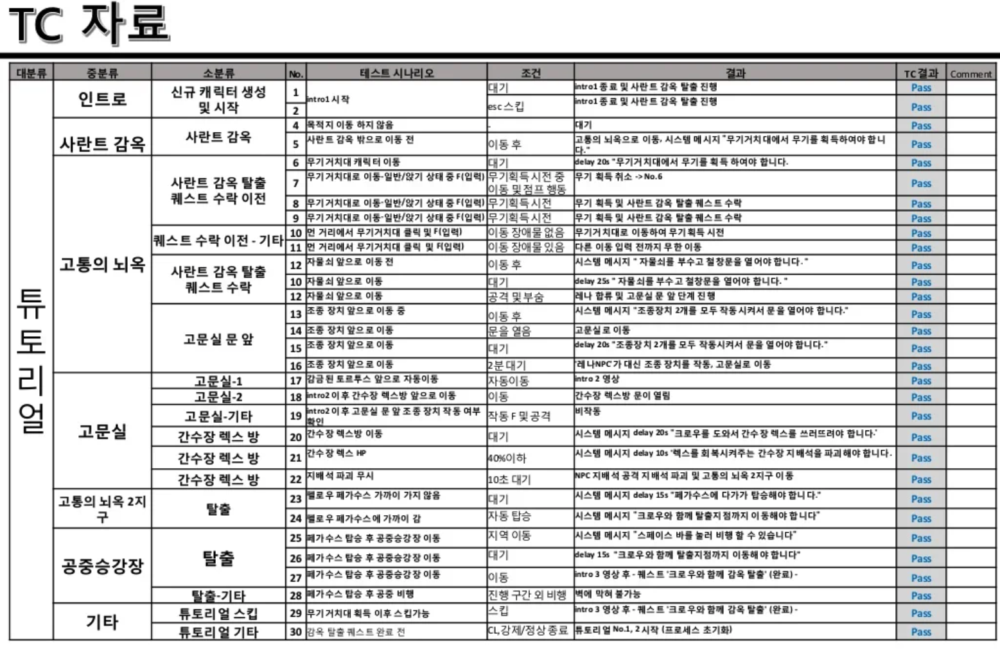

### 2022-08-04

## QA: 테스트 케이스(TC), 체크리스트(CL)
- *참고: https://brunch.co.kr/@gift206/29*
- *참고: https://tech.devsisters.com/posts/not-enough-testcase/*
- *참고: https://inpa.tistory.com/entry/%F0%9F%A7%AA-%EC%B2%B4%ED%81%AC%EB%A6%AC%EC%8A%A4%ED%8A%B8*
- **테스트 결과 전달하기**
  1. PASS
  2. FAIL (의도와 다름)
  3. N/A (결과가 없음)
  4. BLOCK (FAIL이나 N/A에 영향을 받음)

- **행복의 위험성**
  - Happy Path Testing (행복 경로 테스팅)
    - 환경/조건/입력값/사용자 등의 변수가 가장 이상적인 경우만 테스트
  - 위험성
    1. 게임 외부 환경 변수 무시
       - 모바일 디바이스의 다양한 종류
       - 서비스 통신사 속도/환경/품질
       - OS 알려진 이슈 파악
    2. 예측하지 못한 유저의 사용 패턴 및 반응을 고려하지 않는다
       - 유저가 서비스를 의도대로 사용하지 않음
       - 어뷰징, 크래킹의 위험
    3. 사람이 항상 완벽하게 일을 처리할 것이라 가정한다
       - 코드에 오타
       - 데이터 빈값

- **테스트 케이스(TC)**
  - 테스트 용이나 검사 용 입력 데이터의 샘플을 사용해 정확성이나 완전성을 검증하는 것
  - 테스트에 대한 다양한 조건과 "기대 결과" 나열한 것
  - 구조적인 형태
    - 순서: 케이스의 넘버링
    - 분류: 테스트 조건을 묶어서 분류별로 정리. 대/중/소 등으로 구분 가능
    - 사전 조건: 테스트 조건을 확인하기 위해 사전에 준비될 부분
    - 스텝: 테스트 조건을 실행하기 위한 스텝
    - 기대 결과: 스텝을 통해 어떤 결과가 나와야하는지에 대한 기대 결과
    - 결과값: 해당 케이스의 결과. 통과/실패
    - 비고: 결과에 따른 내용 정리

- **체크 리스트(CL)**
  - 테스팅 절차, 기능, 시스템 요소등에 대한 체크리스트 작성
  - 체크 내역: 특정 행동/특성/산물 등을 나열한 목록
  - 일반 체크리스트
    - 수행해야 할 테스트 목록과 절차를 나열
  - 블랙 체크리스트
    - 최상위 기능 체크
    - 개별적인 컴포넌트 기능
    - 서로 다른 레벨의 기능과 그룹핑
  - 시스템 요소 체크리스트
    - 상위 레벨 서브 시스템이나 모듈
    - 개인 구문이나 데이터 아이템
    - 서로 다른 레벨의 시스템 요소와 그룹핑
  - 구조적인 형태
    - 순서: 해당 체크리스트의 넘버링
    - 항목 명 및 체크 내용: 체크할 내용
    - 체크박스: 해당 내용에 대한 결과
    - 비고: 결과에 따른 내용 정리

- 
