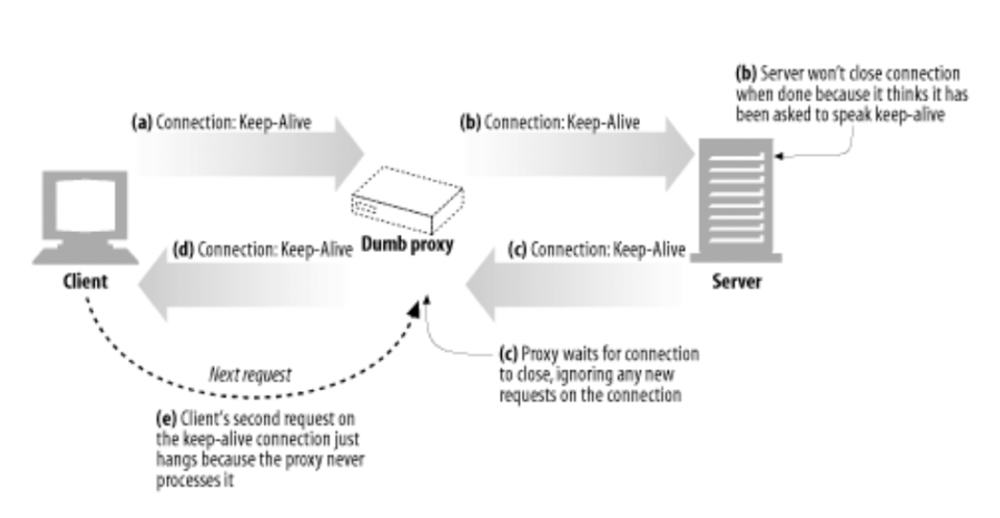
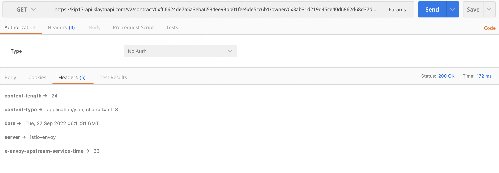

### 2022-09-27

## WebClient 에러 로그
```
19:54:04.891 [ERROR] [reactor-http-epoll-4] [reactor.core.publisher.Operators] - Operator called default onErrorDropped
reactor.core.Exceptions$ErrorCallbackNotImplemented: org.springframework.web.reactive.function.client.WebClientRequestException: readAddress(..) failed: Connection reset by peer; 
nested exception is io.netty.channel.unix.Errors$NativeIoException: readAddress(..) failed: Connection reset by peer
Caused by: org.springframework.web.reactive.function.client.WebClientRequestException: readAddress(..) failed: Connection reset by peer; 
nested exception is io.netty.channel.unix.Errors$NativeIoException: readAddress(..) failed: Connection reset by peer
	at org.springframework.web.reactive.function.client.ExchangeFunctions$DefaultExchangeFunction.lambda$wrapException$9(ExchangeFunctions.java:141)
	Suppressed: reactor.core.publisher.FluxOnAssembly$OnAssemblyException: 
Error has been observed at the following site(s):
	*__checkpoint ⇢ Request to GET https://kip17-api.klaytnapi.com/v2/contract/0xe99540401ef24aba1b7076ea92c94ec38536c6fb/owner/0x3ab31d219d45ce40d6862d68d37de6bb73e21a8d [DefaultWebClient]
Original Stack Trace:
		at org.springframework.web.reactive.function.client.ExchangeFunctions$DefaultExchangeFunction.lambda$wrapException$9(ExchangeFunctions.java:141)
		at reactor.core.publisher.MonoErrorSupplied.subscribe(MonoErrorSupplied.java:55)
		at reactor.core.publisher.Mono.subscribe(Mono.java:4397)
		at reactor.core.publisher.FluxOnErrorResume$ResumeSubscriber.onError(FluxOnErrorResume.java:103)
		at reactor.core.publisher.FluxPeek$PeekSubscriber.onError(FluxPeek.java:222)
		at reactor.core.publisher.FluxPeek$PeekSubscriber.onError(FluxPeek.java:222)
		at reactor.core.publisher.FluxPeek$PeekSubscriber.onError(FluxPeek.java:222)
		at reactor.core.publisher.MonoNext$NextSubscriber.onError(MonoNext.java:93)
		at reactor.core.publisher.MonoFlatMapMany$FlatMapManyMain.onError(MonoFlatMapMany.java:204)
		at reactor.core.publisher.SerializedSubscriber.onError(SerializedSubscriber.java:124)
		at reactor.core.publisher.FluxRetryWhen$RetryWhenMainSubscriber.whenError(FluxRetryWhen.java:225)
		at reactor.core.publisher.FluxRetryWhen$RetryWhenOtherSubscriber.onError(FluxRetryWhen.java:274)
		at reactor.core.publisher.FluxConcatMap$ConcatMapImmediate.drain(FluxConcatMap.java:415)
		at reactor.core.publisher.FluxConcatMap$ConcatMapImmediate.onNext(FluxConcatMap.java:251)
		at reactor.core.publisher.EmitterProcessor.drain(EmitterProcessor.java:537)
		at reactor.core.publisher.EmitterProcessor.tryEmitNext(EmitterProcessor.java:343)
		at reactor.core.publisher.SinkManySerialized.tryEmitNext(SinkManySerialized.java:100)
		at reactor.core.publisher.InternalManySink.emitNext(InternalManySink.java:27)
		at reactor.core.publisher.FluxRetryWhen$RetryWhenMainSubscriber.onError(FluxRetryWhen.java:190)
		at reactor.core.publisher.MonoCreate$DefaultMonoSink.error(MonoCreate.java:201)
		at reactor.netty.http.client.HttpClientConnect$HttpObserver.onUncaughtException(HttpClientConnect.java:400)
		at reactor.netty.ReactorNetty$CompositeConnectionObserver.onUncaughtException(ReactorNetty.java:670)
		at reactor.netty.resources.DefaultPooledConnectionProvider$DisposableAcquire.onUncaughtException(DefaultPooledConnectionProvider.java:205)
		at reactor.netty.resources.DefaultPooledConnectionProvider$PooledConnection.onUncaughtException(DefaultPooledConnectionProvider.java:454)
		at reactor.netty.channel.FluxReceive.drainReceiver(FluxReceive.java:232)
		at reactor.netty.channel.FluxReceive.onInboundError(FluxReceive.java:453)
		at reactor.netty.channel.ChannelOperations.onInboundError(ChannelOperations.java:488)
		at reactor.netty.channel.ChannelOperationsHandler.exceptionCaught(ChannelOperationsHandler.java:126)
		at io.netty.channel.AbstractChannelHandlerContext.invokeExceptionCaught(AbstractChannelHandlerContext.java:302)
		at io.netty.channel.AbstractChannelHandlerContext.invokeExceptionCaught(AbstractChannelHandlerContext.java:281)
		at io.netty.channel.AbstractChannelHandlerContext.fireExceptionCaught(AbstractChannelHandlerContext.java:273)
		at io.netty.channel.CombinedChannelDuplexHandler$DelegatingChannelHandlerContext.fireExceptionCaught(CombinedChannelDuplexHandler.java:424)
		at io.netty.channel.ChannelHandlerAdapter.exceptionCaught(ChannelHandlerAdapter.java:92)
		at io.netty.channel.CombinedChannelDuplexHandler$1.fireExceptionCaught(CombinedChannelDuplexHandler.java:145)
		at io.netty.channel.ChannelInboundHandlerAdapter.exceptionCaught(ChannelInboundHandlerAdapter.java:143)
		at io.netty.channel.CombinedChannelDuplexHandler.exceptionCaught(CombinedChannelDuplexHandler.java:231)
		at io.netty.channel.AbstractChannelHandlerContext.invokeExceptionCaught(AbstractChannelHandlerContext.java:302)
		at io.netty.channel.AbstractChannelHandlerContext.invokeExceptionCaught(AbstractChannelHandlerContext.java:281)
		at io.netty.channel.AbstractChannelHandlerContext.fireExceptionCaught(AbstractChannelHandlerContext.java:273)
		at io.netty.handler.ssl.SslHandler.exceptionCaught(SslHandler.java:1105)
		at io.netty.channel.AbstractChannelHandlerContext.invokeExceptionCaught(AbstractChannelHandlerContext.java:302)
		at io.netty.channel.AbstractChannelHandlerContext.invokeExceptionCaught(AbstractChannelHandlerContext.java:281)
		at io.netty.channel.AbstractChannelHandlerContext.fireExceptionCaught(AbstractChannelHandlerContext.java:273)
		at io.netty.channel.DefaultChannelPipeline$HeadContext.exceptionCaught(DefaultChannelPipeline.java:1377)
		at io.netty.channel.AbstractChannelHandlerContext.invokeExceptionCaught(AbstractChannelHandlerContext.java:302)
		at io.netty.channel.AbstractChannelHandlerContext.invokeExceptionCaught(AbstractChannelHandlerContext.java:281)
		at io.netty.channel.DefaultChannelPipeline.fireExceptionCaught(DefaultChannelPipeline.java:907)
		at io.netty.channel.epoll.AbstractEpollStreamChannel$EpollStreamUnsafe.handleReadException(AbstractEpollStreamChannel.java:728)
		at io.netty.channel.epoll.AbstractEpollStreamChannel$EpollStreamUnsafe.epollInReady(AbstractEpollStreamChannel.java:826)
		at io.netty.channel.epoll.EpollEventLoop.processReady(EpollEventLoop.java:487)
		at io.netty.channel.epoll.EpollEventLoop.run(EpollEventLoop.java:385)
		at io.netty.util.concurrent.SingleThreadEventExecutor$4.run(SingleThreadEventExecutor.java:997)
		at io.netty.util.internal.ThreadExecutorMap$2.run(ThreadExecutorMap.java:74)
		at io.netty.util.concurrent.FastThreadLocalRunnable.run(FastThreadLocalRunnable.java:30)
		at java.base/java.lang.Thread.run(Thread.java:829)
Caused by: io.netty.channel.unix.Errors$NativeIoException: readAddress(..) failed: Connection reset by peer
```
- Connection Provider : https://github.com/reactor/reactor-netty/issues/1774

## 유의미한 에러 로그
- **Operator called default onErrorDropped**
  - *참고: https://tacogrammer.com/onerrordropped-explained/*
  - 높은 동시성을 처리하려고 리액티브 쓰는건데... 비동기로 여러 장소에서 데이터 수신하면 해당 에러 발생할 수도
  - 이미 **다른 스레드에서 onError가 발생**해 **전체 스트림이 terminated**된 상황인 경우

- **The connection observed an error, the request cannot be retried as the headers/body were sent
  io.netty.channel.unix.Errors$NativeIoException: 
  readAddress(..) failed: Connection reset by peer**
  - *참고: https://stackoverflow.com/questions/55233216/spring-webflux-webclient-logs-connection-reset-by-peer*
    - 문제: Client goes away after connecting to it once and the next request fails - then retries
      - 클라이언트가 한번 커넥트 시도하고 그다음 리퀘스트가 fail 한 경우 사라짐
    - 해결: Connection pooling을 없애보는건 어떠니? 
     ```java
     @Bean
     public WebClient webClient() {
         return WebClient.builder()
                  .clientConnector(connector())
                  .build();
     }

     private ClientHttpConnector connector() {
         return new ReactorClientHttpConnector(HttpClient.from(TcpClient.newConnection()));
     }
     ```
  - *참고: https://github.com/reactor/reactor-netty/issues/388*
    - 약간 고질적인 문제같은데...?

## Connection reset by Peer
- *참고: https://groups.google.com/g/vertx/c/3o_DEwIK9dY*
- 커넥션이 다른 쪽에서 끊어진 경우 호출됨
  - 타 웹서버에서 connection을 끊은경우 호출됨
  - 타 웹서버는 idle connection을 몇초 후에 끊어버리는것이 일반적

## Keep-Alive
- *참고: https://developer.mozilla.org/ko/docs/Web/HTTP/Headers/Keep-Alive*
- *참고: https://etloveguitar.tistory.com/137*
- *참고: https://goodgid.github.io/HTTP-Keep-Alive/*
- `Keep-Alive: timeout=x, max=y`
  - 각각 등호로 구분되는 식별자와 값으로 구성됨
  - timeout: 유휴 연결이 계속 열려있어야 되는 최소한의 시간
  - max: 연결이 닫히기 이전에 전송될 수 있는 최대 요청 수
  - HTTP/1.0+ 부터 지원

- **Persistent Connection**
  - Persistent Connection: 요청 처리 이후에도 connection 유지하는 것
    - site locality: 서버에 연속적으로 동일한 클라이언트가 여러 요청을 보낼 가능성이 높은 경우
    - HTTP/1.1 부터 HTTP 어플리케이션이 TCP Connection을 요청마다 close하지 않고 재사용할 수 있는 방법 제공
  - 왜 필요하지?
    - TCP 연결 맺기 위해 SYN-ACK 3-way handshake 매 요청마다 맺을 필요가 없어짐
      1. 네트워크 혼잡 감소: TCP, SSL/TCP connection request 수 줄어듦
      2. 네트워크 비용 감소: 여러개의 connection으로 하나의 client 요청 serving하는 것 보다는 한개의 client 요청 서빙하는게 효율적
      3. latency 감소: 3-way-handshake round-trip 줄어듦

- **Keep-Alive 옵션 규칙들**
  - 클라이언트 측에서 모든 요청에 위에 언급한 헤더를 담아 보내야 함
    - 그게 아니라면 서버는 연결을 close 함
  - 서버 또한 persistent 하게 요청 주고받다가 response에 keep-alive 관련 헤더 안 담겨오면 클라이언트 측에서 서버가 persistent connection 맺고 있지 않다고 판단
  - 정확한 Content-Length 사용할 것
  - **Connection 헤더를 지원하지 않는 Proxy에서는 사용할 수 없음**
  - 클라이언트는 언제든 connection close 될 수 있으니 retry 로직 준비해 둘 것

- **Keep-Alive & 멍청한 Proxy**
  - 
  - Proxy : 전 Keep-Alive 몰라요!
  - Client <-> Proxy <-> Server
    - Client -> Proxy : Keep-Alive
      - Proxy -> Server : Keep-Alive
        - 서버 입장 : "어 Proxy"가 Keep-Alive 지원하네? 커넥션 켜놔야지~
      - Server -> Proxy : Keep-Alive
        - 프록시 입장 : Keep-Alive가 뭐여... 일단 전달. 
          - 삭제하지 않고 요청 그대로를 전달하는게 문제!
    - Proxy -> Client : Keep-Alive
      - 오케이 연결됐다!
  - Client 동일한 Connection에 request
    - Proxy에서는 이미 끊내버린 Connection => 해당 요청 무시 => handshake 안해서 그런가보다
    - Client 입장에서 다음 요청을 보내기 시작할 때 커넥션이 유지되고 있는 프록시에 요청을 보냄
    - 프록시는 같은 커넥션상에서 다른 요청이 오는 경우는 예상하지 못하기 때문에 해당 요청은 프록시로 부터 무시됨
    - Client는 무한정 대기하다 타임아웃 나서 커넥션이 끊김

## WebClient Default Keep-Alive
- *참고: https://stackoverflow.com/questions/4699013/does-webclient-use-keepalive*
- 독스엔 없지만 일단 그런듯

## KAS Keep-Alive
- 
- 일단 KAS는 Connection 관련한 헤더를 응답해주지 않음
  - 요청에 Connection = Keep-Alive, Proxy-Connection=Keep-Alive 보내도 똑같음
- 뭐 프록시를 쓰던, 그냥 서버던 Connection 응답이 없다는 건 Keep-Alive 

## 그럼 KAS 모듈 어떻게 해야지..?
- 우선 매번 HTTP 요청을 단독으로 할 수 있도록 하자. (3-way-handshake 하고 연결 수립)
  - 이렇게 하면 요청에 대한 Connection을 재활용 안하니까 Timeout 이 안날 것 같아
  - Timeout보다만 빠르면 우선 현 상황보단 발전한거니까

## WebClient Timeout & Connection Pool
- *참고: https://yangbongsoo.tistory.com/30*
- **WebClient Timeout**
  ```java
  new ReactorClientHttpConnector(
      reactorResourceFactory,
      httpClient -> httpClient
          .option(ChannelOption.CONNECT_TIMEOUT_MILLIS, 5000)
          .doOnConnected(connection -> 
              connection.addHandlerLast(new ReadTimeoutHandler(5))
          ).addHandlerLast(new WriteTimeoutHandler(5)
          ).responseTimeout(Duration.ofSeconds(5))
  );
  ```
  - ChannelOption.CONNECT_TIMEOUT_MILLIS
    - 서버와 커넥션 맺는데 기다리는 시간. http client level
  - responseTimeout
    - idle 커넥션을 맺거나 하는 시간을 고려하지 않은 순수 http 요청/응답 시간에 대한 timout
  - ReadTimeoutHandler/WriteTimeoutHandler
    - TCP level에서 적용되기에, TLS handshake 기간도 포함
    - HTTP 응답에 대해 원하는 것 보다 timeout 높게 설정할 것
    - HTTP와 관련 없음
    - 다른 read 작업들 사이에 시간 체크하는 표준 네티 핸들러

- **WebClient Connection Pool**
  ```java
  ConnectionProvider provider = ConnectionProvider.builder("ybs-pool")
          .maxConnections(500)
          .pendingAcquireTimeout(Duration.ofMillis(0))
          .pendingAcquireMaxCount(-1)
          .maxIdleTime(Duration.ofMillis(8000L))
          .maxLifeTime(Duration.ofMillis(8000L))
          .build();
  ```
  - maxLifeTime: 커넥션 풀에서 살아있을 수 있는 커넥션의 최대 수명시간
  - maxIdleTime: 커넥션 풀에서 idle 상태의 커넥션 유지하는 시간
  - PendingAcquireTimeout: 커넥션 풀에서 커넥션 얻기위해 기다리는 최대 시간

## reactor-http-epoll-#
- *참고: https://projectreactor.io/docs/netty/snapshot/reference/index.html#_connection_pool*
- 이건 쓰레드 풀로 동작하는건가?
- WebClient도 커넥션 풀을 만들어 둘 수 있어
```
By default, the TCP client uses a “fixed” connection pool with 500 
as the maximum number of the channels, 
45s as the pending acquire timeout and 1000 as the maximum number of 
the registered requests for acquire to keep in the pending queue. 
This means that the implementation creates a new channel 
if someone tries to acquire a channel but none is in the pool. 
When the maximum number of the channels in the pool is reached, 
new tries to acquire a channel are delayed 
until a channel is returned to the pool again. 
The implementation uses FIFO order for channels in the pool. 
By default, there is no idle time specified for the channels in the pool.
```
- 그런데...
- 디폴트로, TcpClient는 고정된 Connection Pool을 사용합니다. 
  - 맥시멈 500의 액티브 채널 (Channel)
  - 1000개까지 채널 acquisition 가능 (Queue)

## 왜 WebClient는 netty를 사용하는거지?
- 비동기 네트워크 프로그래밍에 이점
- 리액터 API 사용
- 논블로킹 TCP/UDP
- 논블로킹 HTTP 클라이언트/서버

## Tomcat vs Netty
- *참고: http://www.mastertheboss.com/jboss-frameworks/netty/netty-vs-tomcat-explained/*
- **Netty**
  - 비동기 이벤트 기반 네트워크 어플리케이션 프레임워크
  - 빠르고 쉬운 네트워크 관련 개발
  - 많은 네트워크 프로토콜과 non-blocking 환경 필요하다면 이거 쓰시고

- **Tomcat**
  - HTTP request/response를 처리하는 자바 서블릿 API 처리하는 것
  - 자바 컨테이너 서블릿 같은거 처리할 때 이거 쓰시고