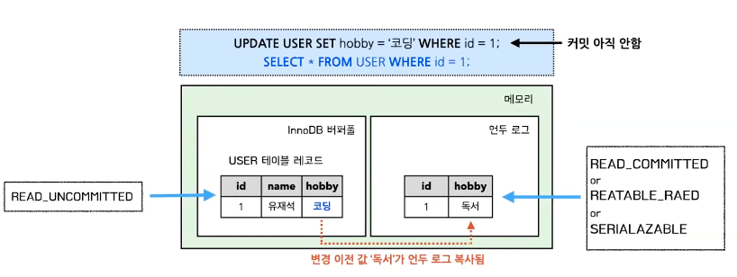

### 2022-10-20

- *참고: Real MySQL 8.0*
- *참고: https://www.youtube.com/watch?v=vQFGBZemJLQ*

## MySQL 아키텍처
- **MySQL 서버 구조**
  - MySQL 접속 클라이언트
    - 여러 언어 API 제공
  - MySQL 엔진 
    - 클라이언트 
    - SQL 접속 및 쿼리 담당
    - 쿼리 파서/전처리기/옵티마이저/실행 엔진 등으로 구성됨
  - 스토리지 엔진
    - 데이터 CRUD 디스크에 직접 실행 담당
    - 옵티마이저의 실행계획에 따라 적절하게 스토리지 실행
  - OS, HW
    - 파일, 로그 등을 직접 저장

- **MySQL 스레딩 구조**
  - MySQL 서버는 쓰레드 기반으로 동작함
    - 포그라운드 쓰레드
      - MySQL 서버에 접속된 클라이언트 수만큼 존재
      - 주로 각 클라이언트가 사용하는 쿼리문장 처리
      - MyISAM은 포그라운드 쓰레드가 데이터 버퍼/캐시 읽기 ~ 데이터 기록까지 담당
      - InnoDB는 포그라운드 쓰레드가 데이터 버퍼/캐시 읽기까지만 담당
    - 백그라운드 쓰레드
      - InnoDB는 여러가지 작업이 백그라운드로 처리됨
        - 인서트 버퍼 병합
        - 로그를 디스크에 기록
        - InnoDB 버퍼 풀의 데이터를 디스크에 기록
        - 데이터를 버퍼로 읽어오기
        - 잠금/데드락을 모니터링하는 쓰레드

- **메모리 할당 및 사용 구조**
  - [글로벌 메모리 영역]
    - 클라이언트 쓰레드 수와 무관하게 하나의 공간만 할당됨
    - 모든 쓰레드에 의해 공유되는 영역
    - 영역 구성
      - 테이블 캐시
      - InnoDB 버퍼 풀
      - InnoDB 어댑티브 해시 인덱스
      - InnoDB 리두 로그 버퍼
  - [로컬 메모리 영역]
    - 클라이언트 쓰레드가 쿼리를 처리하는데 사용하는 메모리 영역
    - 각 클라이언트 스레드 별로 독립적으로 할당되며 공유 절대 안함
    - 영역 구성
      - 정렬 버퍼
      - 조인 버퍼
      - 바이너리 로그 캐시
      - 네트워크 버퍼

- **쿼리 실행 구조**
  1. 쿼리 파서 
     - 사용자 요청으로 들어온 쿼리 문장을 토큰으로 분리해 트리 형태의 구조를 만듦
  2. 전처리기
     - 파서 과정에서 만들어진 파서 트리를 기반으로 쿼리 문장에 구조적인 문제점 있는지 파악
  3. 옵티마이저 (경영진)
     - 쿼리 문장을 어떻게 가장 빠르게 처리할지를 결정
  4. 쿼리 실행 엔진 (중간 관리자)
     - 만들어진 계획대로 핸들러에게 요청해 받은 결과를 또 다른 핸들러의 요청의 입력으로 연결
  5. 스토리지 엔진 (실무자)
     - 디스크에서 데이터 저장/읽어오기
     - 핸들러라고도 불림
     - MyISAM 테이블 조작 시 핸들러는 MyISAM 스토리지 엔진
     - InnoDB 테이블 조작 시 핸들러는 InnoDB 스토리지 엔진

## InnoDB 스토리지 엔진 아키텍처
- **특징**
  - PK에 의한 클러스터링
  - 트랜잭션 지원
    - MVCC
    - 리두 로그 & 언두 로그
    - 레코드 단위 잠금
  - InnoDB 버퍼풀 & 어댑티브 해시 인덱스

- **PK에 의한 클러스터링**
  - 레코드를 PK 순으로 정렬해서 저장
  - PK 인덱스 자동 생성
  - **PK 통해서만 레코드에 접근 가능**
    - 인덱스 걸어줄 때 PK를 value로 가진다는게 이 말인듯
  - PK 통한 범위 검색 매우 빠름

- **트랜잭션 지원**
  - MVCC (Multi Version Concurrency Control)
    - InnoDB 버퍼풀(변경된 데이터를 반영하기 전까지 버퍼링하는 곳), 언두 로그(변경되기 전 데이터 백업)
    - 트랜잭션 격리 수준에 따라 조회되는 데이터가 달라짐
    - 
  - 리두 로그 & 언두 로그 
    - 언두 로그
      - 변경되기 이전 데이터를 백업
      - 트랜잭션 보장
      - 트랜잭션 격리 수준 보장
    - 리두 로그
      - 변경된 데이터를 백업
      - 영속성 보장
  - 레코드 단위 잠금
    - 레코드 단위로 잠금을 걸기에 동시 처리 성능이 좋음
    - 레코드를 잠그는 것이 아닌 인덱스를 잠그는 기술

- **InnoDB 버퍼풀**
  - 데이터 캐싱
    - 인덱스 정보, 데이터 파일을 메모리에 캐싱
    - 페이지 단위로 테이블 데이터 관리
    - 페이지 교체 알고리즘으로 LRU 사용
  - 쓰기 지연 버퍼
    - 변경된 데이터를 버퍼풀에 모았따가 한 번에 디스크에 기록

- **어댑티브 해시 인덱스**
  - 페이지에 빠르게 접근하기 위한 해시 자료구조 기반 인덱스
  - [인덱스 키, 페이지 주소 값] 쌍으로 구성
  - 자주 요청되는 페이지에 대해 InnoDB가 자동으로 인덱스 생성

## MyISAM 특징
- 클러스터링 지원 x
- 트랜잭션 지원 x
- 외래키 지원 x
- 테이블 단위 잠금
- 키 캐시 사용
- 전문 검색, 공간 좌표 검색 기능 지원 
