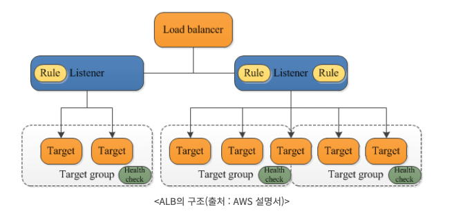
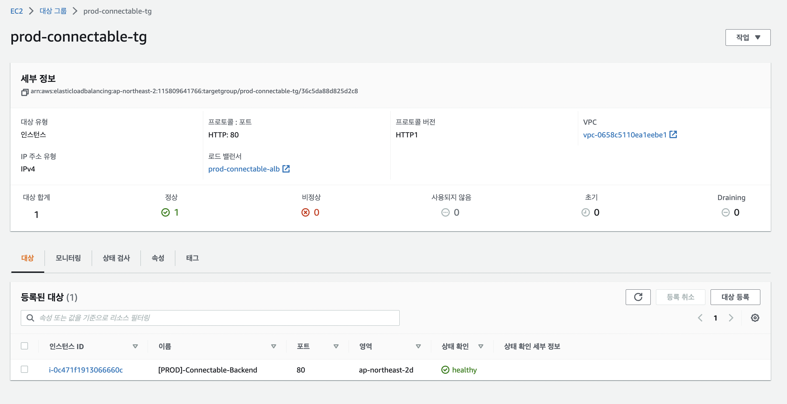
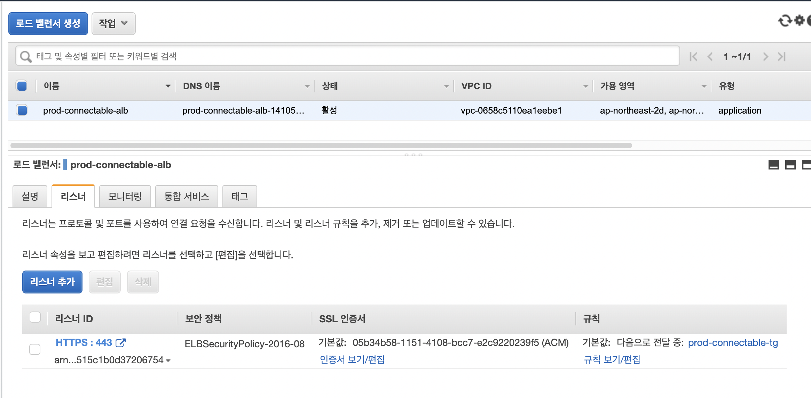
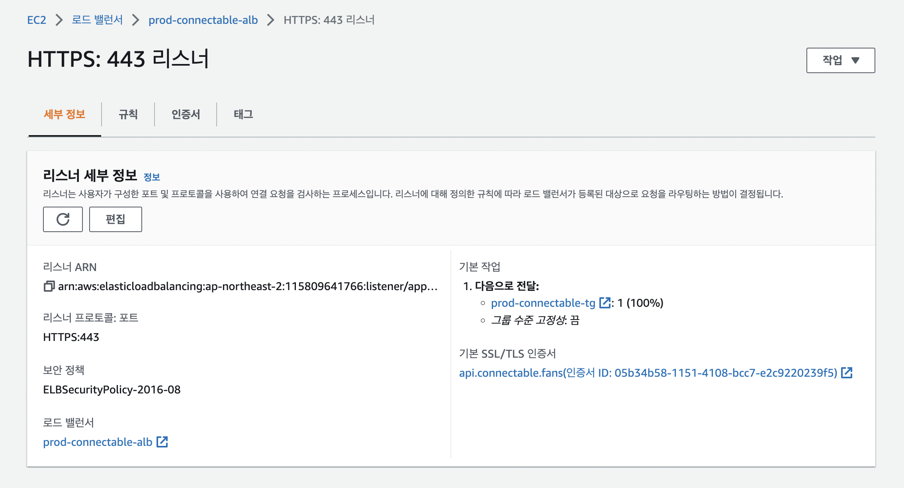

### 2022-10-21

## DB Replication
- *참고: https://parkadd.tistory.com/127*
- *참고: https://parkadd.tistory.com/128*
- **MySQL Replication 장점**
  - Scale Out Solution
    - 부하 분산을 통한 성능 향상
    - 모든 write는 source 서버에서
    - 모든 read는 하나 이상의 replica 서버에서
  - 데이터 보안
    - replica 서버는 replication 일시 중지 할 수 있어, 원본 데이터 손상 없이 백업 가능
  - 데이버 분석
    - 데이터 분석에 대한 부하를 replication에 주어 서비스 성능에 영향 최소화

- **MySQL Replication 사전 설정**
  - Replication 사용하도록 source 서버 구성하자 
    - binlog 활성화 여부
      - my.cnf에 해당 설정을 ON으로 뒀는지 확인
    - 고유한 서버 ID 있는지 여부
      - source 서버와 replica 서버의 id가 각각 달라야함
  - Replication을 위한 유저 생성
    - 각 replica 서버는 MySQL "사용자 이름"과 "비밀번호"를 통해 source 서버에 연결
    - replica 서버가 연결하는데 사용할 수 있는 사용자 계정이 source 서버에 있어야 함

- **Spring Replication 설정**
  - yml 작성
    ```yaml
    spring:
        datasource:
            hikari:
                source:
                    username: root
                    password: sourcepw
                    jdbc-url: jdbc:mysql://localhost:33306/...생략...
                replica:
                    replica-List:
                        -   name: replica1
                            username: replica1
                            password: replicapw
                            jdbc-url: jdbc:mysql://localhost:33307/...생략...
                        -   name: replica2
                            username: replica2
                            password: replicapw
                            jdbc-url: jdbc:mysql://localhost:33308/...생략...
    ```
  - Spring에서 2개 이상의 DB 쓰기 위해서는 DataSource를 직접 생성해줄 것
    - HikariDataSource 등을 통해 구현할 수 있음
    ```java
    @Component
    @ConfigurationProperties(prefix = "spring.datasource.hikari.replica")
    public class Replicas {
        List<Replica> replicaList = new ArrayList<>();
        
        public <D extends DataSource> Map<String, DataSource> replicaDataSources(Class<D> type) {
            return this.replicaList.stream()
                .collect(Collectors.toMap(Replica::getname, replica -> replica.createDataSource(type)));
        }
        
        public List<Replica> getReplicaList() {
            return replicaList;
        }
        
        public static class Replica {
            private String name;
            private String username;
            private String password;
            private Strign jdbcUrl;
            
            public <D extends DataSource> DataSource createDataSource(Class<D> type) {
                return DataSourceBuilder.create()
                    .type(type)
                    .url(this.getJdbcUrl())
                    .username(this.getUsername())
                    .password(this.getPassword())
                    .build();
            }
        }
    }
    ```

- **RoutingDataSource 구현체 생성**
  - `@Transactional(readOnly = false)` -> Master
  - `@Transactional(readOnly = true)` -> Slave
    ```java
    @Slf4j
    public class ReplicationRoutingDataSource extends AbstractRoutingDataSource {
        public static final String DATASOURCE_SOURCE_KEY = "source";
        
        private ReplicaDataSourceNames replicaDataSourceNames;
        
        public void setReplicaDataSourceNames(List<String> names) {
            this.replicaDataSourceNames = new ReplicationRoutingDataSource(names);
        }
        
        @Override
        protected Object determineCurrentLookupKey() {
            // ThreadLocal에 기록된 현재 트랜잭션 가져오는 방식
            final boolean isReadOnly = TransactionSynchronizationManager.isCurrentTransactionReadOnly();
            if (isReadOnly) {
                return replicaDataSourceNames.getNextName();
            }
            return DATASOURCE_SOURCE_KEY;
        }
    
        public static class ReplicaDataSourceNames {
    
            private final List<String> values;
            private int counter = 0;
    
            public ReplicaDataSourceNames(List<String> values) {
                this.values = values;
            }
    
            public String getNextName() {
                if (counter == values.size()) {
                    counter = 0;
                }
                return values.get(counter++);
            }
        }
    }
    ```

- **DatabaseConfig**
  - DataSource 설정
  - `@Configuration` : 컨테이너에 빈 등록
  - `@EnableAutoConfiguration` : 어플리케이션 컨텍스트의 자동 구성 활성화
  - `@EnableTransactionManagement` : Spring의 어노테이션 기반 트랜잭션 관리 기능 활성화
  - `@EnableConfigurationProperties` : `@ConfigurationProperties`
  - `@EnableJpaRepositories` : JPA repository 활성화
    ```java
    @Configuration
    @EnableAutoConfiguration(exclude = {DataSourceAutoConfiguration.class})
    @EnableTransactionManagement
    @EnableConfigurationProperties(Replicas.class)
    @EnableJpaRepositories(basePackages = {"com.wooteco.nolto"})
    public class DatabaseConfig {
    
        private final Replicas replicas;
    
        public DatabaseConfig(Replicas replicas) {
            this.replicas = replicas;
        }
    
        // source 가져오기
        @Bean
        @ConfigurationProperties(prefix = "spring.datasource.hikari.source")
        public DataSource sourceDataSource() {
            return DataSourceBuilder.create().type(HikariDataSource.class).build();
        }
    
        // replica datasource에 대해 Map<String, DataSource> 생성
        @Bean
        public Map<String, DataSource> replicaDataSources() {
            return replicas.replicaDataSources(HikariDataSource.class);
        }
    
        // master/slave datasource 쟁여두고 왔다갔다 할 수 있도록 지원
        // @Qualifier -> 빈 주입받는 방법 중 하나
        @Bean
        public DataSource routingDataSource(@Qualifier("sourceDataSource") DataSource source,
                                            @Qualifier("replicaDataSources") Map<String, DataSource> replicas) {
            ReplicationRoutingDataSource routingDataSource = new ReplicationRoutingDataSource();
    
            Map<Object, Object> dataSources = new HashMap<>();
            dataSources.put(DATASOURCE_SOURCE_KEY, source);
            dataSources.putAll(replicas);
    
            routingDataSource.setTargetDataSources(dataSources);
            routingDataSource.setDefaultTargetDataSource(source);
            List<String> replicaDataSourceNames = new ArrayList<>(replicas.keySet());
            routingDataSource.setReplicaDataSourceNames(replicaDataSourceNames);
    
            return routingDataSource;
        }
    
        // DataSource에 대한 프록시 생성 - 실제 JDBC Connection은 느리게 가져옴
        @Primary
        @Bean
        public DataSource dataSource(@Qualifier("routingDataSource") DataSource routingDataSource) {
            return new LazyConnectionDataSourceProxy(routingDataSource);
        }
    }
    ```

## Route 53
- *참고: https://brunch.co.kr/@topasvga/49*
- *참고: https://aws.amazon.com/ko/route53/*
- **개요**
  - AWS에서 제공하는 DNS
  - 도메인을 IP로 변환하는 일 수행

- **Route 53 기능**
  - DNS + 모니터링 + L4 + GSLB 기능 제공
  - [모니터링]
    - 특정 포트에 대해 모니터링 가능
  - [L4 -> Failover]
    - 네트워크 장비 넷스케일러, 파운드리, 파이오링크와 같이 Failover 기능이 있음
  - [GSLB]
    - Global Server Load Balancing
    - 특정 IDC에 의존적이지 않게, 지역과 나라에 무관한 Load Balancing 가능
    1. Failover
    2. Act-Act: 트래픽 조절
    3. Geolocation: 응답 속도를 빠르게 

- **이점**
  - 높은 가용성과 안정성 : Amazon Route 53
  - 유연성 : 지리적 위치, 지연 시간 등의 범주를 기반으로 트래픽 라우팅 
  - 다른 AWS 서비스와의 연계 
  - 간편성 : 몇 분 내에 DNS 질의에 대한 응답 제공
  - 신속함 : 최적의 위치로 사용자를 자동으로 라우팅
  - 비용이 쌈 
  - 보안 : IAM을 통해 모든 사용자에게 고유한 자격 증명 부여
  - 확장성 : Route53 사용자 개입 없이도 대규모 쿼리 볼륨 자동확장
  - 하이브리드 클라우드 단순화

## ALB
- *참고: https://no-easy-dev.tistory.com/entry/AWS-ALB%EC%99%80-NLB-%EC%B0%A8%EC%9D%B4%EC%A0%90*
- *참고: https://docs.aws.amazon.com/ko_kr/elasticloadbalancing/latest/application/introduction.html*
- 
- **설명**
  - 클라이언트에 대한 단일 접점 역할 수행
  - **여러 가용 영역**에서 EC2 인스턴스 같은 여러 대상에 **수신 어플리케이션 트래픽**을 분산

- **개요**
  1. L7단의 로드밸런서를 지원
  2. HTTP/HTTPS 프로토콜의 헤더를 보고 적절한 패킷으로 전송
  3. IP + 포트 번호 + 패킷 내용 보고 스위칭 제공
  4. IP 주소가 변동되기에 Client에서 Access할 ELB의 DNS Name 이용
  5. ALB는 L7단을 지원하기에 SSL 적용 가능

- **Target Group**
  - Instance의 ID로 지정하여 로드밸런싱

- **특징**
  - HTTP Header, 요청 Method 등을 통해 사용자 요청을 적절한 대상 그룹으로 라우팅
  - HTTP의 특성을 활용한 부하 분선
    - HTTP Header - 요청헤더/일반헤더
    - HTTP 요청 메서드 - GET/POST/PUT 등
  - HTTP/2 지원 -> 네트워크 트래픽 줄이고 접속 효율 높임

- **동작 원리**
  1. 사용자 <-> ALB 3-way-handshake 실시
  2. ALB <-> EC2 3-way-handshake 실시
  3. 사용자 <----> EC2 요청 왔다 갔다

- **리스너**
  - 구성한 프로토콜 및 포트를 사용해 클라이언트의 연결 요청 확인
  - 리스너에 대해 정의한 규칙에 따라 로드 밸런서가 등록된 대상으로 요청을 라우팅 하는 방법이 결정됨

## Connectable ALB
- ALB 설정 보기
  - 
- 리스너 목록 확인
  - 
- 443 리스너 확인
  - 

## NLB
- *참고: https://no-easy-dev.tistory.com/entry/AWS-ALB%EC%99%80-NLB-%EC%B0%A8%EC%9D%B4%EC%A0%90*
- *참고: https://docs.aws.amazon.com/ko_kr/elasticloadbalancing/latest/network/introduction.html*
- *참고: https://kim-dragon.tistory.com/112*
- **설명**
  - 클라이언트 단일 접점 역할 수행
  - 수신 트래픽을 EC2 인스턴스와 같은 여러 대상에 분산

- **개요**
  1. L4단의 로드밸런서 지원
  2. TCP/IP 프로토콜의 헤더를 보고 적절한 패킷으로 전송
  3. IP + 포트 번호를 보고 스위칭
  4. NLB는 할당한 Elastic IP를 static IP로 사용 가능하며 DNS Name, IP 주소 모두 사용 가능
  5. SSL 적용 안댐. 

- **Target Group**
  - IP로 지정하여 로드 밸런싱