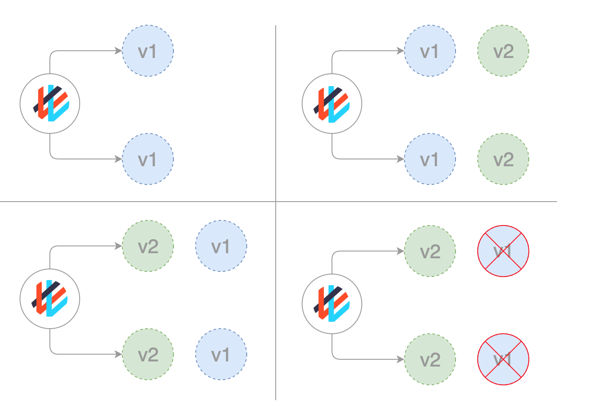
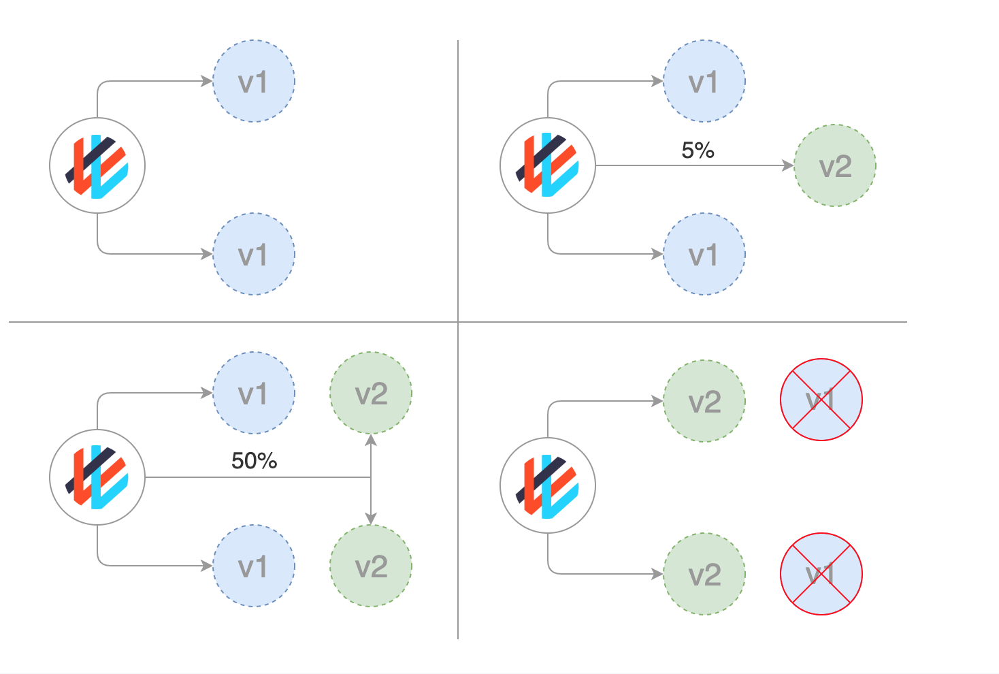

### 2022-10-23

## Database Connection 
- 히카리 풀 관련 쓰레드 `HikariPool-1 housekeeper` 는 백그라운드에서 계속 돌아가면서 커넥션 타임아웃된거 집 들어오라하고 관리하고 그러는 듯

- **이벤트 조회 API 호출시**
  - **JPA EntityManager** 열고 (OSIV 열고)
  - **JPATransactionManager** 에서
    - 쓰레드 기반 EntityManager 획득!
    - 실행할 메서드에 대응되는 새로운 Transaction을 만들어 냄 (설정에 따라 전파레벨, 고립수준, ReadOnly)
    - 쿼리 내보내고...
    - 에러 없으니 커밋!
  - **JPA EntityManager** 닫고 (OSIV 닫고)
  ```
  15:46:46.955 [DEBUG] [HikariPool-1 housekeeper] [com.zaxxer.hikari.pool.HikariPool] - HikariPool-1 - Pool stats (total=10, active=0, idle=10, waiting=0)
  15:46:46.956 [DEBUG] [HikariPool-1 housekeeper] [com.zaxxer.hikari.pool.HikariPool] - HikariPool-1 - Fill pool skipped, pool is at sufficient level.
  15:47:07.077 [DEBUG] [http-nio-8080-exec-4] [o.s.o.j.s.OpenEntityManagerInViewInterceptor] - Opening JPA EntityManager in OpenEntityManagerInViewInterceptor
  15:47:07.077 [DEBUG] [http-nio-8080-exec-4] [o.s.orm.jpa.JpaTransactionManager] - Found thread-bound EntityManager [SessionImpl(81249392<open>)] for JPA transaction
  15:47:07.077 [DEBUG] [http-nio-8080-exec-4] [o.s.orm.jpa.JpaTransactionManager] - Creating new transaction with name [com.backend.connectable.event.service.EventService.getEventDetail]: PROPAGATION_REQUIRED,ISOLATION_DEFAULT,readOnly
  15:47:07.085 [DEBUG] [http-nio-8080-exec-4] [o.s.orm.jpa.JpaTransactionManager] - Exposing JPA transaction as JDBC [org.springframework.orm.jpa.vendor.HibernateJpaDialect$HibernateConnectionHandle@31dea322]
  15:47:07.085 [TRACE] [http-nio-8080-exec-4] [o.s.t.i.TransactionInterceptor] - Getting transaction for [com.backend.connectable.event.service.EventService.getEventDetail]
  15:47:07.085 [TRACE] [http-nio-8080-exec-4] [o.s.t.i.TransactionInterceptor] - No need to create transaction for [org.springframework.data.jpa.repository.support.SimpleJpaRepository.findEventDetailByEventId]: This method is not transactional.
  15:47:07.098 [DEBUG] [http-nio-8080-exec-4] [org.hibernate.SQL] - SELECT 쿼리 좔좔좔
    
  15:47:07.104 [TRACE] [http-nio-8080-exec-4] [o.s.t.i.TransactionInterceptor] - Completing transaction for [com.backend.connectable.event.service.EventService.getEventDetail]
  15:47:07.104 [DEBUG] [http-nio-8080-exec-4] [o.s.orm.jpa.JpaTransactionManager] - Initiating transaction commit
  15:47:07.104 [DEBUG] [http-nio-8080-exec-4] [o.s.orm.jpa.JpaTransactionManager] - Committing JPA transaction on EntityManager [SessionImpl(81249392<open>)]
  15:47:07.109 [DEBUG] [http-nio-8080-exec-4] [o.s.orm.jpa.JpaTransactionManager] - Not closing pre-bound JPA EntityManager after transaction
  15:47:07.111 [DEBUG] [http-nio-8080-exec-4] [o.s.o.j.s.OpenEntityManagerInViewInterceptor] - Closing JPA EntityManager in OpenEntityManagerInViewInterceptor
  15:47:16.956 [DEBUG] [HikariPool-1 housekeeper] [com.zaxxer.hikari.pool.HikariPool] - HikariPool-1 - Pool stats (total=10, active=0, idle=10, waiting=0)
  15:47:16.956 [DEBUG] [HikariPool-1 housekeeper] [com.zaxxer.hikari.pool.HikariPool] - HikariPool-1 - Fill pool skipped, pool is at sufficient level.
  ```


- **닉네임 변경 API 호출시**
  - **JPA EntityManager** 열고 (OSIV 열고) - Controller Layer
  - **JPA TransactionManager** 에서 - Service Layer
    - 쓰레드 기반 EntityManager 획득!
    - 메서드에 작성한 트랜잭션 설정에 따른 트랜잭션 생성
    - 트랜잭션 안의 메서드 수행하며 쿼리 날림
  - **JPA EntityManager** 닫고 (OSIV 닫고) - Controller Layer
  ```
  15:55:12.201 [DEBUG] [http-nio-8080-exec-10] [o.s.o.j.s.OpenEntityManagerInViewInterceptor] - Opening JPA EntityManager in OpenEntityManagerInViewInterceptor
  15:55:12.289 [DEBUG] [http-nio-8080-exec-10] [o.s.orm.jpa.JpaTransactionManager] - Found thread-bound EntityManager [SessionImpl(860516403<open>)] for JPA transaction
  15:55:12.289 [DEBUG] [http-nio-8080-exec-10] [o.s.orm.jpa.JpaTransactionManager] - Creating new transaction with name [com.backend.connectable.user.service.UserService.modifyUserByUserDetails]: PROPAGATION_REQUIRED,ISOLATION_DEFAULT
  15:55:12.292 [DEBUG] [http-nio-8080-exec-10] [o.s.orm.jpa.JpaTransactionManager] - Exposing JPA transaction as JDBC [org.springframework.orm.jpa.vendor.HibernateJpaDialect$HibernateConnectionHandle@109dab5b]
  15:55:12.292 [TRACE] [http-nio-8080-exec-10] [o.s.t.i.TransactionInterceptor] - Getting transaction for [com.backend.connectable.user.service.UserService.modifyUserByUserDetails]
  15:55:12.292 [TRACE] [http-nio-8080-exec-10] [o.s.t.i.TransactionInterceptor] - No need to create transaction for [org.springframework.data.jpa.repository.support.SimpleJpaRepository.findByKlaytnAddress]: This method is not transactional.
  15:55:12.293 [DEBUG] [http-nio-8080-exec-10] [org.hibernate.SQL] - 
      select
          user0_.id as id1_6_,
          user0_.is_active as is_activ2_6_,
          user0_.klaytn_address as klaytn_a3_6_,
          user0_.nickname as nickname4_6_,
          user0_.phone_number as phone_nu5_6_,
          user0_.privacy_agreement as privacy_6_6_ 
      from
          user user0_ 
      where
          user0_.klaytn_address=?
  15:55:12.296 [TRACE] [http-nio-8080-exec-10] [o.s.t.i.TransactionInterceptor] - Completing transaction for [com.backend.connectable.user.service.UserService.modifyUserByUserDetails]
  15:55:12.296 [DEBUG] [http-nio-8080-exec-10] [o.s.orm.jpa.JpaTransactionManager] - Initiating transaction commit
  15:55:12.296 [DEBUG] [http-nio-8080-exec-10] [o.s.orm.jpa.JpaTransactionManager] - Committing JPA transaction on EntityManager [SessionImpl(860516403<open>)]
  15:55:12.322 [DEBUG] [http-nio-8080-exec-10] [org.hibernate.SQL] - 
      update
          user 
      set
          is_active=?,
          klaytn_address=?,
          nickname=?,
          phone_number=?,
          privacy_agreement=? 
      where
          id=?
  15:55:12.339 [DEBUG] [http-nio-8080-exec-10] [o.s.orm.jpa.JpaTransactionManager] - Not closing pre-bound JPA EntityManager after transaction
  15:55:12.341 [DEBUG] [http-nio-8080-exec-10] [o.s.o.j.s.OpenEntityManagerInViewInterceptor] - Closing JPA EntityManager in OpenEntityManagerInViewInterceptor
  15:55:16.959 [DEBUG] [HikariPool-1 housekeeper] [com.zaxxer.hikari.pool.HikariPool] - HikariPool-1 - Pool stats (total=10, active=0, idle=10, waiting=0)
  15:55:16.959 [DEBUG] [HikariPool-1 housekeeper] [com.zaxxer.hikari.pool.HikariPool] - HikariPool-1 - Fill pool skipped, pool is at sufficient level.
  15:55:50.788 [DEBUG] [HikariPool-1 connection closer] [com.zaxxer.hikari.pool.PoolBase] - HikariPool-1 - Closing connection com.mysql.cj.jdbc.ConnectionImpl@1088721: (connection has passed maxLifetime)
  15:55:50.814 [DEBUG] [HikariPool-1 connection adder] [com.zaxxer.hikari.pool.HikariPool] - HikariPool-1 - Added connection com.mysql.cj.jdbc.ConnectionImpl@54d9dffe
  15:56:16.960 [DEBUG] [HikariPool-1 housekeeper] [com.zaxxer.hikari.pool.HikariPool] - HikariPool-1 - Pool stats (total=10, active=0, idle=10, waiting=0)
  15:56:16.960 [DEBUG] [HikariPool-1 housekeeper] [com.zaxxer.hikari.pool.HikariPool] - HikariPool-1 - Fill pool skipped, pool is at sufficient level.
  ```
  
## 쿠버네티스
- **개요**
  - Container를 운영하다보면 발생하는 문제들에 대한 해결책 필요
    - 여러 Container에 어플리케이션 배포할 때는 어떻게 하는가? 
    - Health Check 및 설정관리는?
    - Container를 새로 띄우면 IP가 바뀌는데, Reverse Proxy 어떻게 감지하는가?
    - Container 수평 확장은 어느시점이 좋은가?
    - Container가 많아지면 하나의 Node에서 관리하기 힘들텐데, 여러 Node에서 관리하려면 어떻게?
    - 여러 Node에서 관리하다보면 IP 중복은 안되는가? 

- **특징**
  - Orchestration
    - Master Node의 관리 아래 다양한 컨테이너를 구동
  - 선언적 자동화 관리
    - 원하는 상태를 지정하여 쿠버네티스가 자동 조절 및 복구
  - 추상화된 리소스 관리
    - 서버별 리소스 사용량 모니터링, 리소스 사용량 제한 등 서버 리소스 관리해줌
    - 컨테이너 증설 시 내장 스케줄러가 최적 노트 찾아 배치
    - 자동 확장 기능 제공

- **구성요소**
  - [Ingress] : Nginx 기반 리버스 프록시
    - 유입되는 트래픽을 제어
    - 부하 분산/SSL/도메인 기반 라우팅 등의 기능 제공
  - [Service] : 끝점 담당
    - 어플리케이션 묶음
    - Pod와 연결되는 논리적인 Endpoint 제공
      - pod 변경되어도 사용자는 동일한 IP 사용가능
  - [Pod] : 컨테이너 실행 담당
    - 쿠버네티스 최소 실행 단위
    - 보통 1개의 Pod에 1개의 컨테이너 실행
  - [Replicaset] : 복제 담당
    - yml에 정의된 수만큼 Pod 갯수 유지하려고 노력
  - Deployment : 배포 담당
    - 롤링 업데이트 지원 
      - 
      - 중간중간 교체 쓱싹 하는 방식
    - Scale Out 지원

## 무중단배포
- **Blue/Green 배포**
  - 
  - 블루가 서비스하다가, 그린에 새 버전 배포한 후
  - 그린으로 트래픽 전환
  - 인스턴스 2배로 필요

- **Rolling Update 배포**
  - 
  - n대의 서버에 새로운 버전을 교체하는 방식
  - 서로 다른 버전이 동시에 서비스 되는 시간이 있음

- **Canary 배포**
  - 
  - 트래픽을 천천히 새 버전으로 점차 늘려가는 방식
