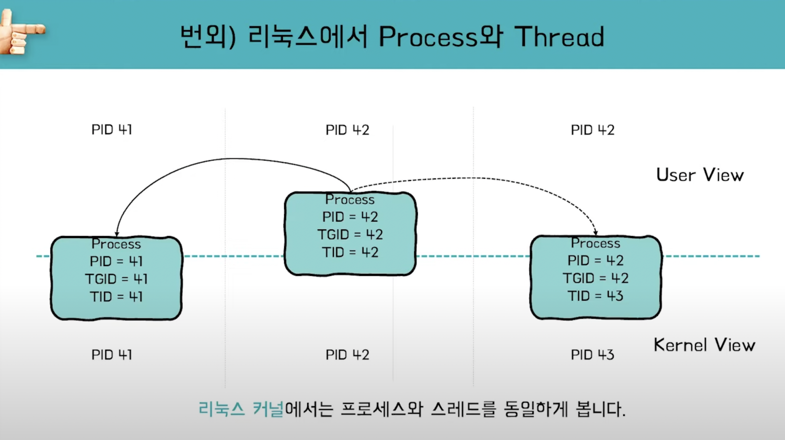

### 프로세스 & 쓰레드

## 코다의 Process vs Thread
- *참고: youtube.com/watch?v=1grtWKqTn50&t=67s*
- **키워드**
  1. 실행 단위 : CPU Core에서 실행하는 하나의 단위로 프로세스와 쓰레드를 포괄하는 개념
  2. (부연 설명이 없는) 프로세스 : 하나의 쓰레드만 가지고 있는 단일 쓰레드 프로세스
  3. 동시성 : 한 순간에 여러개의 일이 일어나는게 아닌, 짧은 전환으로 여러가지 일을 동시에 처리하는 것처럼 보이는 것

- **Process 사전 지식**
  - 메모리
    - 정적 영역
      - Code: 실행 명령을 포함하는 코드들
      - Data: Static 변수 혹은 Global 변수들
    - 동적 영역
      - Stack: 지역변수, 매개변수, 반환값 등의 일시적인 데이터 
      - Heap: 동적으로 활용되는 영역

- **Process & Thread**
  - 쓰레드: 경량화된 프로세스
    - 쓰레드는 프로세스의 코드/데이터/힙 영역을 공통된 자원으로 사용함
    - 스택만 따로 있음
    - 컨텍스트 스위칭이 발생할 때 캐싱 적중률이 올라가 가벼움

- **Multi-process & Multi-thread**
  - Multi-Process
    - 각 프로세스는 독립적
    - IPC를 사용한 통신
    - 자원 소모적, 개별 메모리 차지
    - Context Switching 비용이 큼
    - 동기화 작업이 필요하지 않음
  - Multi-Thread
    - Thread 끼리 긴밀하게 연결되어 있는 구조
    - 공유된 자원으로 통신 비용 절감
    - 공유된 자원으로 효율적인 메모리 사용
    - Context Switching 비용 적음
    - 공유 자원 관리를 해야함
  - 멀티 프로세스 왜 필요하지?
    - 긴밀하게 연결이 되어있는 멀티 쓰레드는 하나 쓰레드 뻗으면 다 뻗는 위험도 있어
    - 구글 크롬은 그래서 멀티 프로세스 채택
  - 멀티 쓰레드 왜 필요하지?
    - 한 어플리케이션 내에서 작업의 단위가 나누어지면 멀티 쓰레드 구조로 처리하는 경우 많음
    - 인텔리제이에서 코드 수정하면서, 테스트도 돌리면서, 추천 코드도 보여줘야하고...

- **Multi-core**
  - 동시성 / 병렬처리

- **리눅스에서 Process와 Thread**
  - 리눅스 커널에서는 프로세스와 쓰레드를 동일하게 봅니당
  - 리눅스에서는 유저 쓰레드 : 커널 쓰레드 = 1:1
  - 

## 프로세스의 메모리 구조
- **동적 영역**
  - 스택
    - 지역변수, 매개변수, 함수가 저장되고 컴파일시에 크기가 결정
    - 함수가 함수를 재귀적으로 호출하면서 동적으로 크기가 늘어날 수 있음 
  - 힙
    - 동적 할당할 때 사용되며 런타임 시 크기가 결정

- **정적 영역**
  - 데이터 영역
    - 전역변수/정적변수가 저장되고 정적인 특징을 갖는 프로그램이 종료되면 사라지는 변수가 들어있는 영역
  - 코드 영역
    - 프로그램에 내장되어 있는 소스 코드가 들어가는 영역

## PCB
- 프로세스에 대한 메타데이터를 저장한 데이터
- 데이터
  - 프로세스 스케줄링 상태
  - 프로세스 ID
  - 프로세스 권한
  - 프로그램 카운터
  - CPU 레지스터
  - CPU 스케줄링 정보
  - 계정 정보
  - I/O 상태 정보

## 교착 상태
- 두 개 이상의 프로세스들이 서로가 가진 자원을 기다리며 중단된 상태
- **원인**
  - 상호 배제: 한 프로세스가 자원 독점, 딴 프로세스는 접근 못함
  - 점유 대기: 특정 프로세스가 점유한 자원을 다른 프로세스가 요청하는 상태
  - 비선점: 다른 프로세스의 자원을 강제적으로 가져올 수 없음
  - 환형 대기: 프로세스 A는 프로세스 B의 자원을, 프로세스 B는 프로세스 A의 자원을 요청

- **해결 방법**
  1. 자원 할당시 교착 상태 조건이 성립되지 않도록 설계
  2. 교착 상태 가능성이 없을 때만 자원 할당되며, 프로세스당 요청할 자원들의 최대치를 통해 자원 할당 가능 여부 판단하는 '은행원 알고리즘' 사용
  3. 교착 상태가 발생하면 사이클이 있는지 찾아보고 이와 관련된 프로세스를 한 개씩 지움
  4. 교착 상태 드물게 일어나기에 사용자가 직접 프로세스 종료시키도록 하였음

## IPC
- *참고: https://jwprogramming.tistory.com/54*
- **개요**
  - 독립되어 있는 만큼 프로세스 간 통신이 어려움
  - 따라서 커널 영역에서 IPC를 제공하게 됨
  - 프로세스는 커널이 제공하는 IPC 설비를 통해 프로세스간 통신을 할 수 있음

- **IPC의 다양한 설비들**
  1. PIPE
     - 두 개의 명확하게 알 수 있는 프로세스를 연결
       - 즉, 부모-자식 간 프로세스 통신
       - 같은 부모를 가지는 자식 프로세스의 통신
     - 하나의 프로세스는 데이터를 쓰기만, 다른 하나는 데이터를 읽기만
     - 한쪽으로만 통신 가능
     - 양쪽으로 할라면 파이프 2개 필요
     - 간단하게 사용 가능

  2. FIFO (Named PIPE)
     - 전혀 모르는 상태의 프로세스들 사이의 통신 경우에 사용
     - 부모 프로세스와 무관하게 모든 프로세스 사이 통신 가능
     - 프로세스 통신을 위해 **이름이 있는 파일** 사용
     - 읽기 전용, 쓰기 전용 각각 필요

  3. Message Queue
     - 메모리 공간에서 선입 선출의 방식으로 통신
     - 파이프가 아닌 어디에서나 물건을 꺼낼 수 있는 컨테이너 벨트
     - 메시지 큐에 쓸 데이터에 번호를 붙임으로서 여러개의 프로세스가 동시에 데이터를 쉽게 다룰 수 있음

  4. Shared Memory
     - 데이터를 아예 메모리 단에서 공유하도록 지원하는 설비
     - 프로세스가 커널에 공유 메모리 할당을 요구하면 메모리 공간을 할당해줌
     - 이후 어떤 프로세스건 해당 메모리 영역에 접근 가능

  5. Memory Map
     - 열린 파일을 메모리에 매핑시켜 공유
     - 파일 == 시스템의 전역적인 자원 -> 프로세스들끼리 데이터 공유에 문제 없음
  
  6. Socket
     - 프로세스 사이의 네트워크 통신

  7. Semaphore
     - 프로세스간 데이터 동기화에 목적있음

## Mutex vs Semaphore
- *참고: https://www.youtube.com/watch?v=oazGbhBCOfU*
- **교착 상태**
  - 서로 점유하고 있는 자원을 놓아줄 생각은 없고 자원 요청을 무한정 대기하고 있는 상태
  - 임계 영역: 교착 상태가 발생할 수 있는 영역
  - 교착 상태가 발생할 수 있는 4가지 조건
    - 상호 배제
    - 점유 대기
    - 비선점
    - 순환 대기

- **상호 배제**
  - 하나의 프로세스가 공유 자원 사용시, 다른 프로세스가 해당 자원 접근 못하게 통제

- **Mutex(Mutual Exclusion)**
  - 여러 쓰레드를 실행하는 환경에서 자원에 대한 접근에 제한을 강제하기 위한 동기화 매커니즘
  1. "대기큐" 를 생성해두고
  2. 임계 영역에 쓰레드가 있으면 
  3. 다른 쓰레드가 공유자원을 사용하려 한다면 해당 "쓰레드 Block" + "대기큐에 Sleep"

- **SpinLock**
  - 대기하는 손님이 쉬지않고 자리가 생겼냐고 물어보는 방식
  - "Busy-waiting" -> 보통 비효율적임
    - 컨텍스트 스위칭하는 시간보다 기다렸다가 자원 할당 받는게 더 빠르리라 예상하면 Busy-Waiting
    - 멀티코어 프로세스라면 조금 더 유리

- **Semaphore**
  - 멀티 프로그래밍 환경에서 다수의 프로세스나 쓰레드의 여러개의 공유 자원에 대한 접근을 제한하는 방법
  - 세마포어 변수를 통해 wait/signal 관리, 0 이상의 정수형 변수를 가짐
  - 계수 세마포어로 사용할 수 있으며, 접근 가능한 공유 자원의 수가 1개일 시, 이진 세마포어로 뮤텍스 처럼 활용 가능
  - Lock 걸지 않은 쓰레드도 Signal을 보내 Lock 해제 가능
