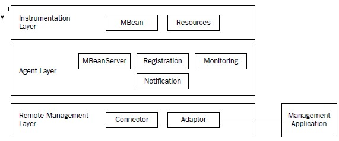

### 2023-05-04

## JMX
- *참고: https://m.blog.naver.com/PostView.naver?isHttpsRedirect=true&blogId=pcmola&logNo=222061574743*
- **개요**
  - 자바 어플리케이션의 모니터링과 관리 기능 제공
  - JDK 1.5 이상부터 기본적으로 탑재된 기능
  - API를 외부로 노출해 application 설정 및 통계데이터를 수집할 수 있는 기능을 제공
  - MBean(Managed Bean)이라는 객체로 표현되어 응용 프로그램/객체/장치 등을 감사

- **환경**
  - 3개의 아키텍쳐 티어 구성
  - 
  - Instrumental Level
    - JMX로 관리 가능한 리소스의 구현을 위한 스펙 제공
    - 자원을 다루는 수단은 Mbean으로
      - Standard MBean
      - Dynamic MBean
      - Model MBean
      - Open MBean 
    - Notification 메커니즘: Mbean이 Notification Event를 통해 다른 레벨에 존재하는 컴포넌트에게 이벤트를 보낸다
  - Agent Level
    - 직접 리소스를 제어하고 원격 관리 어플리케이션이 리소스 컨트롤 할 수 있도록 연결
    - MBean 서버와 MBean을 다루기 위한 에이전트 서비스로 구성
  - Remote Management Level
    - 어댑터와 커넥션의 프로토콜 지정함으로써 에이전트와 외부 커뮤니케이션 정의

- **사용방법**
  - JDK에서 시스템 정보를 가져오는 MBean 제공
  - Apache, Tomcat 등은 해당 서버 정보를 가져올 수 있는 MBean 제공
  - MBeanServer에 접속하기 위해 Connector 또는 Adaptor 이용
    - Connector: JMXMP, RMI
    - Adaptor: HTML, SNMP
  - 특정 데이터 클래스의 인터페이스를 정의한다. 해당 인터페이스는 클래스의 getter, setter, 임의 사용 메서드를 작성, 서버 측에서 그 인터페이스에 대한 실질적인 내용을 작성함
  - Server를 작동시키고 Connector를 통해 Client가 Server에 요청하면 Server는 해당 인터페이스의 기능 수행후 결과 반환

## Sbt dist를 통해 .zip 파일을 만든다는 것...
- **sbt dist**
  - `sbt dist` 명령어는 프로젝트를 실행하기 위한 모든 필요한 파일들 배포 패키지로 묶어준다
  - zip은 아래와 같은 컴포넌트를 가지고 있다
    - `bin`: UNIX, Windows 포맷으로 작성된 시작 스크립트
    - `lib`: JAR 파일로 구성된 디펜던시가 걸려있는 친구들
    - `conf`: 어플리케이션 conf 파일들
  - 어플리케이션 실행하려면, bin의 시작 스크립트 추출해서 실행시키면, lib에서 필요한 디펜던시 땡겨와서 사용할 거다

- **bin 파일의 start script는 플랫폼 독립적일까?**
  - 기본적으로 플레이 어플리케이션이 만들어내는 쉘 스크립트는 Unix-based system. 
    - start script 까보면 결국 JVM위에서 구동시키는 역할이 쓰여있긴함
    - 다만 쉘스크립트가 유닉스 계열일 뿐이지
  - 다른 플랫폼 (ex. windows) 에서도 구동 시키게 할 수 있다
    - Cygwin 등의 툴로 돌리면 변환이 가능하다네...?
  - 도커와 같은 툴로 컨테이너 만들 수도 있어보이고

- **스프링 부트 처럼 jar로 돌릴라면?**
  - addSbtPlugin("com.eed3si9n" % "sbt-assembly" % "1.2.0")
  - fat JAR 만들어주는 라이브러리 쓰세요

- **시작 스크립트 vs jar**
  - 시작 스크립트는...
    - JVM 설정등에서 더 유연함을 가져갈 수 있다
    - 파인튜닝 등이 가능
  - Jar는...
    - 어플리케이션 실행에 더 적은 스텝
    - 다른 툴들과 통합이 쉬움

- **시작 스크립트에서 준 JVM 옵션이 /lib의 jar 구동에도 적용될까?**
  - 똑같이 적용되진 않음
  - `-Xbootclasspath/p:` 이런 옵션 주라네

## 배포시 Warmup을 하는 이유
- *참고: https://www.youtube.com/watch?v=CQi3SS2YspY*
- *참고: https://velog.io/@qwerty1434/ifkakao-JVM-warm-up*
- **JVM 위에서 돌아가는 코드**
  - Source Code --(compile)--> Byte Code ----> JVM
    - Byte Code로 컴파일 한다 (주로 jar, war)

## aspectjweaver
- *참고: https://mvnrepository.com/artifact/org.aspectj/aspectjweaver*
- AspectJ weaver는 자바 클래스에 aspect를 적용한다
- 자바 에이전트로 사용이 가능한데...
  - 클래스 로딩 시점에 Load-Time Weaving(LTW)를 적용하거나
  - AspectJ 런타임 클래스를 포함할 수 있음

## Gateway
- 다른 서비스와 어플리케이션 중간에서 동작하는 SW
- 주 목적은 각기 다른 컴포넌트들에게 획일화된 인터페이스를 제공함으로써 리퀘스트를 알맞은 종착지로 라우팅 해주는 것
- 게이트웨이에서 다음과 같은 태스크를 맡길 수 있음
  - 인증/인가
  - 로드밸런싱
  - 캐싱
  - 프로토콜 전환 (아마 ssl termination일 듯?)
  - 보안 (방화벽/암호화)
  - 외부 위협으로부터의 안전
- 마이크로서비스에서 게이트웨이는,,,
  - API 트래픽을 관리
  - 외부 요청으로부터 중앙화된 엔트리포인트 제공

## lodash
- *참고: https://velog.io/@kysung95/%EC%A7%A4%EB%A7%89%EA%B8%80-lodash-%EC%95%8C%EA%B3%A0-%EC%93%B0%EC%9E%90*
- lodash는 자스의 인기있는 라이브러리
- array, collection, date의 데이터를 쉽게 다룰 수 있게끔 하는데 사용
- 배열안의 객체 값 handling 하도록 유용
- 성능 보장되는 다양한 메서드
- npm으로 뚝딱
- 컬렉션을 거의 뭐 JCF 메서드 맹키로다가 쓸 수 있음