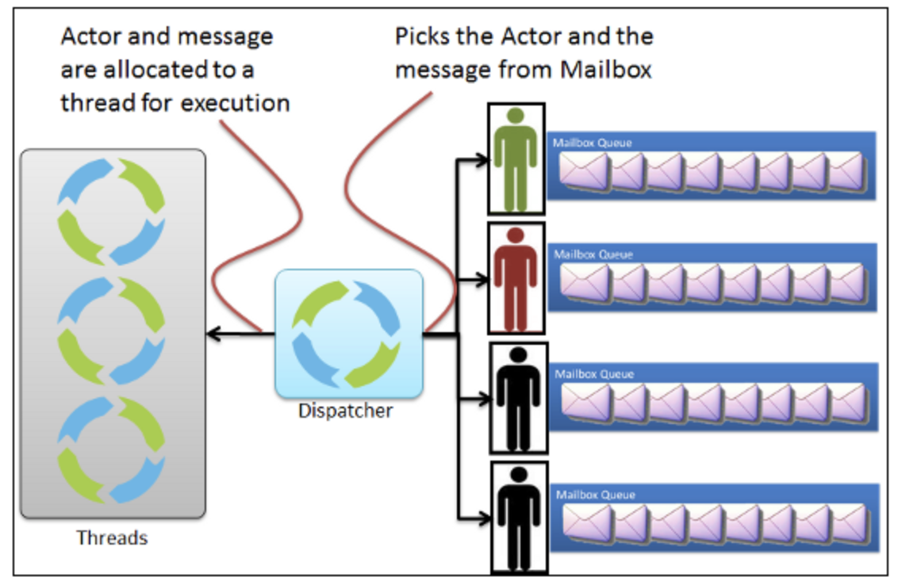
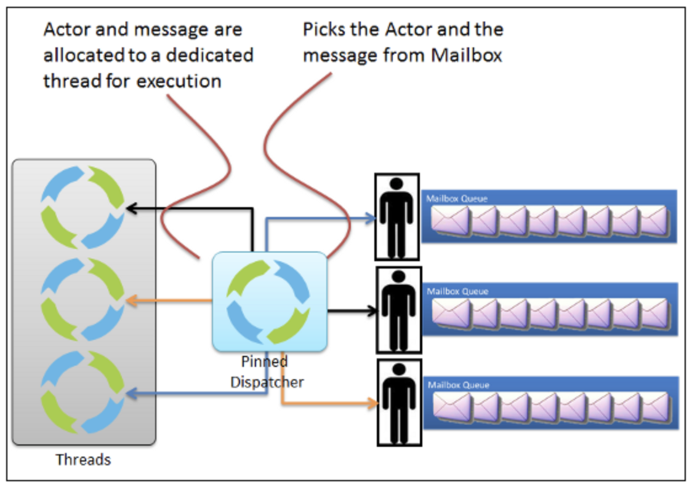

### 2023-09-26

## 레디스 병목
*참고: https://geekcoders.tistory.com/entry/%EB%A0%88%EB%94%94%EC%8A%A4-%EC%9A%B4%EC%98%81-%EC%8B%9C-%EA%B3%A0%EB%A0%A4%EC%82%AC%ED%95%AD*
- **임계점**
  - 좋은 서버라도 장치 한 대의 성능에 한계가 분명함
  - [CPU]
    - 데이터 저장/조회에 단일 스레드 
    - 멀티코어 성능 최대한 끌어내기 위해 인스턴스 여러개 실행하는 것도 방법
      - ex) 8코어 시스템에 레디스 인스턴스 8개
  - [메모리]
    - 인메모리에 데이터를 저장하기에 메모리 크기 지정이 성능과 밀접한 관련있음
    - redis.config의 maxmemory
    - 스왑 영역이 충분치 않으면 메모리 동작 중인 프로세스 제거해 메모리 영역 확보
    - 스왑 영역을 레디스가 사용하게 되면 성능 수백배 느려짐
  - [네트워크]
    - 복제 위한 마스터/슬레이브 간 데이터 전송과 네트워크 단절에 의한 데이터 

## Akka Dispatcher 성능 튜닝
*참고: https://helloino.tistory.com/93*  
*참고: https://blog.naver.com/kbh3983/221142958800*  
*참고: https://doc.akka.io/docs/akka/current/typed/dispatchers.html*  
- **개요**
  - 대부분의 성능이 I/O (Network, File)로 인해 느려진다
  - Akka Dispatcher를 통해 성능 튜닝을 할 수 있다

- **디스패처란?**
  - 쓰레드 풀에서 실행 가능한 쓰레드를 가져다가 처리할 메시지와 함께 액터에 전달하여 액터가 동작하도록 하는 엔진
  - 디스패처 설정을 통해 디스패처가 사용할 쓰레드 풀 관련 설정, 메일박스 설정 할 수 있음
  - 어떻게 쓰레드와 메일박스를 처리할지에 따라 디스패처 종류도 나뉨
    - Default Dispatcher
      - 
      - 디폴트 디스패처가 액터와 메일박스로 부터 메시지를 고름
      - 액터와 메시지가 쓰레드에 실행을 위해 할당됨
    - Pinned Dispatcher
      - 
      - 핀드 디스패처가 액터와 메일박스로 부터 메시지를 고름
      - 액터와 메시지가 지정된 쓰레드에 실행을 위해 각각 할당됨
    - Balancing Dispatcher
      - 
      - 모든 액터가 같은 메일 박스 사용
      - 밸런싱 디스패처가 메일박스에서 메시지를, 액터를 고름
      - 액터와 메시지가 쓰레드에 실행을 위해 할당됨

- **Default Dispatcher**
  - actor-system이 가지고 있는 기본 Dispatcher
  - 대부분 케이스 성능이 좋은 fork-join-executor를 사용

- **Dispatcher 종류**
  - Dispatcher : ThreadPoolExecutor로는 fork-join-executor, thread-pool-executor가 있음
  - Pinned Dispatcher : Actor 1개당, 하나의 Thread-pool을 제공하는 디스패처. File, Network I/O에서 활용

- **Actor Dispatcher 세팅**
  ```
  my-dispatcher {
    type = Dispatcher                 # 이벤트 기반의 디스패처
    executor = "fork-join-executor"   # fork-join-executor를 ExecutionSerivce로 사용할게요
    fork-join-executor {              # Fork-Join pool 설정하기
      parallelism-min = 2             # 최소 쓰레드 수
      parallelism-factor = 2.0        # 병렬 쓰레드 (가능한 프로세서 * 팩터 수치)
      parallelism-max = 10            # 최대 쓰레드 수
    }
    throughput = 100                  # 다른 액터로 넘어가기 전에 처리할 메시지 최대 갯수. 1이 가장 균등 분배
  }
  ```
  
- **코드 레벨 셋업**
  ```
  ActorRef myActor = system.actorOf(Props.create(MyActor.class), "myactor")
  ActorRef myActor = system.actorOf(Props.create(MyActor.class).withDispatcher("my-dispatcher"), "myactor3")
  ```
  ```
  akka.actor.deployment {
    /myactor {
      dispatcher = my-dispatcher
    }
  }
  ```
  
- **서비스 로직이 Blocking인 경우 + 병목이라면...**
  - Blocking...
    - I/O 로직 (네트워크, File I/O)
    - 외부 서비스와의 연동 (REST API)
    - DB 접근 (MySQL)
  - 이 경우, default-dispatcher를 사용한다면...
    - Blocking 처리하고 있는 Actor가 하나의 Thread Pool 차지하기에 다른 Actor가 실행되지 않는 문제 발생할 수 있음
  - **따라서 => Blocking 되는 서비스 로직은 다른 디스패처를 사용하자**
  - **Blokcing이 있는 Actor 자체를 다른 Dispatcher로 활용**

### 복습해보는 Akka...
- **개요**
  - Akka는 Actor Model을 구현하였으며, 병렬/동시성 어플리케이션을 만들 때 쓰인다

- **Actor Model**
  - 병렬 컴퓨팅을 위한 수학적 모델
  - 액터는 기본적인 유닛이며, 이는 메시지를 받고 액션을 수행하고 다른 액터에 메시지를 보낼 수 있다
  - 액터는 고립되어 있으며, 오로지 메시지를 통해서만 소통할 수 있다. 

- **Akka Actor**
  - Akka에서 액터는 경량화되어 있고, 고립되어 있는 컴퓨터 유닛임
  - Akka 액터는 고수준의 추상화를 제공하며, 병렬/분산 시스템을 만들기에 좋다
  - Akka 액터는 그들의 고유 상태가 있고, 메시지를 비동기적으로 처리할 수 있다
  - Akka 액터는 위치 독립적이다. 이는 그들이 같은 JVM에서 돌아갈 수 있다는 것이며, 분산 시스템이면 여러 JVM에서도 돌아갈 수 있다

- **Actor Systems**
  - 액터 시스템은 아카의 가장 고수준 컨테이너. 이는 액터의 생성/생명주기/감시를 수행한다
  - 각 액터 시스템은 액터를 위한 고유의 쓰레드풀 설정을 가진다. 
  - 액터 시스템은 아카 어플리케이션의 시작 시점에 생성된다

- **Message 전송**
  - 아카에서 액터는, 메시지를 주고 받으며 소통한다. 메시지 전송은 비동기적인 커뮤니케이션이다
  - 메시지는 불변이며, 직렬화가 가능한 어떤 객체라도 가능하다
  - 액터는 메시지를 한번에 하나씩 처리하며 이는 그들의 행동을 추적하기 쉽게 만든다. 

- **동시성 & 병렬성**
  - 아카는 동시성/병렬성을 관리하는 것을 도와줘 액터가 동시적으로 일하도록 한다
  - 액터는 여러 기계들 사이에 분산될 수 있으며, 분산시스템에서 병렬처리를 가능토록 한다

- **Fault Tolerance**
  - 아카는 에러 처리를 빌트인으로 제공한다
  - 아카는 자식 액터를 어찌 처리할지 정의할 수 있다
  - 이런 Fault Tolerance는 Akka가 고가용성을 유지하도록 도와준다

- **기타 Utils...**
  - Akka Cluster: 분산/클러스터 시스템 만들도록 도와줌
  - Akka Persistence: 이벤트 소스 어플리케이션 모듈
  - Akka Streams: 스트림 데이터 추상화