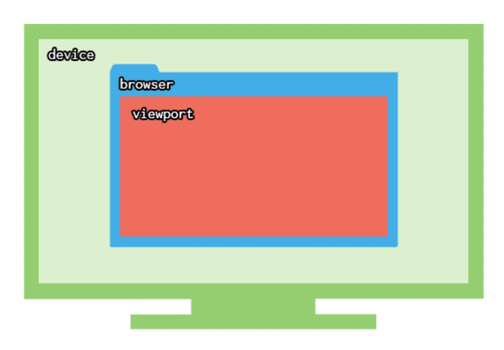

### 2023-10-10

## viewport
*참고: https://velog.io/@ken1204/viewport%EB%9E%80*
- **뷰포트란?**
  - 현재 보고있는 컴퓨터 화면의 영역
  - UI, 메뉴바 제외 브라우저 창과 동일
  - 
  - Chrome의 경우 아래와 같고, `innerWidth`, `innerHeight`를 `layout viewport`로 지칭
    ```
    window.innerWidth /* 1200 */
    window.innerHeight /* 800 */
    ```

- **Layout/Visual Viewport**
  - Layout: 사용자가 보이는 전체 부분
  - Visual: 사용자가 화면으로 보이는 부분 (ex. 키보드 띄울때 키보드 영역 제외)

- **vh/vw**
  - `1vh`: Layout viewport 높이의 1%

## CSS Position
*참고: https://velog.io/@yeonbot/CSS-position-absolute-fixed-%EC%B0%A8%EC%9D%B4*
- **개요**
  - 페이지의 레이아웃을 특정 위치에 배치하기 위함
  - default: `static`
  - 제공: `relative`, `fixed`, `absolute`, `sticky`

- **하나씩 알아보자**
  - `static`: 요소를 일반적인 문서 흐름에 따라 배치
  - `relative`: 요소를 일반적인 문서 흐름에 따라 배치하되, 자기 기준 top/right/bottom/left 값에 따라 오프셋 적용
  - `absolute`: 원하는 위치를 지정해 배치
  - `fixed`: 지정한 위치에 고정하여 배치
  - `sticky`: 위치에 따라 동작 방식 달라짐. 요소가 임계점(scorll 박스 기준) 이전에는 relative, 이후는 fixed로 동작

- **absolute vs fixed**
  - 이 둘은 top/bottom/left/right의 절대적 위치 지정 가능
  - 각각의 값은 **기준**으로 부터 얼마나 떨어져있을지를 지칭 (그럼 뭐가 기준인데?)
  - `absolute` : 가장 가까운 부모 요소이면서 조상 요소 중 position 속성이 static이 아닌 요소
  - `fixed`: 뷰포트 기준

- **언제 fixed, 언제 absolute?**
  - `fixed`
    - 스크롤이 내려가도 떠있는 헤더
    - modal
    - floating 버튼
  - `absolute`
    - 특정 엘리먼트 내 다른 엘리먼트와 관계없이 움직이는 경우