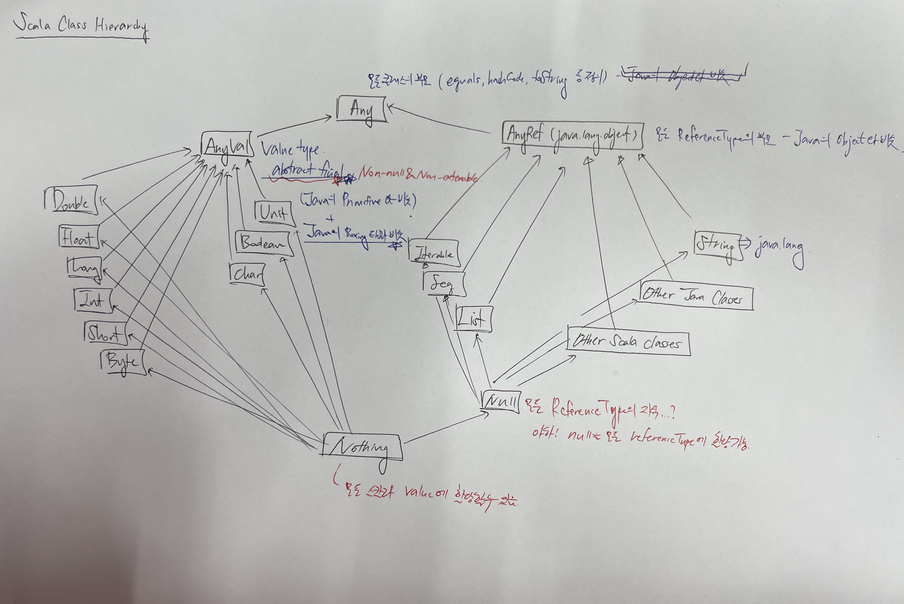

### 2023-11-17

## 이젠 알아보자 FlatMap
- *참고: https://knight76.tistory.com/entry/scala-map-flatten-flatmap-%EC%98%88%EC%8B%9C*
- **예시**
    ```scala
    class UserService {
        def findById(id: Long): Future[User] = {
            Future.successful(User(id))
        }
    }
    
    class ReadService {
        def read(userId: Long, noticeId: Long): Future[Unit] = {
            Future.successful {
                reads += UserRead(userId, noticeId)
            }
        }
    }
    ```
    ```scala
    val test1: Future[Future[Unit]] = userService.findById(1L) map { user => 
        readService.read(user.id.get, 100L)
    }
    
    val test2: Future[Unit] = userService.findById(1L) flatMap { user => 
        readService.read(user.id.get, 100L)
    }
    ```

- **가벼운 예제로 알아보자**
    ```scala
    val list1 = List(1, 2, 3)
    val list2 = List(4, 5, 6)
    val list3 = List(7, 8, 9)
    
    val mapTest = list1.map { x => 
      list2.map {
        y => (x, y)
      }
    }
    
    println(mapTest) 
    // List(List((1,4), (1,5), (1,6)), List((2,4), (2,5), (2,6)), List((3,4), (3,5), (3,6)))
    
    val flatMapTest = list1.flatMap { x =>
      list2.map {
        y => (x, y)
      }
    }
    
    println(flatMapTest)
    // List((1,4), (1,5), (1,6), (2,4), (2,5), (2,6), (3,4), (3,5), (3,6))
    ```
  
- **for-comprehension**
    ```scala
    val list1 = List(1, 2, 3)
    val list2 = List(4, 5, 6)
    val list3 = List(7, 8, 9)
    
    val forCompTest = for {
        a <- list1
        b <- list2
        c <- list3
    } yield (a, b, c)
    
    println(forCompTest)
    // List((1,4,7), (1,4,8), (1,4,9), (1,5,7), (1,5,8), (1,5,9), (1,6,7), (1,6,8), (1,6,9), (2,4,7), (2,4,8), (2,4,9), (2,5,7), (2,5,8), (2,5,9), (2,6,7), (2,6,8), (2,6,9), (3,4,7), (3,4,8), (3,4,9), (3,5,7), (3,5,8), (3,5,9), (3,6,7), (3,6,8), (3,6,9))
    ```
    - for-comprehension은 최종 연산에 `map`을 사용하여 결과 처리하고, 그 전엔 줄줄이 `flatMap`을 사용하여 처리해
        - 요런 감성이야
        ```scala
        for {
          a <- operation1
          b <- operation2
          c <- operation3
        } yield (expression)
    
        operation1.flatMap(a => operation2.flatMap(b => operation3.map(c => expression)))
        ```
        - `flatMap`을 통해서 중간중간 스텝에서 flatten 처리해서 모나드형식(?)으로 잘 변경해줬다가
        - `map`을 통해서 마지막에 트랜스폼을 뚝딱 해주는 겨
        - 이를 통해 monadic nature를 달성할 수 있는겨

- **Future FlatMap & Promise chaining**
  - 약간 콜백 지옥과도 비슷한 느낌이 드는데...
    - 스칼라에서 for-comprehension 중첩 오퍼레이션에 대해 가독성이 좋을 수 있도록 문법적으로 지원을 해주는거야
    - JS의 `async/await` 감성처럼
    - 둘 모두 인덴트 뒤지게 들어가고 중첩에 중첩을 막으려고해. 동기적으로 보이고, 직관적이게 보이려고. 
      - **하지만 실질적으로는 굉장히 비동기적으로 열심히 일하고 있고, monadic type으로 서로가 서로를 감싸고 있지**
    - JS에서 Promise는...
      - `.then()`을 통해서 프로미스를 체이닝해 (스칼라의 `flatMap()`과 비슷하다고 생각해)
  - 그러니까 한 번 각각 보자면...
  - Scala
    ```scala
    val eventualResult = for {
        step1 <- Future(doSomething())
        step2 <- Future(doSomethinsElse(step1))
    } yield step2
    ```
  - JS
    ```js
    let eventualResult = Promise.resolve( doSomething() )
        .then(step1 => doSomethingElse(step1));
    ```

- **map, flatten, flatmap**
  - [map]
    - 변형의 의미를 가짐
  - [flatten]
    - 콜렉션을 펼쳐놓는 메서드
    - None은 다 날려줌
  - [flatMap]
    - map에 flatten을 합성한 메서드
    ```scala
    val list = List(List(1), List(2))
    println(list.flatMap(x => x.map(_*2)))
    // List(2, 4)
    
    println(list.map(x => x.map(_*2)).flatten)
    // List(2, 4)
    ```
    
- **자 읽고 블로그에 정리하세요**
  - https://qowns8.github.io/scala/2018/06/14/iteratorTypePedigree.html
  - https://tech.kakao.com/2016/03/03/monad-programming-with-scala-future/
  - https://gist.github.com/jooyunghan/e14f426839454063d98454581b204452
  - https://hamait.tistory.com/606
  - http://taewan.kim/post/how_to_process_abnomal_pattern_with_flatmap/
  - https://partnerjun.tistory.com/7

## 스칼라 타입 Hierarchies
*참고: https://www.baeldung.com/scala/type-hierarchies*
- 
- **개요**
  - 컴파일 타임에 타입 체크, 런타임 퍼포먼스를 위해 코드 최적화

- **Any**
  - 모든 클래스의 부모로 equals, hashcode, toString 메서드 있음

- **AnyVal**
  - 모든 값 객체의 부모
  - 자바처럼 원시타입 없어. 박싱이라고 생각하면 됨
  - abstract final
  - Null 안됨
  - 상속 안됨

- **AnyRef**
  - 모든 reference Type의 부모
  - Java의 Object와 비슷

- **Null**
  - 모든 ReferenceType의 자식
  - 즉, 모든 ReferenceType에 할당될 수 있음

- **Nothing**
  - 모든 스칼라 클래스의 자식
