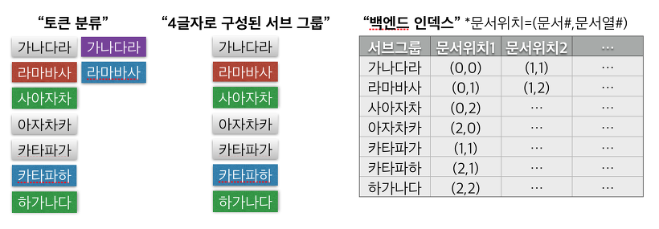
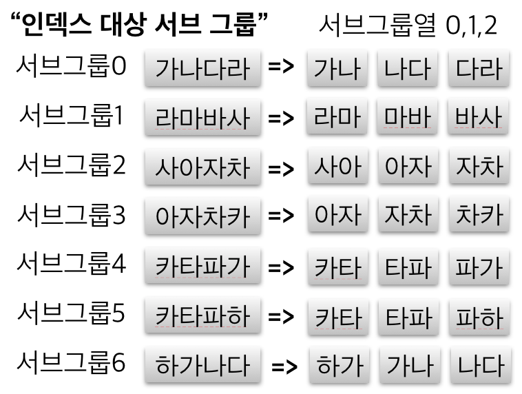
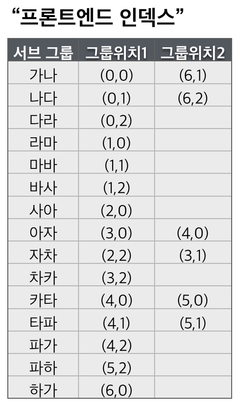

### 2024-03-07

## Elastic
*참고: https://esbook.kimjmin.net/*
### 1. Elastic Stack 소개
- **ElasticSearch**
  - Full Text Search 강점
  - 타 플랫폼 연동이 쉬움
  - 오픈 소스 (루씬 기반)
  - 실시간 분석 시스템 
    - 배치 기반의 분석 시스템
    - 소스 데이터, 분석을 수행할 프로그램 올려 놓고 분석을 실행해 결과 셋 도출
    - ElasticSearch 클러스터가 실행되고 있는 동안에는 계속해서 데이터가 입력됨
    - 그와 동시에 실시간에 가까운 속도로 색인된 데이터의 검색/집계 가능
  - Full Text 검색 엔진
    - inverted file index 구조로 데이터 저장
    - JSON 형식으로 응답 전달
    - 복합적인 정보 포함하는 형식 문서 그대로 전달
    - logstash를 통해 CSV, Apache log, syslog 등으로 변환
  - REST API 지원
  - 멀티테넌시
    - 서로 다른 인덱스 별도 커넥션 없이 하나의 질의로 묶어서 검색/하나의 출력으로 도출

- **Logstash**
  - 데이터 수집/저장을 위한 프로젝트
  - 데이터 수집의 도구가 필요했던 ElasticSearch가 입력 수단으로 Logstash 도입
  - LogStash의 데이터 처리 과정
    - `입력 -> 필터 -> 출력`

- **Kibana**
  - ElasticSearch의 검색 결과 시각화
    - Discover: 색인된 소스 데이터들의 검색, 시계열 기반 시간 히스토그램 그래프 출력
    - Visualize: 집계 데이터를 통해 통계 차트로
    - Dashboard: Visualize로 만들어진 시각화 도구 조합 => 대시보드 화면 

- **Beats**
  - Logstash의 데이터 수집이 부피가 커짐으로써 자원을 많이 요하게 됨
  - 모든 단말에 Logstash 도입? => 부담스러움
  - Beats를 통해 가볍게 데이터 수집할 수 있도록 지원

### 2. ElasticSearch 시작하기
- **데이터 색인**
  - 색인(indexing): 데이터가 **검색될 수 있는 구조**로 변경하기 위해 원본 문서를 **검색어 토큰**들로 변환해 저장하는 과정
  - 인덱스(index): 색인 과정을 거친 결과물, 색인된 데이터가 저장되는 저장소. 
  - 검색(search): 인덱스에 들어있는 검색어 토큰들을 포함하고 있는 문서 찾아가기
  - 질의(query): 사용자

## MySQL Full-Text Index
*참고: https://interconnection.tistory.com/95*
- **MySQL Full-Text 인덱싱 방법**
  1. Built-in Parser(Stop-word Parser)
     - 기본 내장 파서를 이용하여 stop-word를 기반으로 토큰 나눔
     - ex) stop-word가 " "(공백)이라면, 토큰이 다음과 같이 나뉨
       - "나는 매일이 지옥 같았습니다" => 나는|매일이|지옥|같았습니다
  2. N-gram parser
     - 토큰의 크기 n 만큼씩 데이터를 인덱스로 파싱해두었다가 사용하는 파서
     - ex) N-gram token(n) : 2
       - "나는 김치찌개가 좋습니다" => 나는|는 | 김|김치|치찌|찌개|개가|가 | 좋|좋습|습니|니다|다
         - 위의 분류 중 token 2가 아닌 (는 ),( 김), (가 ), ( 좋), (다 ) 제거

- **N-gram Full-Text Index 생성 과정**
  1. 인덱스 대상 문서를 n보다 큰 값의 토큰으로 **서브그룹** 나눔
     - 각 문서에 대한 4글자 토큰 서브 그룹을 생성
     - 
  2. 서브그룹을 통한 **백엔드 인덱스** 생성
     - 중복되지 않는 4글자로 구성된 서브그룹 리스트를 통해 백엔드 인덱스를 만든다
     - 중복되지 않는 4글자로 구성된 서브 그룹 활용해 백엔드 인덱스에 문서 위치와 같이 생성
     - 서브그룹 위치하는 곳에 (문서번호, 문서열번호) 넣음
     - 
  3. 백엔드 인덱스 내 중복되지 않은 서브그룹에서 n-gram용 서브그룹 만듦
     - 각 서브그룹을 다시 2-gram 방식으로 서브그룹을 2글자 토큰으로 나눔
     - 
  4. 중복되지 않는 2-gram 서브 그룹 생성
     - 
  5. 2-gram 방식으로 토크나이징한 서브그룹 정보를 통해 **프론트엔드** 인덱스 생성
     - 여기서 생성된 프론트엔드 인덱스는 백엔드 인덱스의 (서브그룹번호, 서브그룹열번호)로 구성
     - 

- **N-gram Full-Text Index 검색 과정**
  1. 인덱스의 검색은 생성되는 반대로 n-gram의 n바이트 단위로 동일하게 자름
     - ex) "마바사" 검색 시, "마바", "바사" 동일하게 자름
  2. 동일하게 자른 검색용 n-gram 토큰을 통해 프론트엔드 인덱스 검색
  3. 검색된 결과 정보를 백엔드 인덱스 검색 대상 후보 리스트로 두고, 백엔드 인덱스를 통해 최종 확인 거쳐 일치 결과 가져옴

- **Built-in vs N-gram**
  - 검색어가 많을수록, N-gram이 빠름
  - 저장 데이터 바이트 수가 많을수록, 스토리지 엔진 사용량은, N-gram이 많음

- **검색 모드 종류**
  1. 자연어 검색
     - 검색 문자열을 단어 단위로 분리한 후, 해당 단어 중 하나라도 포함되는 행 찾음
  2. Boolean 모드 검색
     - 검색 문자열을 단어 단위로 분리
     - 해당 단어가 포함되는 행을 찾는 규칙을 추가적으로 적용하여 해당 규칙에 매칭되는 행 찾기
     - 정렬은 되지 않을수도
  3. 쿼리 확장 검색
  
