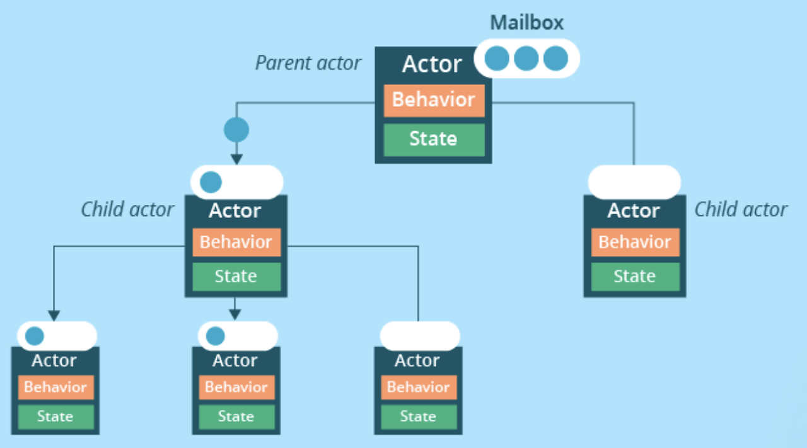

### Akka

## 액터 모델
*참고: https://blog.rajephon.dev/2018/11/25/akka-00/*
*참고: https://velog.io/@wansook0316/Actor-Model*
- **개요**
  - 멀티 코어 프로세서로 발전하는 컴퓨터... 물리적 환경에 맞춰 최대한 성능을 낼 수 있는 코드를 짜자!
  - 멀티 쓰레드 프로그래밍은 많은 문제에 봉착
    1. 공유 리소스 접근: heap 영역 race condition
    2. Lock 처리 통한 임계 영역 처리: 어려워! 힘들어!
    
- **Lock의 문제**
  1. Concurrency 제한: Thread 일시 정지 & 복원 => OS에서 비싼 작업
  2. Block된 Thread에서 유의미한 작업 X
  3. Deadlock 유발 가능

- **액터 모델**
  - 
  - 모든 것은 액터다 (Everything is an actor)
  - 액터 모델은 본질적으로 동시성을 제공
  - 액터는 비동기적으로 메시지를 처리할 수 있는 Computational Entity...
    - 다른 액터에게 유한한 갯수의 메시지를 보낼 수 있음
    - 유한한 갯수의 새로운 액터를 만들 수 있음
    - 다른 액터가 받을 메시지에 수반될 행동을 지정할 수 있음
  - 액터가 차지하는 메모리 공간은 독립적
    - 다른 쓰레드나 액터가 접근할 수 없음!
    - 메모리 공유 없이 "메시지 전달"만을 사용하기에 공유 메모리의 교착 상태 등 뇌절 상황 미연에 방지

- **액터 모델의 목표**
  1. lock에 의존하지 않고 캡슐화를 통해 동기화 문제를 해결
  2. Cooperative Entity 모델 사용: 전체 앱이 서로에게 시그널을 보내고 값을 변경하면서 동작
  3. 우리가 당연하게 생각하는 방식(사람이 서로 말하듯) 으로 처리

- **액터 모델의 기본 구조**
  - [액터 구조]
    - Mailbox: Queue
    - Message
    - Behavior: Message에 따른 행동 결정 및 실행
      - 본인의 상태 변경
      - Child Actor 생성/제거
      - 타 Actor에게 메시지 전송
    - State: Actor의 실행 상태(init, ready, closed) - 자신만 변경 가능
  - [메시지 전달 방식]
    - Lock, Blocking X
    - 특정 메서드 호출이 아닌, 특정 액터에게 메시지 전달!
    - 메시지 전달 != Thread 실행
    - 각 액터는 독립적으로 받은 메시지 수행

- **액터 모델의 효용**
  1. Lock이 필요 없음 => Actor는 독립적으로 queue를 가짐
  2. Actor의 상태값은 해당 객체가 가진 Queue로 부터 넘어오는 동작으로만 처리됨 => 동시성 문제 해결 

## Akka란?
