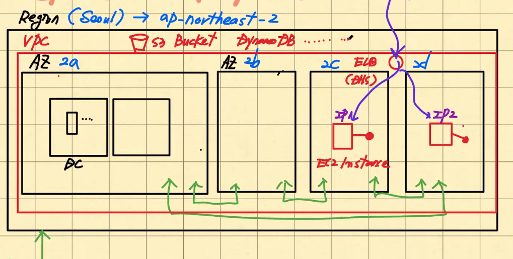
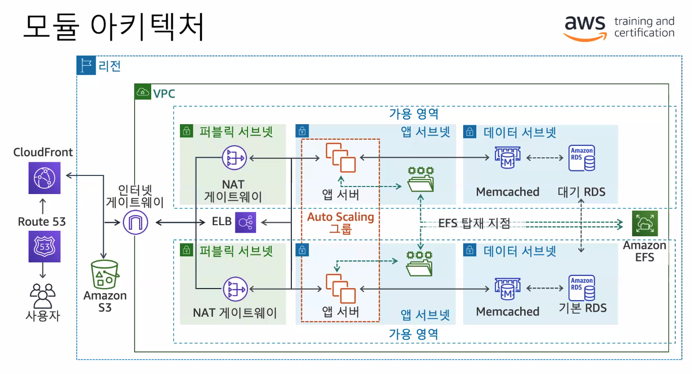

## Architecting on AWS

### 아키텍팅 기본 사항
- **AWS란?**
  - 가상화를 통한 리소스 생성
  - 가상화를 통한 리소스를 생성하는데 이를 서비스 형태로 제공해줌!
    - 서비스 -> 리소스
    - EC2 -> Instance AMI
    - S3 -> Bucket
    - EBS -> Volume snapshot
  - Pay as you go 
  - 인터넷 기반: "VPC <- EC2"로 구성하자!
- **AWS API**
  - REST API
  - COnsole (GUI)
  - CLI, SDK
  - CloudFormation
- **리소스 식별**
  - ResourceId: EC2 에서 많이 사용 (i-xxxxxx, ami-xxxxxx)
  - ARN: Amazon Resource Name (IAM 정책 등에서 사용)
- **Managed Service : AWS가 많은 부분 관리**
  1. Instance 기반 서비스: OS 깔아주고, 필요한 app 깔아주고, volume storage 설치하고 다 묶어서 리소스로 뚝딱 제공 (ex. RDS)
  2. Serverless 서비스: 대부분 공개가 되어있지 않음. 인프라가 어떻게 생겼는지 모르고 그냥 뚝딱 씀. 프로비져닝, 고가용성 -> API 기능만 쓰면 됨 (ex. S3, DynamoDB, Lambda) 
- **Global Infra**
  - 
  - 
  - Region (Seoul) : ap-northeast-2
    - VPC를 만들어주면 여기서 뚝딱
      - AZ (Availablity Zone) : 가용영역 현재 서울에 4개 있음 (2a, 2b, 2c, 2d)
        - ELB : DNS 이름을 여기다가 붙이는 갬성 <- 엔드유저가 여기에만 접근 뚝딱
          - DC (Data Center)
            - 이 안에 EC2
  - Edge Location : 지연시간을 짧게, DDoS 방어 등등 410 개 정도...
    - CloudFront
    - Route 53
    - Global Accelerator
    - WAF
    - Shield
- **AWS Well-Architected Tool**
  - 특정한 리소스를 얼만큼 어떻게 쓰고 싶은지 정하면 서비스 둑딱 보고서로써 정해줌
  - 보안/성능/...
- 실습: AWS API를 사용한 EC2 인스턴스 배포 살펴보기

### 계정 보안
- **Account & User(IAM)**
  - Account: Account ID 생성 (숫자 12개), e-mail/password로 가입 => Root User로 불림
    - Root User는 근데 쓰지 마세요! 
      - 최대 권한 가지고 있고, 권한 제어가 불가능 함
      - MFA를 가지고 인증을 받고 연결해서 쓰세요!
  - User: IAM User 어카운트
    - IAM 서비스는 계정 단위임
      1. User 
         - 영구자격 증명 => 사원증
         - username과 password 세트 => Console
         - accessKey(access key id & secret access key) 만듦 => CLI/SDK/API
      2. Group 
      3. Policy (JSON) 
         - JSON으로 정책 만들어서 권한을 지정할 수 있음
         - identity
         - resource 기반
      4. Role
         - 임시 자격 증명 (만료 기간이 있음) => 방문증
         - 권한을 위임한다
           - IAM, Federation User

- **Organizations**
  - 통합결제/모든기능
  1. Organization
  2. Account
     - management
     - member
  3. OU
  4. Policy
     - scp
     - tag policy

- **IAM**
  - Access Advisor를 통해 어떤 서비스를 언제 접근했는지 확인할 수 있다
  - IAM 권한 경계
    - 계층적 방어를 위해 정책을 사용한다
  - 페더레이션: AWS 서비스 사용하려면 IAM이 있어야 함
    - SAML, OIDC
  - AWS SSO를 통해 한번에 인증할 수 있음
  - AWS Organizations
    - 하위 계정들에 대해 결제를 한번에 진행할 수 있음

### 네트워킹 1
- **VPC**
  - 외부 네트워크와 격리시켜 그 안에 EC2를 만든다
  - VPC 내부의 인스턴스와는 통신 가능
  - VPC 외부(인터넷, 다른 VPC)와는 통신이 불가능
  - 외부와의 통신은 게이트웨이로!
    - VPC 하나당 인터넷 게이트웨이 연결! (in/out 모두 가능)
    - NAT gateway를 통해서는 인터넷으로 나가는 것만 가능! (out만 가능)
  - CIDR를 통해 IP 대역을 설정함
    - 10.0.0.0/16 => 2^16개 사용가능
  - 다중 VPC의 이점
    - 환경별로 VPC를 나눠서 운영할 수 있음

- **IP**
  - IPv4: 8비트 4자리 (32비트)
    - 172.31.0.0/16
      - /prefix: CIDR (Classless Inter Domain Routing)
        - 앞에서 부터 몇 비트가 고정이다
        - 예시에서는 172.31 이 고정이다
        - 0.0 은 유동적이다 (0-255, 0-255) 
        - 이러면 2^16 개가 활용할 수 있어
    - 필수
  - IPv6: 8비트 6자리 (128개)
    - 어라 ip 부족하네?
    - option
  - CIDR
    - 0.0.0.0/0 : 모든 ip
    - 10.22.33.44/32 : 10.22.33.44 특정 ip 지정
    - 10.22.33.0/24 : 10.22.33.* (2^8)
    - 10.22.0.0/16 : 10.22.*.* (2^16)
    - 될 수 있으면 ip를 많이 만들어두세요!
      - 비용 더 나가는 것도 아니니, 큰 범위를 써보세요!
  - 공인 ip 주소: 인터넷을 통해 연결 가능
  - 사설 ip 주소: 인터넷으로 연결 불가능
    - 10.0.0.0/16 => 이거 다 사설!
      - 10.0.*.* - 랜덤하게 할당이 된다
    - 인터넷을 통해서 해당 ip를 접근할 수 없어 -> 필요하면 공인 ip 받으세요
  - Elastic IP : stop -> start 해도 공인 ip 그대로 유지

- **서브넷**
  - 퍼블릭 서브넷 : 인터넷과 통신이 가능하다
  - 프라이빗 서브넷 (앱 서브넷, 데이터 서브넷) : 인터넷과 통신이 불가능하다
  - CIDR로 나눈 IP를 서브넷으로 나누어 소통할 수 있도록 분리/Grouping 함
  - 서브넷을 통해 VPC 분리하기
    - CIDR/22 => 32bit 중에서 22bit 고정 => 2^10개의 ip를 나눠쓸 수 있다 (1024개)
      - 서브넷1~서브넷4 각각 251개씩
      - 256개가 아닌 이유는 5개는 AWS가 내부적으로 쓰고 있어서 못씀

- **게이트웨이**
  - 인터넷 게이트웨이 (in/out 모두 가능하게)
    - 기본적으로 수평 확장되고 중복되며 고가용성
  - 인터넷 게이트웨이를 만들면 리소스id가 생겨
  - NAT 게이트웨이 (EIP 필수!)
    - 퍼블릭 서브넷 <-> 프라이빗 서브넷
    - 프라이빗 서브넷에 다음과 같은 정보 추가
      - 0.0.0.0/0 - nat-02031

- **라우팅 테이블**
  - 경로 규칙을 설정할 수 있음 (나 어디로 이동할거야!)
  - VPC에서는 암시적 라우터가 있음
  - 라우팅 테이블
    - 대상위치 - 대상
    - 172.31.0.0/16 - local
    - 0.0.0.0/0 - igw-12345
    - ::/0 - igw-12345
    - 찾아가고자 하는 경로의 가장 가까운 경로로 가려고 함
  - 서브넷 당 라우팅 테이블을 따로따로 만드는 것이 좋음!
    - 서브넷 당 라우팅 테이블을 만들어서 연결하는 감성
    - 172.31.0.0/16 - local => 삭제 안되고 고정 => VPC 내부에서는 통신이 무조건 통신이 가능하다는 뜻
  - 퍼블릭 라우팅 서브넷
  - 프라이빗 라우팅 서브넷
    - 인터넷 게이트웨이에 대한 정보 필요 X

- **가상 방화벽**
  - NACL (Network ACL)
    - 상태 비저장
    - 허용되어 있음
  - 보안그룹 리소스당
    - 상태 저장
    - 들어오는게 차단되어 있음 (허용 규칙 필수)
    - 허용 규칙만 허락해준다고 생각하면 됨

- **VPC 심층 방어**
  - 인터넷 게이트웨이 <-> 라우팅 테이블 <-> 네트워크 ACL <-> 퍼블릭 서브넷 <-> 보안 그룹 <-> 인스턴스

- **사용자 지정 보안 그룹 규칙**
  - 인바운드
    - 0.0.0.0/0 - 80,443
  - 아웃바운드
    - db 연결

- **가용 영역**
  - 웹 보안 그룹
    - 인바운드 규칙
      - 443 허용
      - 소스: 0.0.0.0/0
  - 앱 보안 그룹
    - 인바운드 규칙 
      - 80 허용
      - 소스: 웹 티어
  - 데이터 보안 그룹
    - 인바운드 규칙
      - 3306 허용
      - 소스: 앱 티어

### ToDo
- 팀원들에게 IAM을 만들어서 할당하기
- VPC 만들어보기

### 컴퓨팅 서비스
- **AWS 컴퓨팅의 진화**
  - 물리적 서버 -> 가상화 -> 컨테이너화 -> 서버리스 -> 서버리스 컨테이너화 -> 특화 프로세서

- **EC2 인스턴스**
  - t3.micro등의 사양: cpu, network, memory 등 결정
  - AMI
    - 인스턴스 볼륨 템플릿
    - 시작 권한
    - 블록 디바이스 매핑
  - 이점
    - 반복 가능
    - 재사용 가능
    - 복구 가능
  - EC2 백업은 AMI로 뚝딱 => S3에 aws가 저장해줌
  - 최신 유형 쓰는거 권장합니다
    - https://aws.amazon.com/ko/ec2/instance-types
  - c5n.xlarge
    - 인스턴스패밀리_인스턴스세대_속성.인스턴스크기
  - 인스턴스 수명 주기
    - 보류 중 -> 실행 중 -> 재부팅 중 -> 중지 중 -> 중지 됨
      - -> 종료 중 -> 종료 됨
  - 인스턴스 메타데이터
    - 사용자의 AMI -> EC2 인스턴스 실행
    - instance-id/mac/public-hostname/public-ipv4/local-hostname/local-ipv4
  - 구매 옵션
    - 예약 인스턴스 : 온디맨드 요금 대비 1년/3년 약정
    - Savings Plans: EC2 예약 인스턴스와 비슷한 할인 이지만 더 높은 유연성으로 1년/3년 약정 (lambda도 지원)
    - 스팟 인스턴스: 온디맨드 요금 대비 최대 90% 할인으로 Amazon EC2 용량 확보
    - 온디맨드 인스턴스: 장기 약정 없이 시간단위로 컴퓨팅 용량 구입
  - 인스턴스 유형을 선택해서 만들면, 서버가 랜덤하게 선택되고, 원하는 크기만큼의 가상화를 해서 인스턴스가 제공받아짐
  - 인스턴스 유형에 따라 스토리지에 따라 제공되는 것이 있음
  - stop이 되면 회수되었다가, start하면 또 랜덤하게 만들어짐 -> 이게 ip가 바뀌는 이유
  - 볼륨 영구적 저장을 위해서는 EBS를 쓰세요

- **Amazon EBS**
  - 볼륨이 EC2 인스턴스와 돌깁적으로 지속
  - 가용 영역 내에서 정의됨 
  - 99.999% 가용성
  - 네트워크를 통해 인스턴스의 볼륨을 연결해줌 (유실되지 않도록)
  - 인스턴스에 따라 볼륨 여러개 붙일 수 있음

### 스토리지
- Amazon Simple Storage Service (S3) 보안 및 버전 관리
- 스토리지 클래스
- 스토리지 수명 주기 및 암호화
- 공유 파일 시스템
- Amazon Elastic Block Store (Amazon EBS) 볼륨
- 데이터 마이그레이션 도구

### 데이터베이스 서비스
- AWS 데이터베이스 솔루션
- Amazon Relational Database Service (RDS) 및 Amazon Aurora
- Amazon DynamoDB
- Amazon Redshift
- 데이터베이스 캐싱
- 데이터베이스 마이그레이션 도구

### 모니터링 및 스케일링
- AWS CloudTrail
- Amazon CloudWatch
- VPC Flow Logs
- 호출 이벤트
- Elastic Load Balancing
- 오토 스케일링
- 실습: Amazon VPC에서 고가용성 구성

### 자동화
- AWS CloudFormation (Infrastructure as Code -> JSON, YAML)
- AWS Elastic Beanstalk
- 스택 및 정책
- AWS 솔루션 구현
- AWS Cloud Development Kit (AWS CDK)
- AWS Systems Manager

### 컨테이너
- 마이크로서비스
- AWS X-Ray를 통한 모니터링
- 컨테이너 개요
- 마이크로서비스 및 컨테이너
- AWS 컨테이너 서비스 (ECS, EKS)

### 네트워킹 2
- VPC 엔드포인트
- VPC 피어링
- AWS Transit Gateway
- 하이브리드 네트워킹
- Amazon Route 53
- 라우팅 옵션

### 서버리스
- Amazon API Gateway
- Amazon Simple Queue Service (Amazon SQS)
- Amazon Simple Notification Service (Amazon SNS)
- Amazon Kinesis
- AWS Step Functions
- Amazon MQ

### 엣지 서비스
- 엣지 기본 사항
- Amazon CloudFront
- AWS Global Accelerator

### 백업 및 복구
- 재해 복구 계획
- AWS Elastic Disaster Recovery
- AWS Backup
- 복구 전략
- 복구 모델

### 캡스톤
- 멀티티어 아키텍쳐

### 실습
- AWS API를 사용한 EC2 인스턴스 배포 살펴보기
- Amazon VPC 인프라 구축
- Amazon VPC 인프라에 데이터베이스 계층 생성
- Amazon VPC에서 고가용성 구성
- 서버리스 아키텍처 구축
- Amazon S3 오리진으로 CloudFront 배포 구성
- AWS 멀티 티어 아키텍처 구축
