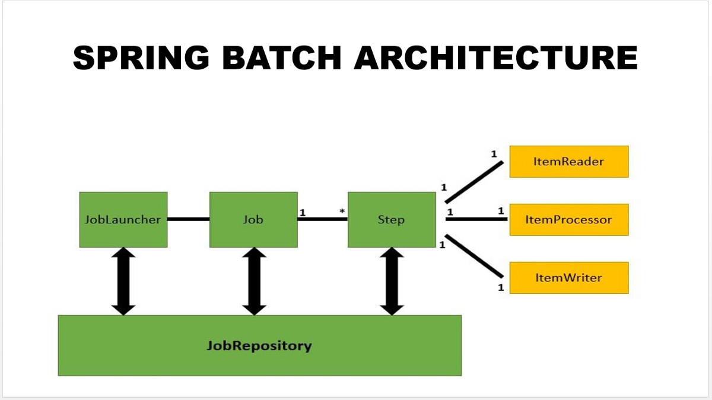

### Spring Batch

*참고*
- https://devbksheen.tistory.com/284

- **개요**
  - 엔터프라이즈 시스템 운영에 있어 대용량 일괄 처리의 편의를 위해 설계된 가볍고 포괄적인 배치 프레임워크
  - Spring의 특성을 그대로 가지고 있음
    - DI, AOP, 서비스 추상화
  - 아래의 경우 많이 사용
    - 대용량의 비즈니스 데이터를 복잡한 작업으로 처리해야하는 경우
    - 특정한 시범에 스케쥴러를 통해 자동화된 작업이 필요한 경우 (ex. 푸시알림, 월별 리포트)
    - 대용량 데이터의 포맷을 변경, 유효성 검사 등의 작업을 트랜잭션 안에서 처리 후 기록해야하는 경우
  - Spring Batch는 로깅/추적, 트랜잭션 관리, 작업 처리 통계, 작업 재시작, 건너뛰기, 리소스 관리 등 대용량 레코드 처리에 필수적인 재사용 기능 제공
  - 최적화 및 파티셔닝 기술을 통해 대용량/고성능 일괄 작업을 가능하게 지원
  - 다음의 조건을 만족하면 배치 어플리케이션으로 고려할 것
    - 대용량 데이터: 대량 데이터 가져오거나, 전달하거나, 계산하거나!
    - 자동화: 심각한 문제 해결 제외 사용자 개입없을 것!
    - 견고성: 잘못된 데이터를 충돌/중단 없이 처리할 것
    - 신뢰성: 무엇이 잘못되었는지 추적할 수 있을 것
    - 성능: 지정한 시간 안에 처리 완료하거나, 동시에 실행되는 다른 어플리케이션 방해하지 않도록 수행

- **스프링 배치 아키텍쳐**
  - 
    - **Application**: 스프링 배치 사용해 개발자가 작성한 모든 배치 작업과 사용자 정의 코드
    - **Batch Core**: 배치 작업 시작하고 제어하는데 필요한 핵심 런타임 클래스 포함
    - **Batch Infrastructure**: 개발자와 어플리케이션에서 사용하는 일반적인 Reader, Writer, RetryTemplate
  - 개발자는 Application 계층의 비즈니스 로직에 집중!
  - 배치의 동작과 관련된 것은 Batch Core에 있는 클래스를 이용하여 제어
  - 
    - **JobRepository**
      - 다양한 배치 수행과 관련된 "수치 데이터"와 "잡의 상태"를 유지 및 관리
      - 관계형 데이터베이스를 사용하여 스프링 배치 내의 대부분의 주요 컴포넌트가 공유
      - 실행된 Step, 현재 상태, 읽은 아이템 및 처리된 아이템 수 등이 모두 JobRepository에 저장
    - **Job**
      - 배치 처리 과정을 하나의 단위로 만들어 표현한 객체
      - 여러 Step 인스턴스를 포함하는 컨테이너
      - Job이 실행될 때 스프링 배치의 많은 컴포넌트는 탄력성을 제공하기 위해 상호작용함
    - **JobLauncher**
      - Job 실행하는 역할
      - `Job.execute` 호출역할
      - Job의 재실행 가능 여부 검증, 잡의 실행 방법, 파라미터 유효성 검증 등 수행

