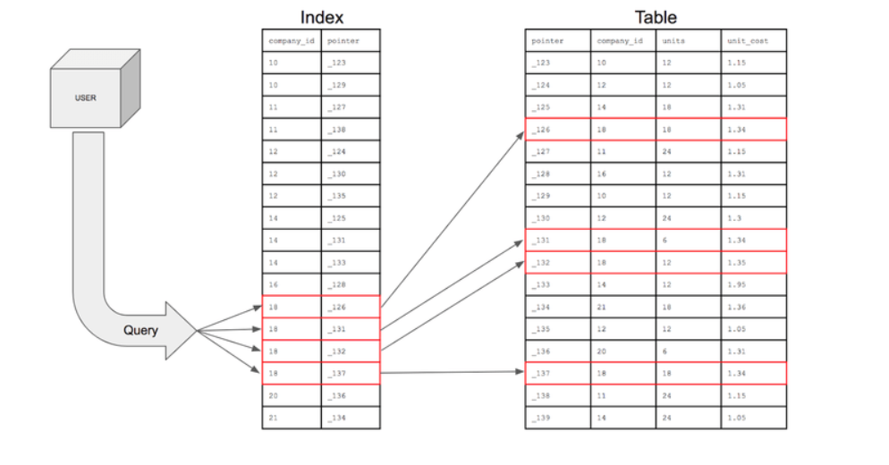
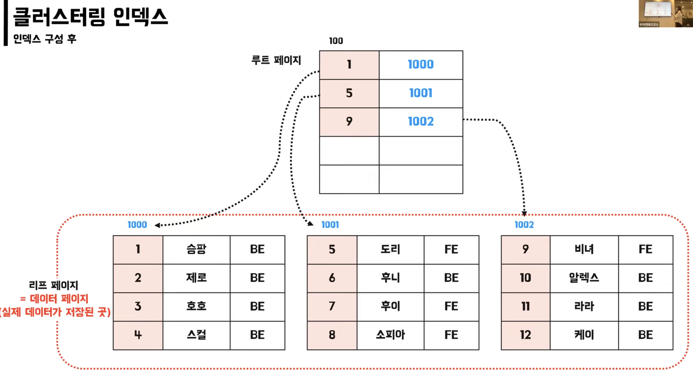
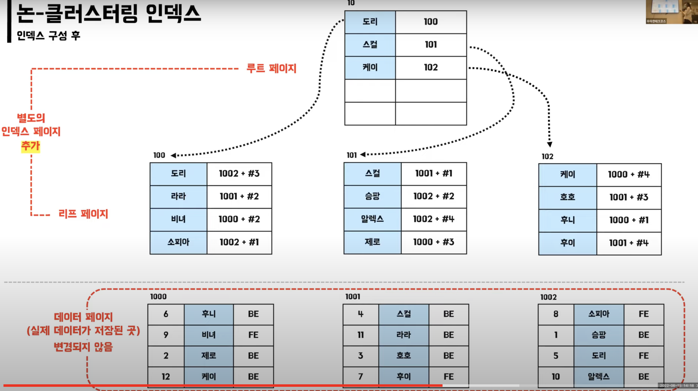
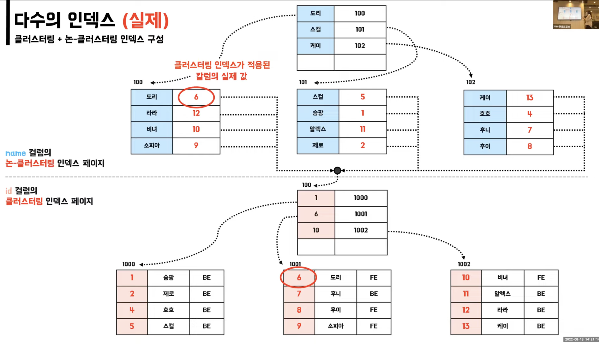

### 인덱스
*참고: https://rebro.kr/167*
*참고: https://www.youtube.com/watch?v=edpYzFgHbqs*

## 소개
- 데이터베이스 테이블에 대한 검색 성능을 향상시키는 자료 구조이며, WHERE 절 등을 통해 활용된다. 
- 데이터베이스의 테이블 검색 속도 향상 시켜주는 자료 구조
- 해당 컬럼의 데이터를 정렬한 후, 별도의 메모리 공간에 데이터의 물리적 주소와 함께 저장
- 칼럼 값-물리 주소 key-value 형식으로
- 
- **장점**
  - 테이블을 검색하는 속도/성능 향상
  - 시스템 전반적인 부하 줄임
  - 데이터들이 정렬된 형태 => Full Table Scan에서 조건에 맞는 데이터만 탐색하는 형식으로 개선 가능
  - Order By, MIN/MAX 빨라짐

- **단점**
   - 인덱스를 관리하기 위한 추가 작업 필요
   - 추가 저장 공간 필요
     - Delete는 Soft-Delete로 처리되어서 메모리 낭비가 커질 수도
   - 잘못 사용하면 오히려 검색 성능 저하
     - 전체 데이터의 10~15% 이상 데이터 처리하거나 데이터 형식에 따라 성능 낮아질 수도
     - 인덱스 읽고 다시 많은 데이터 조회해야해서 비효율적일 수도

## B-Tree
- 전체 테이블 말고 밸런스 맞춘 트리로 데이터 자장
- 트리 높이가 같음
- 자식 노드를 2개 이상 가질 수 있음
- 기본 데이터베이스 인덱스 구조

## 인덱스 만드는 방법
- **MySQL**
  - 클러스터형 인덱스(Clustered-index)
    - 테이블 당 하나를 설정할 수 있음
    - PK 옵션을 기본키로 만들면 클러스터형 인덱스 생성 가능
  - 세컨더리 인덱스(Non-clustered-index)
    - 보조 인덱스로 여러개의 필드값을 기반으로 쿼리 많이 보낼때 생성

## 인덱스 유의점
1. 인덱스는 비용이다
   - 두번 탐색하도록 강요
   - 컬렉션이 수정되었을 때 인덱스도 수정되어야 함
     - B트리 다시 균형 맞추고, 데이터 효율적 조회를 위한 설정
   - 쿼리에 있는 필드 싹 다 인덱스 설정하는 건 노답

2. 테스팅 할 것
   - explain을 통해 실행계획 보기

3. 복합 인덱스는 같음-정렬-다중값-카디널리티 순
   1. 어떠한 값과 같음을 비교하는 ==/equals 쓰는 쿼리는 인덱스 걸자
   2. 정렬에 쓰는 필드라면 그 다음 인덱스로 설정
   3. 다중 값을 출력해야하는 필드, 쿼리 자체가 >/< 등 많은 값 출력하는 쿼리라면 나중에 인덱스 설정
   4. 카디널리티가 높은 순서로 인덱스 걸자!

- 규모가 큰 테이블
- READ >> INSERT/UPDATE/DELETE 인 컬럼
- WHERE, ORDER BY, JOIN 등 자주 사용되는 컬럼
- 데이터의 중복도가 낮은 컬럼

## 인덱스 알고리즘 
- **페이지**
  - 데이터가 저장되는 단위 (16KB)

- **Full Table Scan**
  - 장점
    - 순차적 접근
    - 접근 비용 감소
  - 언제 쓰임?
    - 적용 가능한 인덱스가 없는 경우
    - 인덱스 처리 범위가 넓은 경우
    - 크기가 작은 테이블에 엑세스 하는 경우

- **Insert로 인한 페이지 분할**
  - 
  - 페이지에 새로운 데이터를 추가할 여유공간이 없어 페이지의 변화가 발생
  - DB가 느려지고 성능에 영향을 준다

- **인덱스 사용시**
  - SELECT: 성능 향상
  - INSERT/UPDATE/DELETE: 성능 저하

- **인덱스 종류**
  - 클러스터링 인덱스 : 실제 데이터와 같은 무리의 인덱스 
    - 국어 사전 생각하기 -> ㄱ/ㄴ/ㄷ/ㄹ/ㅁ... 그냥 펼치면 실제 데이터 뚝딱
    - PK
  - 논-클러스터링 인덱스 (보조 인덱스, 세컨더리 인덱스) : 실제 데이터와 다른 무리의 별도의 인덱
    - 찾아보기 페이지 생각하기 -> 특정 단어 - p188 => 188쪽 펼쳐서 확인하기
    - UNIQUE

- **클러스터링 인덱스**
  - 클러스터링 인덱스 쓰려면...
    - PK 도입
    - NOT NULL + UNIQUE 도입
  - 도입 후
    - 클러스터링 인덱스 적용한 컬럼 기준으로 데이터 정렬
    - 정렬된 데이터들은 리프 페이지가 되고, 해당 리프 페이지를 가리키는 루트 페이지 도입됨
    - 
    - 1000은 데이터 페이지의 찐 물리주소
  - 특징
    - 실제 데이터 자체가 정렬됨
    - 따라서 테이블당 1개만 존재 가능
    - 리프 페이지가 데이터 페이지
    - 아래의 제약조건 시 자동 생성
      - primary key (우선순위)
      - unique + not null

- **논-클러스터링 인덱스**
  - 논-클러스터링 인덱스 쓰려면...
    - UNIQUE 도입
    - INDEX 직접 생성
  - 도입 후
    - 논-클러스터링 인덱스가 적용되었다고 찐 테이블의 데이터에 변경이 가해지지 않음
    - 
    - 도리: 1002 페이지의 3번째로 가세요
  - 특징
    - 실제 데이터 페이지는 그대로
    - 별도의 인덱스 페이지 생성 -> 추가 공간이 필요하다
    - 테이블당 여러개 존재 가능
    - 리프 페이지에 실제 데이터 페이지 주소를 담는다
    - 아래의 제약조건 시 자동 생성
      - unique
      - 직접 index 생성

- **클러스터링 인덱스 + 논-클러스터링 인덱스 같이 적용?**
  - 
  - 왜 이렇게?
    - 새로운 데이터 들어오면 페이지 분할, 주소도 변경 계속 변경 빡세
    - 인덱스 페이지 영향 덜주려고 그럼
